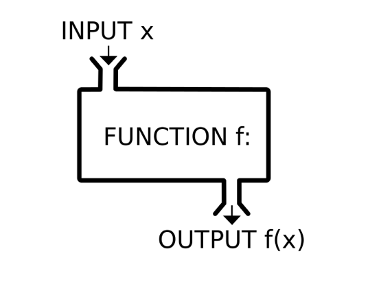
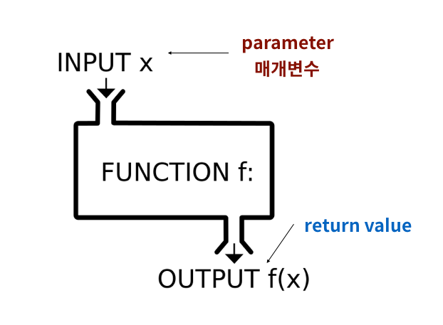

# **함수(function) I**



```python
# 함수를 활용하지 못한 예
values = [100, 75, 85, 90, 65, 95, 90, 60, 85, 50, 90, 80]
total = 0
cnt = 0

for value in values:
    total += value
    cnt += 1
mean = total / cnt

total_var = 0
for value in values:
    total_var += (value - mean) ** 2
sum_var = total_var / cnt

target = sum_var
count = 0 
while True : 
    count += 1 
    root = 0.5 * (target + (sum_var / target))  
    if (abs(root - target) < 0.0000000000000001): 
        break 
    target = root

std_dev = target
print(std_dev)
```

```python
# 함수 활용
import math
values = [100, 75, 85, 90, 65, 95, 90, 60, 85, 50, 90, 80]
cnt = len(values)
mean = sum(values) / cnt
sum_var = sum(pow(value - mean, 2) for value in values) / cnt
std_dev = math.sqrt(sum_var)
print(std_dev)
```

```python
# 함수 활용
import statistics
values = [100, 75, 85, 90, 65, a95, 90, 60, 85, 50, 90, 80]
statistics.pstdev(values)
```


### 함수(function)

특정한 기능(function)을 하는 코드의 묶음

#### 함수를 쓰는 이유

- 가독성
- 재사용성
- 유지보수

#### 함수의 선언과 호출

- 함수의 선언은 `def` 키워드를 활용합니다.

- 들여쓰기(4spaces)

  로 함수의 body(코드 블록)를 작성합니다.

  - Docstring은 함수 body 앞에 선택적으로 작성 가능합니다.

- 함수는 `매개변수(parameter)`를 넘겨줄 수도 있습니다.

- 함수는 동작후에 `return` 을 통해 결과값을 전달합니다.
  - 반드시 하나의 객체를 반환합니다 (`return` 값이 없으면, `None`을 반환)

- 함수는 호출은 함수명()으로 합니다.
  - 예) `func()` / `func(val1, val2)`



```python
# 내장함수 max() 직접 만들기
def my_max(value1, value2):
    if value1 >= value2:
        return value1
    else:
        return value2
my_max(1, 5)
# 5
max(1, 5)
# 5
```


## 함수의 Output

#### 함수의 `return`

앞서 설명한 것과 마찬가지로 함수는 반환되는 값이 있으며, 이는 어떠한 종류(~~의 객체~~)라도 상관없습니다.

단, **오직 한 개의 객체**만 반환됩니다.

함수가 return 되거나 종료되면, 함수를 호출한 곳으로 돌아갑니다.

```python
def rectangle(width, height):
    area = width * height
    perimeter = 2 * (width + height)
    return area, perimeter

print(rectangle(30, 20))
print(rectangle(50, 70))
# (600, 100)
# (3500, 240)

# return 값이 2개라고 2개의 객체가 반환되는 것이 아니라 하나의 튜플 객체로 반환됨
```


### 함수의 입력(Input)

#### 매개변수(parameter) & 전달인자(argument)

#####  매개변수(parameter)

```python
def func(x):
      return x + 2
```

- `x` 는 매개변수(parameter)입니다.
- 입력을 받아 함수 내부에서 활용할 `변수`라고 생각하면 됩니다.
- 함수의 정의 부분에서 볼 수 있습니다.

##### 전달인자(argument)

```python
func(2)
```

- `2` 는 (전달)인자(argument)
- 실제로 전달되는 `입력값`이라고 생각하면 됩니다.
- 함수를 호출하는 부분에서 볼 수 있습니다.


★주로 혼용해서 사용하지만 엄밀하게 따지면 둘은 다르게 구분되어 사용됩니다. 개념적 구분보다 함수가 작동하는 원리를 이해하는게 더 중요합니다.


#### 함수의 인자

함수는 입력값(input)으로 `인자(argument)`를 넘겨줄 수 있습니다.


##### 위치 인자 (Positional Arguments)

기본적으로 인자는 위치에 따라 함수 내에 전달됩니다.

```python
def cylinder(r,h):
    return 3.14 * r * r * h
print(cylinder(5, 2))
print(cylinder(2, 5)) # 순서를 바꾸면 다른 값이 나옵니다.
# 157.0
# 62.800000000000004
```


##### 기본 인자 값 (Default Argument Values)

**함수를 정의할 때,** 기본값을 지정하여 함수를 호출할 때 인자의 값을 설정하지 않도록하여, 정의된 것 보다 더 적은 개수의 인자들로 호출 될 수 있습니다.

```python
def greeting(name='익명'):
    print(f'"{name}, 안녕?"')
    
greeting()
greeting('철수')
# "익명, 안녕?"
# "철수, 안녕?"
```

***주의\* 단, 기본 인자값(Default Argument Value)을 가지는 인자 다음에 기본 값이 없는 인자를 사용할 수는 없습니다.**

```python
def greeting(name='john', age):
    return f'{name}은 {age}살입니다.'

File "C:\Users\User\AppData\Local\Temp/ipykernel_13668/3180908920.py", line 2
    def greeting(name='john', age):
                                 ^
SyntaxError: non-default argument follows default argument
    
    
def greeting(age, name='john'):
    return f'{name}은 {age}살입니다.'

print(greeting(1))
print(greeting(2, 'json'))
# john은 1살입니다.
# json은 2살입니다.
```


##### 키워드 인자 (Keyword Arguments)

**함수를 호출할 때** 키워드 인자를 활용하여 직접 변수의 이름으로 특정 인자를 전달할 수 있습니다.

```python
def greeting(age, name):
    return f'{name}은 {age}살입니다.'

greeting(name='철수', age=24)
greeting(24, name='철수')
# '철수은 24살입니다.'
# '철수은 24살입니다.'
```

 **아래와 같이 `키워드 인자`를 활용한 다음에 `위치 인자`를 활용할 수는 없습니다.**

```python
greeting(age=24, '철수')

File "C:\Users\User\AppData\Local\Temp/ipykernel_13668/681848598.py", line 2
    greeting(age=24, '철수')
                         ^
SyntaxError: positional argument follows keyword argument
```


### 정해지지 않은 여러 개의 인자 처리

##### 가변(임의) 인자 리스트(Arbitrary Argument Lists)

앞서 설명한 `print()`처럼 개수가 정해지지 않은 임의의 인자를 받기 위해서는 **함수를 정의할 때** 가변 인자 리스트`*args`를 활용합니다.

가변 인자 리스트는 `tuple` 형태로 처리가 되며, 매개변수에 `*`로 표현합니다.

```python
def func(a, b, *args):
```

> `*args` : 임의의 개수의 위치인자를 받음을 의미
>
> 보통, 이 가변 인자 리스트는 매개변수 목록의 마지막에 옵니다.

```python
# 가변 인자 예시
# print문은 *obejcts를 통해 임의의 숫자의 인자를 모두 처리합니다.
# 아래의 코드로 확인해봅시다.
print('hi', '안녕', 'Guten Tag', 'gonnichiwa', sep=',')
# hi,안녕,Guten Tag,gonnichiwa

def my_func(*args):
    return args
    
print(my_func(1, 2))
print(type(my_func(1, 2)))
# (1, 2)
# <class 'tuple'>
```

```python
def my_max(*args):
    max_val = None
    for arg in args:
        if max_val is None:
            max_val = arg
        if max_val <= arg:
            max_val = arg
    return max_val

my_max(-1, -2, -3, -4)
# -1
```


##### 가변(임의) 키워드 인자(Arbitrary Keyword Arguments)

정해지지 않은 키워드 인자들은 **함수를 정의할 때** 가변 키워드 인자 `**kwargs`를 활용합니다.

가변 키워드 인자는 **`dict`** 형태로 처리가 되며, 매개변수에 `**`로 표현합니다.

```python
def func(**kwargs):
```

> `**kwargs` : 임의의 개수의 키워드 인자를 받음을 의미합니다

```python
# 딕셔너리 생성 함수 예시입니다.(가변 키워드 인자 활용)
hi = dict(한국어='안녕', 영어='hi')
print(hi)
# {'한국어': '안녕', '영어': 'hi'}

dict(1=1, 2=2) # X
File "C:\Users\User\AppData\Local\Temp/ipykernel_13668/3465462128.py", line 4
    dict(1=1, 2=2) # X
         ^
SyntaxError: expression cannot contain assignment, perhaps you meant "=="?
    
# Key가 숫자인 딕셔너리를 만들고 싶다면, 아래와 같이 사용해야합니다.
dict([(1, 1), (2, 2)])
dict(((1,1), (2,2)))
# {1: 1, 2: 2}

def my_dict(**kwargs):
    return kwargs

print(my_dict(한국어='안녕', 영어='hi', 독일어='Guten Tag'))
# {'한국어': '안녕', '영어': 'hi', '독일어': 'Guten Tag'}
```


```python
def my_url(**kwargs):
    url = 'https://api.go.kr?'
    for key, value in kwargs.items():
        url += f'{key}={value}&'
    return url

def my_url2(**kwargs):
    return(f"https://api.go.kr?sidoname={kwargs['sidoname']}&key={kwargs['key']}&")

print(my_url(sidoname='서울', key='asdf'))
# https://api.go.kr?sidoname=서울&key=asdf&
```