# **에러 & 예외 처리**

## 1 에러(Error)

발생할 수 있는 에러의 종류를 확인해봅시다.

### 1.1 문법 에러(Syntax Error)

> 문법 에러가 있는 프로그램은 실행되지 않습니다.

- 에러 발생 시 `SyntaxError`라는 키워드와 함께, 에러의 상세 내용을 보여줍니다.

- `파일이름`과 `줄번호`, `^` 문자를 통해 파이썬이 코드를 읽어 들일 때(`parser`) 문제가 발생한 위치를 표현합니다.

- `parser` 는 줄에서 에러가 감지된 가장 앞의 위치를 가리키는 캐럿(caret)기호(`^`)를 표시합니다.

```python
# 코드를 실행시켜보고 invalid syntax 오류를 확인해보세요.
if True:
    print('참')
else
    print('거짓')
```

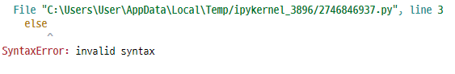

```python
# 코드를 실행시켜보고 EOL 오류(따옴표 오류)를 확인해봅시다.
print('hi)
```

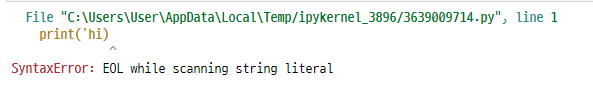

```python
# 정확한 위치를 지정하지 않을 수도 있으므로 지정된 위치 전후를 모두 확인해야합니다.

# 아래 코드의 조건문에는 콜론이 누락되어 있습니다.
# 코드를 실행시켜보고 문법 오류를 확인해보세요.
if True print('참')
```

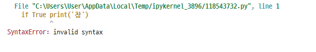

### 1.2 예외(Exception)

> 실행 도중 예상하지 못한 상황(exception)을 맞이하면, 프로그램 실행을 멈춥니다.

- 문법적으로는 옳지만, 실행시 발생하는 에러입니다.

- *아래 제시된 모든 에러는 `Exception`을 상속받아 이뤄진다.*

```python
# ZeroDivisionError를 확인해봅시다.
15 / 0
```

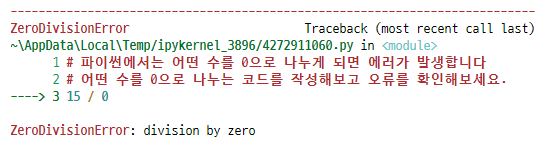

```python
# NameError를 확인해봅시다. 
print(abc)
```

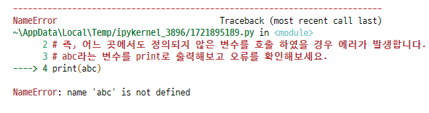

```python
# TypeError를 확인해봅시다.
1 + '1'
```

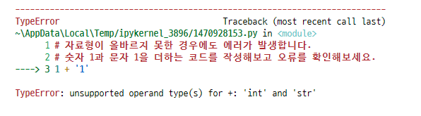

```python
# 함수호출 과정에서 다양한 오류를 확인할 수 있습니다. 
# (1) 필수 매개변수가 누락된 경우를 살펴봅시다.
import random
random.sample([1, 2, 3])
```

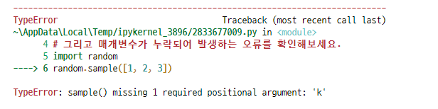

```python
# 함수호출 과정에서 다양한 오류를 확인할 수 있습니다. 
# (2) 매개변수 개수가 초과해서 들어온 경우를 살펴봅시다.
random.choice([1, 2, 3], 6)
```

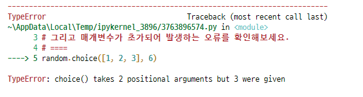

```python
# ValueError를 확인해봅시다.
int('3.5')
```

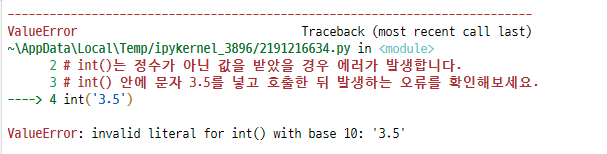

```python
# IndexError를 확인해봅시다.
empty_list = []
empty_list[-1]
```

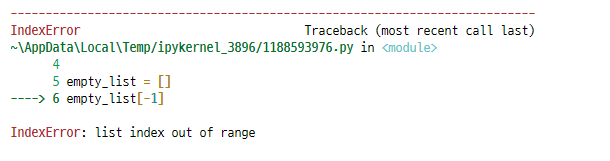

```python
# KeyError를 확인해봅시다. 
songs = {'sia': 'candy cane lane'}
songs['queen']
```

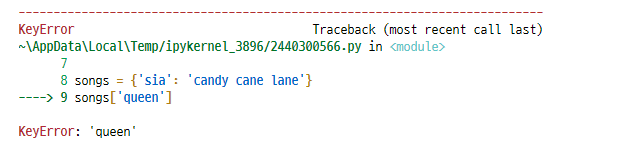


## 2 예외 처리(Exception Handling)

### 2.1 `try` & `except`

`try` 문을 이용하여 예외 처리를 할 수 있습니다.

#### 2.1.1 기초 문법

```python
try:
    <코드 블럭 1>
except (예외):
    <코드 블럭 2>
```

- `try` 아래의 코드블락(code block)이 실행됩니다.
- 예외가 발생되지 않으면, **`except`없이 실행이 종료 됩니다.**
- 예외가 발생하면, **남은 부분을 수행하지 않고**, `except`가 실행됩니다.

```python
try:
    num = input()
    print(int(num))
except ValueError:
    print('숫자를 입력하세요.')
# asdf
# 숫자를 입력하세요.
```


#### 2.1.2 복수의 예외 처리

하나 이상의 예외를 모두 처리할 수 있습니다.

괄호가 있는 튜플로 여러 개의 예외를 지정할 수 있습니다.

**활용법**

```python
try:
    <코드 블럭 1>
except (예외1, 예외2):
    <코드 블럭 2>


try:
    <코드 블럭 1>
except 예외1:
    <코드 블럭 2>
except 예외2:
    <코드 블럭 3>
```


```python
try:
    num = input('숫자를 입력해주세요.')
    print(100 / int(num))
except ValueError:
    print('숫자를 입력하라니깐요!!')
except ZeroDivisionError:
    print('0으로 어떻게 나눔???')
# 숫자를 입력해주세요.0
# 0으로 어떻게 나눔???
```

```python
try:
    num = input('값을 입력하시오: ')
    100/int(num)
except Exception: # Exception 은 가장 큰 범주
    print('모르겠지만 에러야')
except ValueError:
    print('숫자를 넣어')
```


#### 2.1.3 `else`

- 에러가 발생하지 않는 경우 수행되는 문장은 `else`를 이용합니다.
- 모든 except 절 뒤에와야 합니다.
- try 절이 예외를 일으키지 않을 때 실행되어야만 하는 코드에 적절합니다.

**활용법**

```python
try:
    <코드 블럭 1>
except 예외:
    <코드 블럭 2>
else:
    <코드 블럭 3>
```

```python
try:
    numbers = [1, 2, 3]
    number = numbers[2]
except IndexError:
    print('오류 발생')
else:
    print(number * 100)
# 300

try:
    numbers = [1, 2, 3]
    number = numbers[100]
except IndexError:
    print('오류 발생')
else:
    print(number * 100)
# 오류 발생
```


#### 2.1.4 `finally`

- 반드시 수행해야하는 문장은 `finally`를 활용합니다.
- 즉, 모든 상황에 실행되어야만 하는 코드를 정의하는데 활용합니다.
- 예외의 발생 여부과 관계없이 try 문을 떠날 때 항상 실행합니다.

**활용법**

```python
try:
    <코드 블럭 1>
except 예외:
    <코드 블럭 2>
finally:
    <코드 블럭 3>
```


```python
# Finally 동작 예제

def my_func1(string):
    try:
        result = int(string)
        return result
    except:
        return False
    finally:
        print(f'Finally:{string}')

def my_func2(string):
    try:
        result = int(string)
        return result
    except:
        return False
    print(string)

print(my_func1('3.5'))
print('--'*15)
print(my_func2('3.5'))

# Finally:3.5
# False
# ------------------------------
# False
```


#### 2.1.5 에러 메시지 처리 `as`

`as` 키워드를 활용하여 에러 메시지를 보여줄 수도 있습니다.

**활용법**

```python
try:
    <코드 블럭 1>
except 예외 as err:
    <코드 블럭 2>
```


```python
# 아래 코드에서 as를 활용하여 에러 메세지를 그 아래 코드 블럭에 넘겨보세요.
# 그리고 as로 명명한 에러 메세지를 print를 이용하여 출력해보세요.

try:
    empty_list = []
    print(empty_list[-1])
except IndexError as err:
    print(f'{err}, 에러 발생!!')

# list index out of range, 에러 발생!!
```


### 2.2 예외 발생 시키기(Exception Raising)

#### 2.2.1 `raise`

`raise`를 통해 예외를 강제로 발생시킬 수 있습니다.

**활용법**

```python
raise <에러>('메시지')
```

```python
raise ValueError('hi')
```


```python
def avg(scores):
    if not len(scores):
        raise Exception('학생이 없습니다.')
    
    return sum(scores) / len(scores)
avg([])
```

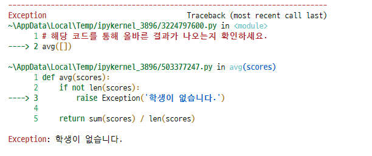


#### 2.2.3 `assert`

`assert` 문은 예외를 발생시키는 다른 방법입니다.

보통 **상태를 검증하는데 사용**되며 무조건 `AssertionError`가 발생합니다.

**활용법**

```python
assert Boolean expression, error message

assert len([1, 2]) == 1, '길이가 1이 아닙니다.'
```

위의 검증식이 거짓일 경우를 발생합니다.

일반적으로 디버깅용도로 사용됩니다.

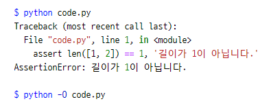


