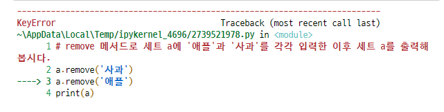
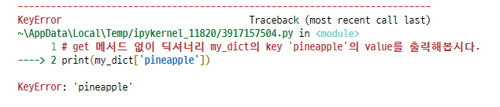
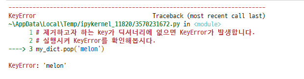

# 데이터 구조(Data Structure) II

- 알고리즘에 빈번히 활용되는 순서가 없는(unordered) 데이터 구조
  - 세트(Set)
  - 딕셔너리(Dictionary)

## 1 세트(Set)

> 변경 가능하고(mutable), 순서가 없고(unordered), 순회 가능한(iterable)

데이터 구조로서의 세트(set)와 조작법(method)

### 1.1 추가 및 삭제

#### 1.1.1 `.add(elem)`

elem을 세트에 추가합니다.

```python
a = {'사과', '바나나', '수박'}
a.add('포도')
a.add('포도')
print(a)
# {'바나나', '사과', '포도', '수박'}
```


#### 1.1.2 `.update(*others)`

여러 값을 추가합니다.

인자로는 반드시 iterable 데이터 구조를 전달해야합니다.

```python
a = {'사과', '바나나', '수박'}
a.update({'토마토', '토마토', '딸기'}, {'포도', '레몬'})
print(a)
# {'토마토', '수박', '레몬', '딸기', '포도', '사과', '바나나'}
```


#### 1.1.3 `.remove(elem)`

elem을 세트에서 삭제하고, 없으면 KeyError가 발생합니다.

```python
a = {'사과', '바나나', '수박'}
a.remove('사과')
print(a)
# {'수박', '바나나'}

a.remove('애플')
```




#### 1.1.4 `.discard(elem)`

elem을 세트에서 삭제하고 없어도 에러가 발생하지 않습니다.

```python
a = {'사과', '바나나', '수박'}
a.discard('포도')
a.discard('수박')
print(a)
# {'사과', '바나나'}
```


#### 1.1.5 `.pop()`

**임의의 원소**를 제거해 반환합니다.

```python
a = {'사과', '바나나', '수박', '아보카도'}
print(a.pop())
# 사과
```


## 2 딕셔너리(Dictionary)

> 변경 가능하고(mutable), 순서가 없고(unordered), 순회 가능한(iterable)
>
> `Key: Value` 페어(pair)의 자료구조

데이터 구조로서의 딕셔너리(dictionary)와 조작법(method)

### 2.1 조회

#### 2.1.1 `.get(key[, default])`

key를 통해 value를 가져옵니다.

절대로 KeyError가 발생하지 않습니다. default는 기본적으로 None입니다.

```python
my_dict = {'apple': '사과', 'banana': '바나나', 'melon': '멜론'}
print(my_dict['pineapple'])
```



```python
print(my_dict.get('pineapple'))
# None
print(my_dict.get('apple'))
# 사과
print(my_dict.get('pineapple',0))
# 0
```


### 2.2 추가 및 삭제

#### 2.2.1 `.pop(key[, default])`

key가 딕셔너리에 있으면 제거하고 그 값을 돌려줍니다. 그렇지 않으면 default를 반환합니다.

default가 없는 상태에서 딕셔너리에 없으면 KeyError가 발생합니다.

```python
my_dict = {'apple': '사과', 'banana': '바나나'}
my_dict.pop('apple')
print(my_dict)
# {'banana': '바나나'}

my_dict.pop('melon')
```



```python
# pop 메서드의 두번째 인자로 default 값을 설정 해 KeyError가 발생하지 않도록 할 수 있습니다.
# pop 메서드로 딕셔너리 my_dict의 key 'melon'을 제거하고 해당 key가 없다면 0을 반환하도록 해봅시다.
my_dict.pop('melon',0)
# 0
```


#### 2.2.2 `.update()`

값을 제공하는 key, value로 덮어씁니다.

```python
my_dict = {'apple': '사과', 'banana': '바나나', 'melon': '멜론'}
my_dict.update({'apple': '사과아', 'banana': '버내너', 'carrot': '당근'})
print(my_dict)
# {'apple': '사과아', 'banana': '버내너', 'melon': '멜론', 'carrot': '당근'}
```


### 2.3 딕셔너리 순회(반복문 활용)

딕셔너리에 `for` 문을 실행하면 기본적으로 다음과 같이 동작합니다.

```python
grades = {'john':  80, 'eric': 90, 'justin': 90}
for student in grades:
    print(student)
# john
# eric
# justin
```

딕셔너리의 **key**를 접근할 수 있으면 **value**에도 접근할 수 있기 때문입니다.

따라서 딕셔너리의 value를 출력하기 위해서는 아래와 같이 작성합니다.

```python
for student in grades:
    print(grades[student])
# 80
# 90
# 90
```

- dictionary에서 `for`를 활용하는 4가지 방법

```python
# 0. dictionary 순회 (key 활용)
for key in dict:
    print(key)
    print(dict[key])


# 1. `.keys()` 활용
for key in dict.keys():
    print(key)
    print(dict[key])


# 2. `.values()` 활용
# 이 경우 key는 출력할 수 없음
for val in dict.values():
    print(val)


# 3. `.items()` 활용
for key, val in dict.items():
    print(key, val)
```


```python
# 아래의 grades를 활용하여 4가지 반복문을 직접 작성해봅시다.
grades = {'john':  80, 'eric': 90, 'justin': 90}

for student in grades:
    print(grades[student])

for key in grades.keys():
    print(key)
    
for value in grades.values():
    print(value)

for key, value in grades.items():
    print(key, value)

# 80
# 90
# 90
# john
# eric
# justin
# 80
# 90
# 0
# john 80
# eric 90
# justin 90
```


#### 2.3.1 [연습] 딕셔너리 순회

> 혈액형 검사한 결과가 담긴 `blood_types`이 주어졌을때, 해당 딕셔너리를 순회하며, `key`와 `value`를 출력해보세요.

**[출력 예시]**

```
A형은 40명입니다.
B형은 11명입니다.
AB형은 4명입니다.
O형은 45명입니다.
```

```python
blood_types = {'A': 40, 'B': 11, 'AB': 4, 'O': 45}
#1
for blood in blood_types:
    print(f'{blood}은 {blood_types[blood]}명입니다.')
#2
for blood in blood_types.keys():
    print(f'{blood}은 {blood_types[blood]}명입니다.')
#3
for blood, cnt in blood_types.items():
    print(f'{blood}은 {cnt}명입니다.')
```


#### 2.3.2 [실습] 딕셔너리 순회

> 혈액형 검사한 결과가 담긴 `blood_types`이 주어졌을때, 해당 검사에 참가한 사람들의 총합을 구해보세요.

**[출력 예시]**

```
검사에 참가한 사람은 총 100명입니다.
```

```python
blood_types = {'A': 40, 'B': 11, 'AB': 4, 'O': 45}
#1
total = 0
for blood in blood_types:
    total += blood_types[blood]
    
print(f'검사에 참가한 사람은 총 {total}명 입니다.')

#2
total = 0
for value in blood_types.values():
    total += value
    
print(f'검사에 참가한 사람은 총 {total}명 입니다.')

#3
total = sum([ value for value in blood_types.values()])
print(f'검사에 참가한 사람은 총 {total}명 입니다.')

#4
total = sum(blood_types.values())
print(f'검사에 참가한 사람은 총 {total}명 입니다.')
```


#### 2.3.3 [응용] 딕셔너리 구축하기(counter)

> 리스트가 주어질 때, 각각의 요소의 개수를 value 값으로 갖는 딕셔너리를 만드세요.

------

**[출력 예시]**

```
{'great': 2, 'expectations': 1, 'the': 2, 'adventures': 2, 'of': 2, 'sherlock': 1, 'holmes': 1, 'gasby': 1, 'hamlet': 1, 'huckleberry': 1, 'fin': 1}
```

```python
book_title =  ['great', 'expectations', 'the', 'adventures', 'of', 'sherlock', 'holmes', 'the', 'great', 'gasby', 'hamlet', 'adventures', 'of', 'huckleberry', 'fin']

# 1. dict[key]로 접근하는 방법을 통해 작성해보세요.
word_count = {}
for title in book_title:
    if title in word_count:
        word_count[title] += 1
    else:
        word_count[title] = 1
print(word_count)

# 2. count 메서드를 활용해 작성해보세요.
word_count = {}
for title in book_title:
    word_count[title] = book_title.count(title)

print(word_count)

# 3. get 메서드를 활용해 작성해보세요.
word_count = {}
for title in book_title:
    word_count[title] = book_title.get(title, 0) + 1

print(word_count)
```

> ```
> get(key[, default])
> ```

- key 가 딕셔너리에 있는 경우 key 에 대응하는 값을 돌려주고, 그렇지 않으면 default 를 돌려줍니다.


### 2.4 Dictionary comprehension

dictionary도 comprehension을 활용하여 만들 수 있습니다.

#### 2.4.1 활용법

`iterable`에서 `dict`를 생성할 수 있습니다.

```python
{키: 값 for 요소 in iterable}

dict({키: 값 for 요소 in iterable})
```

```python
cubic = {i: i**3 for i in range(1, 9)}

print(cubic)
# {1: 1, 2: 8, 3: 27, 4: 64, 5: 125, 6: 216, 7: 343, 8: 512}

blood_types = {'A': 40, 'B': 11, 'AB': 4, 'O': 45}
blood_types = {f'-{key}' : value for key, value in blood_types.items()}

print(blood_types)
# {'-A': 40, '-B': 11, '-AB': 4, '-O': 45}
```


### 2.5 Dictionary comprehension + 조건

List comprehension과 유사하게, 조건문에 참인 식으로 딕셔너리를 생성합니다.


#### 2.5.1 활용법

```python
{키: 값 for 요소 in iterable if 조건식}
```


#### 2.5.2 Dictionary comprehension 사용해보기

```python
dusts = {'서울': 72, '인천': 82, '제주': 29, '동해': 45}
dust_dict = {key : dusts[key] for key in dusts if dusts[key] > 80}
print(dust_dict)
# {'인천': 82}

dust_dict = {key : '나쁨' if value > 80 else '보통' for key, value in dusts.items() }
print(dust_dict)
# {'서울': '보통', '인천': '나쁨', '제주': '보통', '동해': '보통'}

result = {key : '매우나쁨' if value > 150 else '나쁨' if value > 80 else '보통' if value > 30 else '좋음' for key, value in dusts.items()}
print(result)
# {'서울': '보통', '인천': '나쁨', '제주': '좋음', '동해': '보통'}
```


