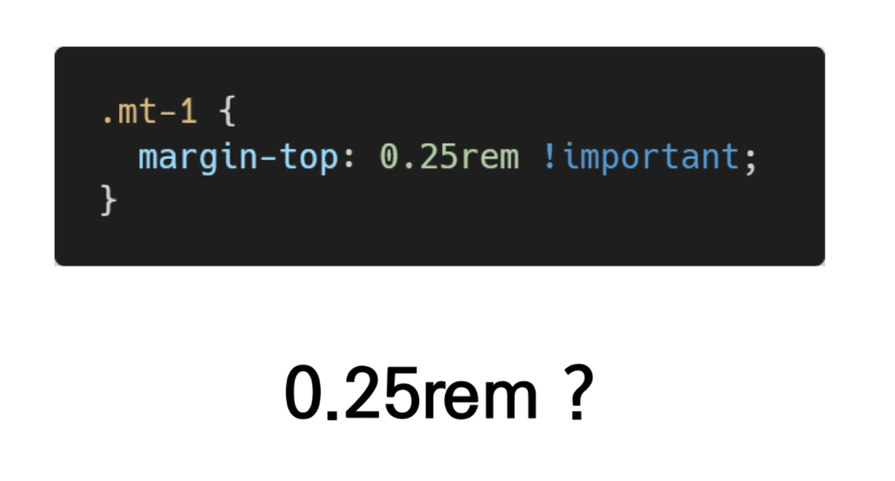
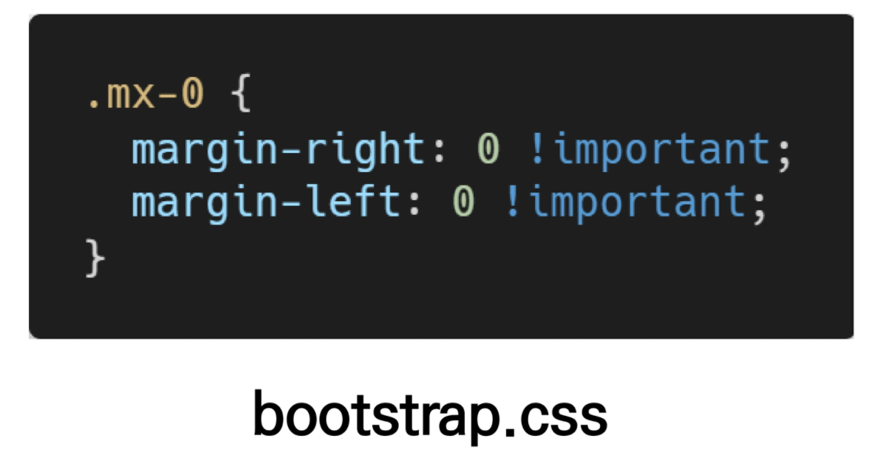
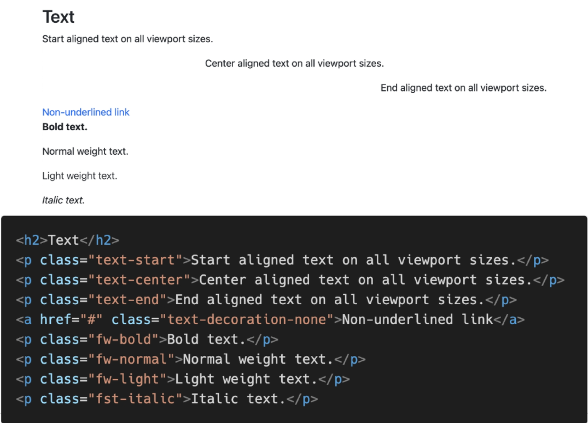
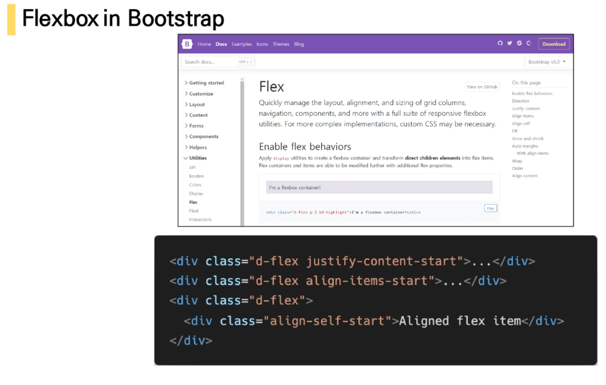
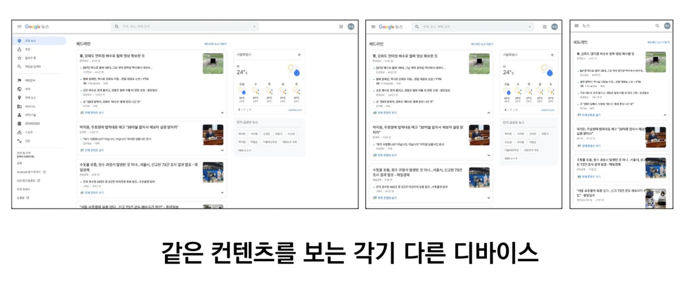
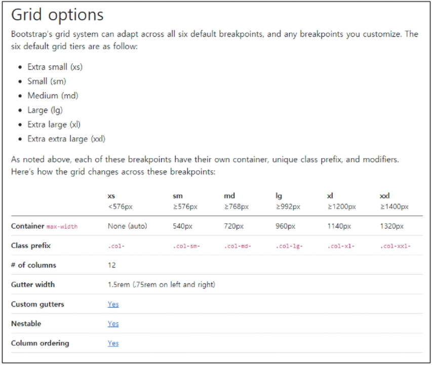

# Bootstrap

## CDN (Content Delivery(Distribution) Network)

>컨텐츠(CSS, JS, Image, Text 등)을 효율적으로 전달하기 위해 여러 노드에 가진 네트워크에 데이터를 제공하는 시스템.

###### 개별 end-user의 가까운 서버를 통해 빠르게 전달 가능(지리적 이점) 외부 서버를 활용함으로써 본인 서버의 부하가 적어짐

### spacing

------

-----

------

------

### color

----

### ex)

------------

---------------

### Responsive Web

### Responsive Web Design

- 다양한 화면 크기를 가진 디바이스들이 등장함에 따라 responsive web design 개념이 등장
- 반응형 웹은 별도의 기술 이름이 아닌 웹 디자인에 대한 접근 방식, 반응형 레이아웃 작성에 도움이 되는 사례들의 모음 등을 기술하는데 사용되는 용어
- ex )
  - Media Querise, Flexbox, Bootstrap Grid System, The viewport meta tag

-----

## Bootstrap Grid System

- Bootstrap Grid system 은 flexbox로 제작됨
- container, rows, column으로 컨텐츠를 배치하고 정렬
- 반드시 기억해야 할 2가지 !
  - 12개의 column
  - 6개의 grid breakpoints

### Grid system breakpoints

-----------

### Grid system breakpoints

