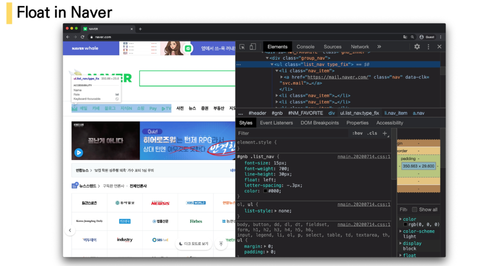

# CSS Layout

- Display
- Position
- Float
- Flexbox
- Grid System

## Float

- 본래는 이미지 좌, 우측 주변으로 텍스트를 둘러싸는 레이아웃을 위해 도입
- 더 나아가 이미지가 아닌 다른 요소들에도 적용해 웹 사이트의 전체 레이아웃을 만드는데까지 발전


#### Float 속성

- none: 기본값
- left : 요소를 왼쪽으로 띄움
- right : 요소를 오른쪽으로 띄움


#### Float clear

- 선택한 요소의 맨 마지막 자식으로 가상 요소를 하나 생성
- 보통 content 속성과 함께 짝지어, 요소에 장식용 콘텐츠를 추가할 때 사용
- 기본값은 inline

- 선행 floating 요소 다음일 수 있는지 또는 그 아래로 내려가(해제되어(cleared))야 하는 지를 지정
- clear 속성은 부동 및 비부동 요소 모두에 적용됨


>관련 링크 : https://developer.mozilla.org/ko/docs/Web/CSS/clear


### Float 정리

- flexbox 및 그리드 레이아웃과 같은 기술이 나오기 이전에 Float은 열 레이아웃을 만드는데 사용됨
- flexbox와 grid의 출현과 함께 결국 원래 텍스트 블록 내에서 float이미지를 위한 역할로 돌아감

(mdn 에서는 더 새롭고 나은 레이아웃 기술이 나와있으므로 레거시 레이아웃 기술로 분류해놓기도)

- 웹에서 여전히 사용하는 경우도 있음 (ex. naver nav bar)




# Flexbox


## CSS Flexible Box Layout

- 요소 간 공간 배분과 정렬 기능을 위한 1차원(단방향) 레이아웃
- 크게 딱 2가지만 기억하자. 요소와 축!
- 요소
  - Flex Container (부모 요소)
  - Flex Item (자식 요소)

- 축
  - main axis (메인축)
  - cross axis (교차축)


## Flexbox의 구성 요소

- Flex Container (부모 요소)
  - flexbox 레이아웃을 형성하는 가장 기본적인 모델
  - Flex Item들이 놓여있는 영역
  - display 속성을 flex 혹은 inline-flex로 지정
- Flex Item (자식 요소)
  - 컨테이너의 컨텐츠


### Flex에 적용하는 속성

- 배치 방향 설정 : `flex-direction`
- 메인축 방향 정렬 : `justify-content`
- 교차축 방향 정렬 : `align-items` , `align-self` , `align-content`
- 기타 
  - `flex-wrap` , `flex-flow` , `flex-grow` , `order`


#### flex_direction

> main-axis 방향만 바뀐다.
>
> flexbox는 단방향 레이아웃이기 때문이다.


- content : 여러줄
- items : 한 줄
- self : flex item 개별 요소

```css
ex)
justify-content : 메인축 기준 여러 줄 정렬
align-items : 교차축 기준 한 줄 정렬
align-self : 교차축 기준 선택한 요소 하나 정렬
```


#### content & items & self

- justify-content
  - flex-start, flex-end, center, space-between, space-around, space-evenly
- align-items
  - flex-start, flex-end, center, stretch, baseline
- align-content
  - flex-start, flex-end, center, stretch, space-between, space-around
- align-self
  - auto, flex-start, flex-end, center, baseline, stretch


##### 예시를 통해 확인해보기!


----

---


## 정리

- **display : flex**

  - #### **정렬하려는 부모 요소에 작성**

  - inline-flex : flex 영역을 블록으로 쓰지 않고 인라인 블록으로 사용

- **flex-direction**

  - #### **item이 쌓이는 방향 설정**

  - main-axis 가 변경됨

  - row (기본값) : 주축의 방향이 왼쪽에서 오른쪽

  - row-reverse : 주축의 방향이 오른쪽에서 왼쪽

  - column : 주축의 방향이 위에서 아래

  - column-reverse : 주축의 방향이 아래에서 위

- **flex-wrap**

  - #### **요소들이 강제로 한 줄에 배치 되게 할 것인지 여부 설정**

  - nowrap (기본 값) : 모든 아이템들 한 줄에 나타내려고 함 >> 그래서 자리가 없어도 튀어나옴

  - wrap : 넘치면 그 다음 줄로

  - wrap-reverse : 넘치면 그 윗줄로(역순)

- **flex-flow**

  - #### flex-direction 과 flex-wrap 의  shorthand

  - flex-direction 과 flex-wrap 에 대한 설정 값을 차례로 작성

  - ex ) flex-flow : row nowrap;


- **justify-content**

  - #### main 축 정렬

  - flex-start (기본 값) : 시작 지점부터 차례로 쌓임

  - flex-end : 쌓이는 방향이 뒤쪽부터 시작 ( 순서가 역순이 되는게 아니라 아이템들이 뒤로 몰리는 형식)

  - center : 정 중 앙

  - space-between : 좌우 정렬 (item들 간의 간격이 동일)

  - space-around : 균등 좌우 정렬 ( 내부 요소 여백은 외곽 여백의 2배)

  - space-evenly : 균등 정렬 ( 내부 요소 여백과 외각 여백 모두 동일)


- **align-items**

  - #### cross 축 정렬

  - stretch (기본 값) : 컨테이너를 가득 채움

  - flex-start : 위

  - flex-end : 아래

  - center : 가운데

  - baseline : item 내부의 text에 기준선을 맞춤


- **align-self**
  - 개별 item에 적용하는 속성 ( 정렬 방식은 align-items와 동일, 속성이 적용되는 대상이 다름)
  - auto (기본 값)
  - flex-start
  - flex-end
  - center
  - baseline
  - stretch : 부모 컨테이너에 자동으로 맞춰서 늘어남


- order
  - 작은 숫자 일수록 앞(우선 쌓이는 방향) 으로 이동
  - 기본 값 : 0
- flex-grow
  - 주축에서 남는 공간을 항목들에게 분배하는 방법
  - 각 아이템의 상대적 비율을 정하는 것은 아님
  - 기본 값 : 0
  - 음수 불가능

