## 현재의 웹 표준

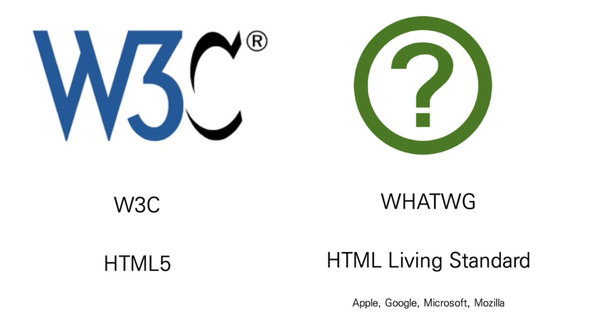

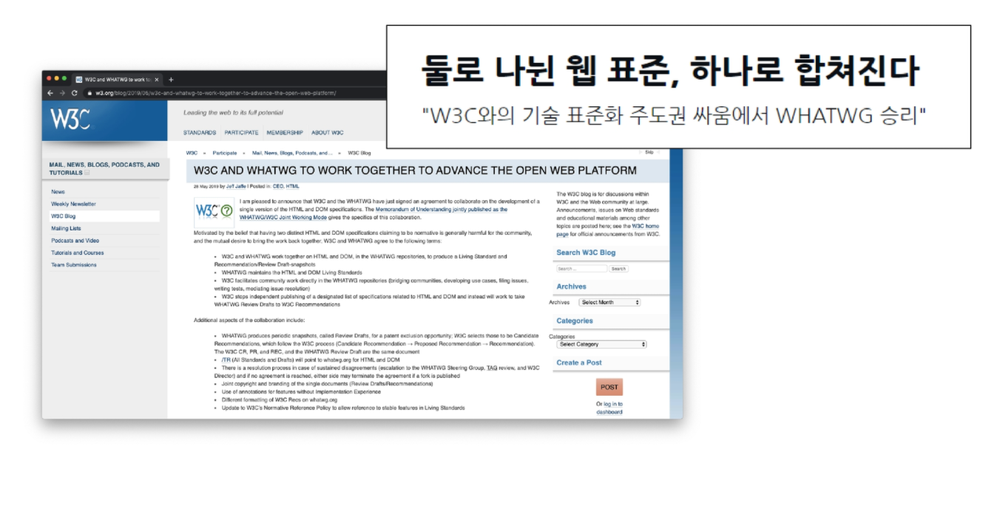

----

### Markup language

- 태그 등을 이용하여 문서나 데이터의 구조를 명시하는 언어
- 프로그래밍 언어와는 다르게 단순하게 데이터를 표현하기만 한다.
- 대표적인 예 - HTML, Markdown

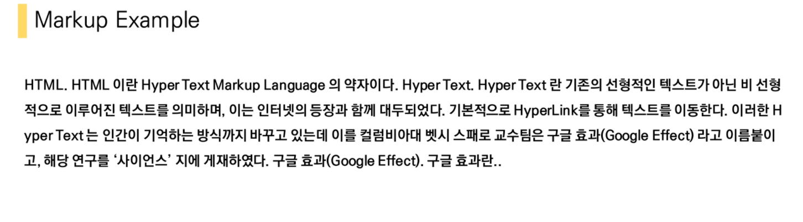

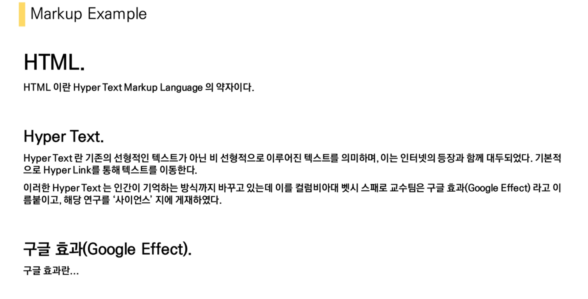

----


# HTML

####  - Hyper Text Markup Language

>  웹 페이지를 작성하기 위한(구조를 잡기 위한) 언어
>
> 웹 컨텐츠의 의미와 구조를 정의

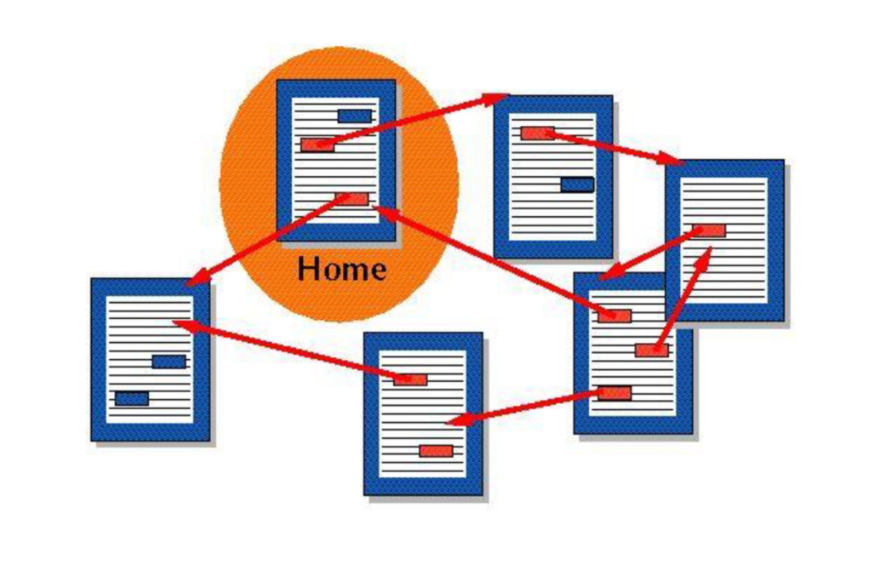

- Hyper
  - 텍스트 등의 정보가 동일 선상에 있는 것이 아니라 다중으로 연결되어 있는 상태
- Hyper Text
  - 참조(하이퍼링크)를 통해 사용자가 한 문서에서 다른 문서로 즉시 접근할 수 있는 텍스트


## HTML 기본구조

#### DOM(Document Object Model) 트리

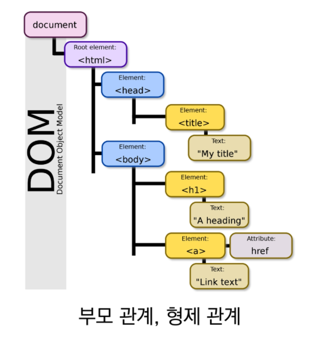

ex)

```html
<body>
  <h1>웹문서</h1>
    <ul>
      <li>HTML</li>
      <li>CSS</li>
    </ul>
</body>
```

- DOM은 문서의 구조화된 표현을 제공하며, 프로그래밍 언어가 DOM구조에 접근할 수 있는 방법을 제공하여 그들이 문서 구조, 스타일 내용 등을 변경 할 수 있게 도움
- DOM은 동일한 문서를 표현하고, 저장하고, 조작하는 방법을 제공
- Web Page의 **객체 지향 표현**


#### 요소(element)

> HTML의 요소는 태그와 내용(contents)로 구성되어 있다.

- HTML 요소는 시작 태그와 종료 태그 그리고 태그 사이에 위치한 내용으로 구성
  - 태그는 컨텐츠를 감싸는 것으로 그 정보의 성격과 의미를 정의
- 요소는 중첩될 수 있음
  - 요소의 중첩을 통해 하나의 문서를 구조화
  - 여는 태그와 닫는 태그의 쌍을 잘 확인해야함
  - 오류를 반환하지 않음 >> 그냥 레이아웃이 깨진 상태로 출력 >> 디버깅이 힘듦


#### 속성(attribute)

> 태그별로 사용할 수 있는 속성은 다르다.

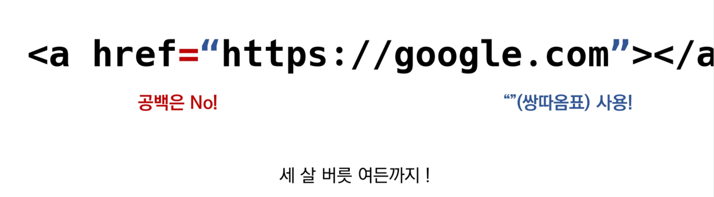


- 속성을 통해 태그의 부가적인 정보를 설정할 수 있음
- 요소의 시작 태그에 작성하며, 보통 이름과 값이 하나의 쌍으로 존재

- 태그와 상관없이 사용 가능한 속성(HTML Global Attribute)들도 있음


##### HTML Global Attribute

- 모든 HTML 요소가 공통으로 사용할 수 있는 속성 (몇몇 요소에는 아무 효과가 없을 수 있음)
  - `id`, `class`
  - `hidden`
  - `lang`
  - `style`
  - `tabindex`
  - `title`


#### 시맨틱 태그

- HTML5에서 의미론적 요소를 담은 태그의 등장. ~~div~~
- 대표적인 태그
  - `hearder` : 문서 전체나 섹션의 헤더(머릿말 부분)
  - `nav` : 내비게이션
  - `aside` : 사이드에 위치한 공간, 메인 콘텐츠와 관련성이 적은 콘텐츠
  - `section` : 문서의 일반적인 구분, 컨텐츠의 그룹을 표현
  - `article` : 문서, 페이지, 사이트 안에서 독립적으로 구분되는 영역
  - `footer` : 문서 전체나 섹션의 푸터(마지막 부분)

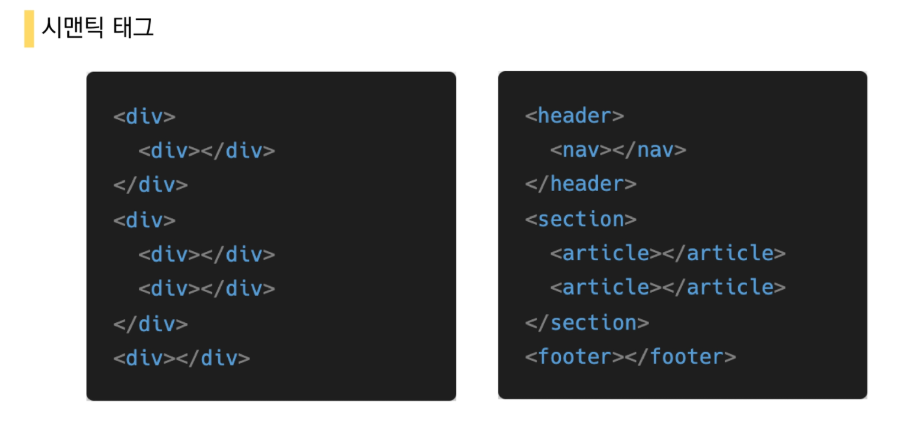

- 개발자 및 사용자 뿐만 아니라 검색엔진 등에 의미 있는 정보의 그룹을 태그로 표현
- 단순히 구역을 나누는 것 뿐만 아니라 '의미'를 가지는 태그들을 활용하기 위한 노력
- Non semantic 요소는 `div`, `span` 등이 있으며 `h1`, `table` 태그들도 시맨틱 태그로 볼 수 있음
- 요소의 의미가 명확해지기 때문에 코드의 가독성을 높이고 유지보수를 쉽게 함
- 검색엔진최적화를 위해서 메타태그, 시맨틱 태그 등을 통한 마크업을 효과적으로 할 필요가 있다.


## HTML 문서 구조화

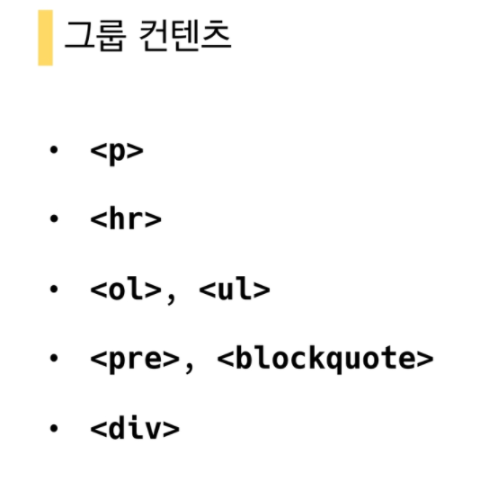

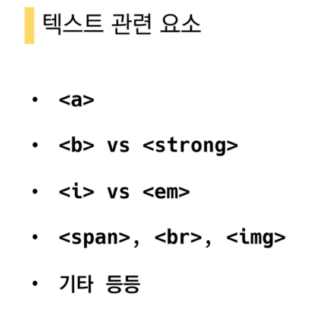

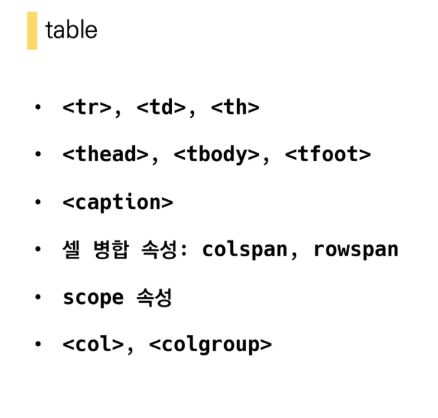

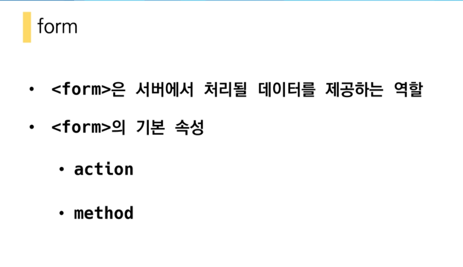

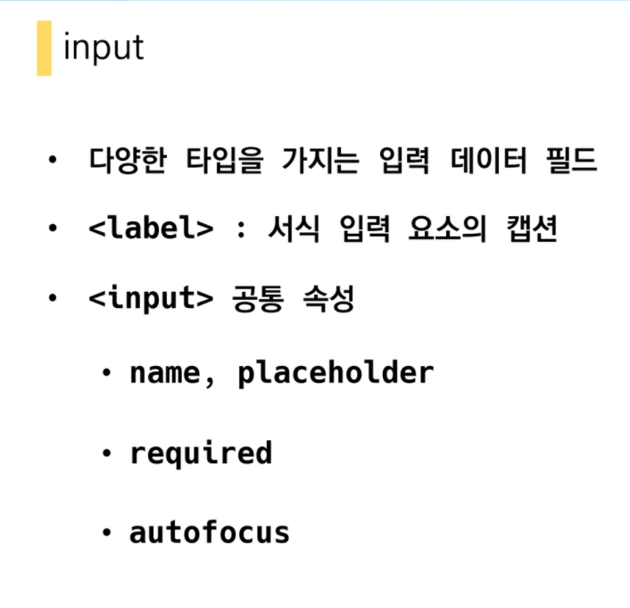

- <input> 요소의 동작은 type에 따라 달라지므로, 각각의 내용을 숙지할 것.


