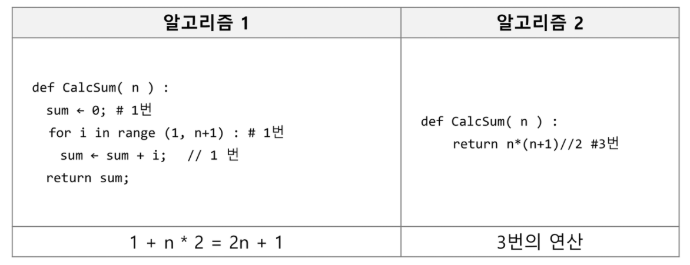

# 알고리즘

> 유한한 단계를 통해 문제를 해결하기 위한 절차나 방법이다. 주로 컴퓨터용어로 쓰이며, 컴퓨터가 어떤 일을 수행하기 위한 단계적 방법을 말한다.

### 컴퓨터 분야에서 알고리즘을 표현하는 방법

#### 1. 슈더코드

#### 2. 순서도

### 좋은 알고리즘이란?

- 정확성 : 얼마나 정확하게 동작하는가
- 작업량 : 얼마나 적은 연산으로 원하는 결과를 얻어내는가
- 메모리 사용량 : 얼마나 적은 메모리를 사용하는가
- 단순성 : 얼마나 단순한가
- 최적성 : 더 이상 개선할 여지없이 최적화 되었는가

### 알고리즘의 성능 측정 방법

> 주어진 문제를 해결하기 위해 사용가능 한 여러 개의 다양한 알고리즘 중 어떤 알고리즘을 사용해야 하는가?

##### 알고리즘의 성능 분석 필요

- 많은 문제에서 성능 분석의 기준으로 알고리즘의 작업량을 비교한다.

### 시간복잡도

> 알고리즘의 작업량을 표현할 때 시간복잡도로 표현한다.

- 실제 걸리는 시간을 측정
- 실행되는 명령문의 개수를 계산

#### 빅-오(O) 표기법

- 시간 복잡도 함수 중에서 가장 큰 영향력을 주는 n에 대한 항만을 표시
- 계수(Coefficient)는 생략하여 표시

- ex)
  - n개의 데이터를 입력 받아 저장한 후 각 데이터에 1씩 증가시킨 후 각 데이터를 화면에 출력하는 알고리즘의 시간복잡도는 어떻게 되나?
  - 데이터 입력 : O(n)
  - 데이터 1씩 증가 : O(n)
  - 각 데이터 출력 : O(n)
  - O(3n) >> O(n) : 계수 3 제거

