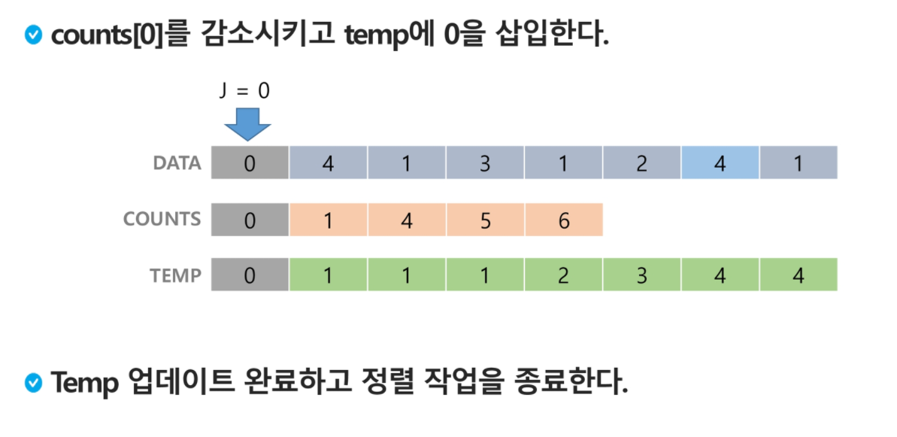
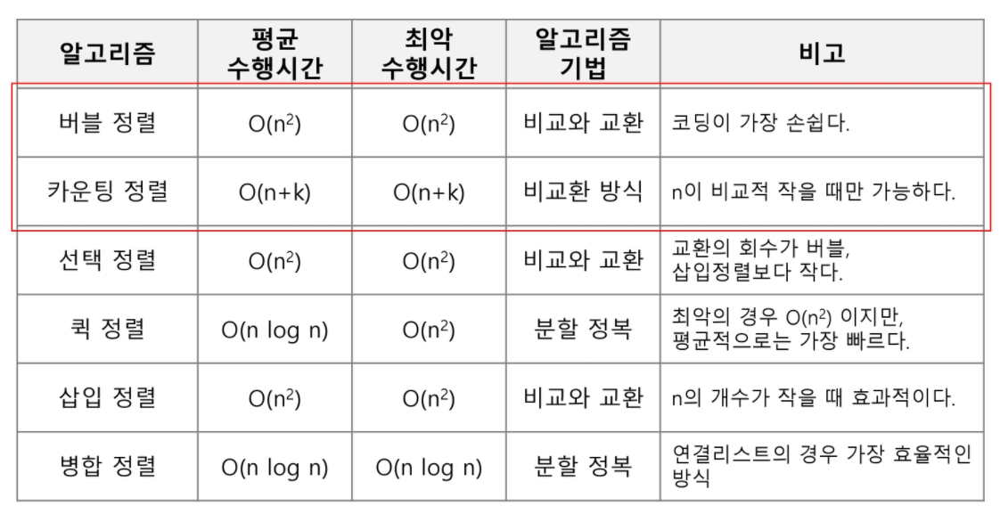

# 정렬

> 2개 이상의 자료를 특정 기준에 의해 작은 값부터 큰 값(오름차순 : ascending), 혹은 그 반대의 순서대로(내림차순 : descending) 재배열 하는 것

##### 키

- 자료를 정렬하는 기준이 되는 특정 값

### 대표적인 정렬 방식의 종류

- 버블 정렬 (Bubble Sort)
- 카운팅 정렬 (Counting Sort)
- 선택 정렬 (Selection Sort)
- 퀵 정렬 (Quick Sort)
- 삽입 정렬 (Insertion Sort)
- 병합 정렬 (Merge Sort)

## 버블 정렬(Bubble Sort)

> 인접한 두 개의 원소를 비교하며 자리를 계속 교환하는 방식

#### 정렬 과정

- 첫 번째 원소부터 인접한 원소끼리 계속 자리를 교환하면서 맨 마지막 자리까지 이동한다.
- 한 단계가 끝나면 가장 큰 원소가 마지막 자리로 정렬된다.
- 교환하며 자리를 이동하는 모습이 물 위에 올라오는 거품 모양과 같다고 하여 버블 정렬이라고 한다.

#### 시간 복잡도 : O(n^2)

----

## 카운팅 정렬(Counting Sort)

> 항목들의 순서를 결정하기 위해 집합에 각 항목이 몇 개씩 있는지 세는 작업을 하여, 선형 시간에 정렬하는 효율적인 알고리즘

#### 제한 사항

- 정수나 정수로 표현할 수 있는 자료에 대해서만 적용 가능 : 각 항목의 발생 회수를 기록하기 위해, 정수 항목으로 인덱스 되는 카운트들의 배열을 사용하기 때문이다
- 카운트들을 위한 충분한 공간을 할당하려면 집합 내의 가장 큰 정수를 알아야 한다.

#### 시간 복잡도 : O(n + k) : n은 리스트 길이, k는 정수의 최대값

----

- 정렬된 집합에서 각 항목의 앞에 위치할 항목의 개수를 반영하기 위해 counts의 원소를 조정한다.

---

### 완전 검색

> 완전 검색 방법은 문제의 해법으로 생각할 수있는 모든경우의 수를 나열해보고 확인하는 기법이다.
>
> Brute-force 혹은 generate-and test 기법이라고도 불리 운다.
>
> 모든 경우의 수를 테스트한 후, 최종 해법을 도출한다.
>
> 일반적으로 경우의 수가 상대적으로 작을 때 유용하다.
>
> 모든 경우의 수를 생성하고 테스트하기 때문에 수행 속도는 느리지만, 해답을 찾아내지 못할 확률이 작다.
>
> 자격검정평가 등에서 주어진 문제를 풀 때, 우선 완전 검색으로 접근하여 해답을 도출한 후, 성능 개선을 위해 다른 알고리즘을 사용하고 해답을 확인하는 것이 바람직하다.

----

### 탐욕(Greedy) 알고리즘

> 탐욕 알고리즘은 최적해를 구하는 데 사용되는 근시안적인 방법
>
> 여러 경우 중 하나를 결정해야 할 때마다 그 순간에 최적이라고 생각되는 것을 선택해 나가는 방식으로 진행하여 최종적인 해답에 도달한다.
>
> 각 선택의 시점에서 이루어지는 결정은 지역적으로는 최적이지만, 그 선택들을 계속 수집하여 최종적인 해답을 만들었다고 하여, 그것이 최적이라는 보장은 없다.
>
> 일반적으로, 머릿속에 떠오르는 생각을 검증 없이 바로 구현하면 Greedy 접근이 된다.

----

