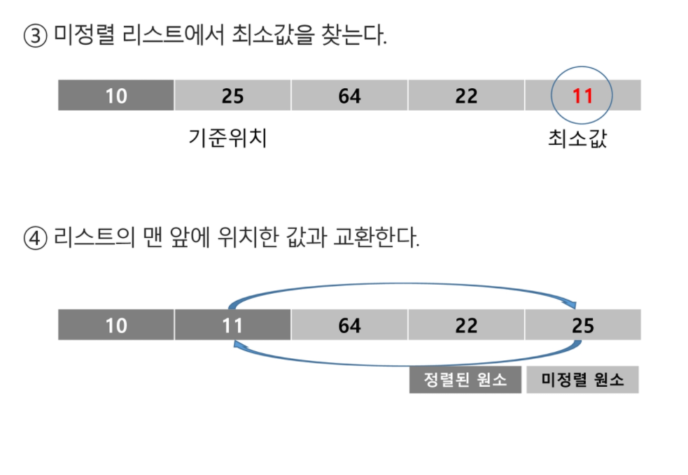

# 정렬2


## 2차원 배열

- 1차원 List를 묶어놓은 List

- 2차원 이상의 다차원 List는 차원에 따라 Index를 선언
- 2차원 List의 선언 : 세로길이(행의 개수), 가로길이(열의 개수)를 필요로 함
- Python 에서는 데이터 초기화를 통해 변수선언과 초기화가 가능함


#### 배열 순회

> n X m 배열의 n*m 개의 모든 원소를 빠짐없이 조사하는 방법


##### 행 우선 순회

```python
# i 행의 좌표
# j 행의 좌표
for i in range(len(Array)):
    for j in range(len(Array[i])):
        Array[i][j] # 필요한 연산 수행
```


##### 열 우선 순회

```python
for j in range(len(Array[0])):
    for i in range(len(Array)):
        Array[i][j] # 필요한 연산 수행
```


##### 지그재그 순회

```python
for i in range(len(lst)):
    for j in range(len(lst[i])):
        print(lst[i][j + (len(lst[i])-1-j*2) * (i%2)], end=' ')
    print('')
```


##### 델타를 이용한 2차 배열 탐색

- 2차 배열의 한 좌표에서 4방향의 인접 배열 요소를 탐색하는 방법

```python
#        상  하 좌  우
dir_r = [-1, 1, 0, 0]
dir_c = [0, 0, -1, 1]

for i in range(1, len(lst)-1):
    for j in range(1, len(lst[i])-1):
        for idx in range(4):
            print(lst[i+dir_r[idx]][j+dir_c[idx]], end=' ')
        print('')
```


##### 전치 행렬

```python
for i in range(len(lst)):
    for j in range(len(lst[i])):
        if i < j:
            lst[i][j], lst[j][i] = lst[j][i], lst[i][j]
        print(lst[i][j], end=' ')
    print('')
```

------


### 부분집합 

> 완전검색 기법으로 부분집합 합 문제를 풀기 위해서는, 우선 집합의 모든 부분집합을 생성한 후에 각 부분집합의 합을 계산해야 한다.
>
> 주어진 집합의 부분집합을 생성하는 방법에 대해서 생각해보자.


#### 부분집합의 수

- 집합의 원소가 n개일 때, 공집합을 포함한 부분집합의 수는 2n개이다.
- 이는 각 원소를 부분집합에 포함시키거나 포함시키지 않는 2가지 경우를 모든 원소에 적용한 경우의 수와 같다.


```python
for i in range(2):
    lst[0] = i
    for j in range(2):
        lst[1] = j
        for k in range(2):
            lst[2] = k
            for l in range(2):
                lst[3] = l
                print(lst)
```

##### 비트 연산자

> & : 비트 단위로 AND 연산을 한다.
>
> | : 비트 단위로 OR 연산을 한다.
>
> << : 피 연산자의 비트 열을 왼쪽으로 이동시킨다.
>
> `>>`: 피 연산자의 비트 열을 오른쪽으로 이동시킨다.


```python
n = len(arr)

for i in range(1<<n):
    for j in range(n+1):
        if i & (1<<j):
            print(arr[j], end=' ')
    print('')
```


## 검색(Search)

> 저장되어 있는 자료 중에서 원하는 항목을 찾는 작업
>
> 목적하는 탐색 키를 가진 항목을 찾는 것
>
> - 탐색 키(search key) : 자료를 구별하여 인식할 수 있는 키
>
> 검색의 종류
>
> - 순차 검색(sequential search)
> - 이진 검샘(binary search)
> - 해쉬(hash)


### 순차 검색(Sequential Search)

- 일렬로 되어 있는 자료를 순서대로 검색하는 방법

> 가장 간단하고 직관적인 검색방법
>
> 배열이나 연결 리스트 등 순차구조로 구현된 자료구조에서 원하는 항목을 찾을 때 유용함
>
> 알고리즘이 단순하여 구현이 쉽지만, 검색 대상의 수가 많은 경우에는 수행시간이 급격히 증가하여 비효율적임


- 2가지 경우
  - 정렬되어 있지 않은 경우
  - 정렬되어 있는 경우

##### 검색 과정 (정렬되어 있지 않은 경우)

- 첫 번째 원소부터 순서대로 검색 대상과 키 값이 같은 원소가 있느지 비교하며 찾는다.
- 키 값이 동일한 원소를 찾으면 그 원소의 인덱스를 반환한다.
- 자료구조의 마지막에 이를 때까지 검색 대상을 찾지 못하면 검색 실패


- 찾고자 하는 원소의 순서에 따라 비교회수가 결정됨
  - 첫 번째 원소를 찾을 때는 1번 비교, 두 번째 원소를 찾을 때는 2번 비교....
  - 정렬되지 않은 자료에서의 순차 검색의 평균 비교 회수
    - = (1/n) * (1+2+3+...+n) = (n+1)/2
  - 시간 복잡도 : O(n)

```python
arr = [3, 6, 7, 1, 8, 2, 5]
key = 2

for idx in range(len(arr)):
    if arr[idx] == key:
        print(idx)
        break
else:
    print(-1)
```


##### 검색 과정 (정렬되어 있는 경우)

- 자료가 오름차순으로 정렬된 상태에서 검색을 실시한다고 가정하자.
- 자료를 순차적으로 검색하면서 키 값을 비교하여, 원소의 키 값이 검색 대상의 키 값보다 크면 찾는 원소가 없다는 것이므로 더 이상 검색하지 않고 검색을 종료한다.


- 찾고자 하는 원소의 순서에 따라 비교회수가 결정됨

  - 정렬이 되어있으므로, 검색 실패를 반환하는 경우 평균 비교 회수가 반으로 줄어든다.
  - 시간 복잡도 : O(n)

  

```python
key = 5
arr2 = [0, 1, 2, 3, 4, 6, 7, 8, 9, 10, 11]

for idx in range(len(arr2)):
    if arr2[idx] == key:
        print(idx)
        break
    elif arr2[idx] > key:
        print(-1)
        break
```


## 이진 검색(Binary Search)

> 자료의 가운데에 있는 항목의 키 값과 비교하여 다음 검색의 위치를 결정하고 검색을 계속 진행하는 방법
>
> - 목적 키를 찾을 때까지 이진 검색을 순환적으로 반복 수행함으로써 검색 범위를 반으로 줄여가면서 보다 빠르게 검색을 수행함
>
> 이진 검색을 하기 위해서는 자료가 정렬된 상태여야 한다.


- 검색 과정
  - 자료의 중앙에 있는 원소를 고른다.
  - 중앙 원소의 값과 찾고자 하는 목표 값을 비교한다.
  - 목표 값이 중앙 원소의 값보다 작으면 자료의 왼쪽 반에 대해서 새로 검색을 수행하고, 크다면 자료의 오른쪽 반에 대해서 새로 검색을 수행한다.
  - 찾고자 하는 값을 찾을 때까지 위의 과정을 반복한다.


```python
start = 0
end = len(arr2) - 1
key = 5

while start <= end:
    middle = (start + end) // 2
    if arr2[middle] < key:
        start = middle + 1
    elif arr2[middle] > key:
        end = middle - 1
    else:
        print(arr2[middle])
        print(middle)
        break
```


## 인덱스

> 인덱스라는 용어는 Database 에서 유래했으며, 테이블에 대한 동작 속도를 높여주는 자료 구조를 일컫는다. Database 분야가 아닌 곳에서는 Look up table 등의 용어를 사용하기도 한다.
>
> 인덱스를 저장하는데 필요한 디스크 공간은 보통 테이블을 저장하는데 필요한 디스크 공간보다 작다. 왜냐하면 보통 인덱스는 키-필드만 갖고 있고, 테이블의 다른 세부 항목들은 갖고 있지 않기 때문이다.

- 배열을 사용한 인덱스
  - 대량의 데이터를 매번 정렬하면, 프로그램의 반응은 느려질 수 밖에 없다. 이러한 대량 데이터의 성능 저하 문제를 해결하기 위해 배열 인덱스를 사용할 수 있다.


### 선택 정렬

> 주어진 자료들 중 가장 작은 값의 원소부터 차례대로 선택하여 위치를 교환하는 방식
>
> - 앞서 살펴본 셀렉션 알고리즘을 전체 자료에 적용한 것이다.

##### 정렬 과정

- 주어진 리스트 중에서 최소값을 찾는다.
- 그 값을 리스트의 맨 앞에 위치한 값과 교환한다.
- 맨 처음 위치를 제외한 나머지 리스트를 대상으로 위의 과정을 반복한다.

##### 시간 복잡도 : O(n2)





- 미 정렬원소가 하나 남은 상황에서는 마지막 원소가 가장 큰 값을 갖게 되므로, 실행을 종료하고 선택 정렬이 완료된다.


``` python
arr3 = [3, 6, 8, 9, 2, 3, 1, 12, 16, 45, 5, 4]

def selection_sort(a, n):
    for i in range(n-1):
        min = i
        for j in range(i, n):
            if a[min] > a[j]:
                min = j
        a[min], a[i] = a[i], a[min]
    return a
arr4 = selection_sort(arr3, len(arr3))
print(arr3)
print(arr4)
# [1, 2, 3, 3, 4, 5, 6, 8, 9, 12, 16, 45]
# [1, 2, 3, 3, 4, 5, 6, 8, 9, 12, 16, 45]
```


### 셀렉션 알고리즘(Selection Algorithm)

> 저장되어 있는 자료로부터 k번째로 큰 혹은 작은 원소를 찾는 방법을 셀렉션 알고리즘이라 한다.
>
> - 최소값, 최대값 혹은 중간값을 찾는 알고리즘을 의미하기도 한다.

##### 선택 과정

- 셀렉션은 아래와 같은 과정을 통해 이루어진다.
  - 정렬 알고리즘을 이용하여 자료 정렬하기
  - 원하는 순서에 있는 원소 가져오기

##### k번째로 작은 원소를 찾는 알고리즘

- 1번부터 k번째까지 작은 원소들을 찾아 배열의 앞쪽으로 이동시키고, 배열의 k번째를 반환한다.
- k가 비교적 작을 때 유용하며 O(kn)의 수행시간을 필요로 한다.

```python
arr3 = [3, 6, 8, 9, 2, 3, 1, 12, 16, 45, 5, 4]

def kth_selection(a, k, n):
    for i in range(k):
        idx = i
        for j in range(i+1, n):
            if a[idx] > a[j]:
                idx = j
        a[idx], a[i] = a[i], a[idx]
    return a[k-1]

result = kth_selection(arr3, 7, len(arr3))
print(result)
```


