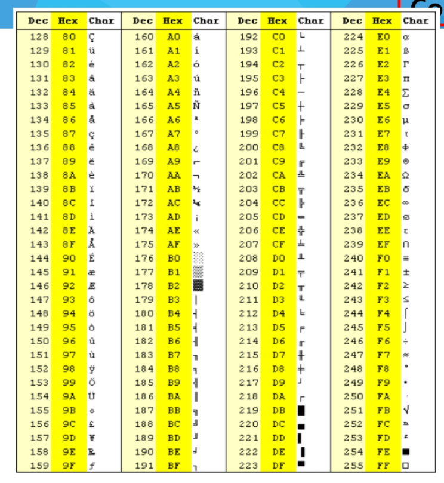

# 문자열(string)


#### 컴퓨터에서의 문자표현

>코드체계의 표준안을 만들기로 하였다.
>
>1967년 미국에서 ASCII(American Standard code for Information Interchange)라는 문자 인코딩 표준이 제정되었다.
>
>ASCII는 7bit 인코딩으로 128문자를 표현하며 33개의 출력 불가능한 제어 문자들과 공백을 비롯한 95개의 출력 가능한 문자들로 이루어져 있다.


##### 확장 아스키

> 확장 아스키는 표준 문자 이외의 악센트 문자, 도형 문자, 특수 문자, 특수 기호등 부가적인 문자를 128개 추가할 수 있게 하는 부호이다. 

- 표준 아스키는 7bit를 사용하여 문자를 표현하는 데 비해 확장 아스키는 1B 내의 8bit를 모두 사용함으로써 추가적인 문자를 표현할 수 있다.
- 컴퓨터 생산자와 소프트웨어 개발자가 여러 가지 다양한 문자에 할당할 수 있도록 하고 있다. 이렇게 할당된 확장 부호는 표준 아스키와 같이 서로 다른 프로그램이나 컴퓨터 사이에 교환되지 못한다.
- 그러므로 표준 아스키는 마이크로컴퓨터 하드웨어 및 소프트웨어 사이에서 세계적으로 통용되는 데 비해, 확장 아스키는 프로그램이나 컴퓨터 또는 프린터가 그것을 해독할 수 있도록 설계되어 있어야만 올바로 해독될 수 있다.




> 오늘날 대부분의 컴퓨터는 문자를 읽고 쓰는데 ASCII형식을 사용한다.
>
> 그런데 컴퓨터가 발전하면서 미국 뿐 아니라 각 나라에서도 컴퓨터가 발전했으며 각 국가들은 자국의 문자를 표현하기 위하여 코드체계를 만들어서 사용하게 되었다.
>
> - 우리나라도 아주 오래된 이야기지만 한글 코드체계를 만들어 사용했고 조합형, 완성형 두 종류를 가지고 있었다.


> 인터넷이 전 세계로 발전하면서 ASCII를 만들었을 때의 문제와 같은 문제가 국가간에 정보를 주고 받을 때 발생했다.
>
> 자국의 코드체계를 타 국가가 가지고 있지 않으면 정보를 잘못 해석 할 수 밖에 없었다.
>
> 그래서 다국어 처리를 위해 표준을 마련했다 이를 유니코드라고 한다.


##### 유니코드도 다시 Character Set으로 분류된다

> - UCS-2(Universal Character Set 2)
> - UCS-4(Universal Character Set 4)
> - 유니코드를 저장하는 변수의 크기를 정의
> - 그러나, 바이트 순서에 대해서 표준화하지 못했음
> - 다시 말해 파일을 인식 시 이 파일이 UCS-2, UCS-4인지 인식하고 각 경우를 구분해서 모두 다르게 구현해야하는 문제 발생
> - 그래서 유니 코드의 적당한 외부 인코딩이 필요하게 되었다.


##### big-endian, little-endian


- 빅 엔디안(big endian)
  - 낮은 주소에 데이터의 높은 바이트 부터 저장하는 방식
  - 메모리에 저장된 순서 그대로 읽을 수 있으며, 이해하기가 쉽다는 장점
- 리틀 엔디안(little endian)
  - 낮은 주소에 데이터의 낮은 바이트부터 저장하는 방식
  - 메모리에 저장된 순서 반대로, 거꾸로 읽어야한다. 연산의 속도에 장점을 가지고 있다.


#### 유니코드 인코딩 (UTF : Unicode Transformation Format)

- UTF-8 (in web)
  - MIN : 8bit, MAX : 32bit(1 Byte * 4)
- UTF-16 (in windows, java)
  - MIN : 16bit, MAX : 32bit(2 Byte * 2)
- UTF-32 (in unix)
  - MIN : 32bit, MAX : 32bit(4 Byte * 4)


##### Python에서의 문자열 처리

- char 타입 없음

- 텍스트 데이터의 취급방법이 통일되어 있음

- 문자열 기호

  - '(홑따움표), "(쌍따옴표), '''(홑따옴표 3개), """(쌍따옴표 3개)
  - +연결(Concatenation)
    + 문자열 + 문자열 : 이어 붙여주는 역할
  - *반복
    * 문자열 * 수 : 수만큼 문자열이 반복

- 문자열은 시퀀스 자료형으로 분류되고, 시퀀스 자료형에서 사용할 수 있는 인덱싱, 슬라이싱 연산들을 사용할 수 있음

- 문자열 클래스에서 제공되는 메소드

  ```python
  replace(), split(), isalpha(), find()
  ```

- 문자열은 튜플과 같이 요소값을 변경 할  수 없음(immutable)


#### 문자열 숫자 >> 정수, 정수 >> 문자열 숫자

##### atoi()

```python
def my_atoi(letter):
    result = ord(letter) - ord('0')
    return result
```

##### itoa()

```python
def my_itoa(number):
    result = chr(number + ord('0'))
    return result
```


## 패턴 매칭

> - 고지식한 패턴 검색 알고리즘
> - 카프-라빈 알고리즘
> - KMP 알고리즘
> - 보이어-무어 알고리즘

### 고지식한 알고리즘(Brute Force)

- 본문 문자열을 처음부터 끝까지 차례대로 순회하면서 패턴 내의 문자들을 일일이 비교하는 방식으로 동작


```python
def bruteforce(p, t):
    i = 0
    j = 0
    while j < M and i < N:
        if sentence[i] != pattern[j]:
            i = i - j
            j = -1
        i += 1
        j += 1
    if j == M :
        return i-M
    else:
        return -1
```

- 고지식한 패턴 검색 알고리즘의 시간 복잡도
  - 최악의 경우 시간 복잡도는 텍스트의 모든 위치에서 패턴을 비교해야 하므로 O(MN)이 됨
  - 예에서는 최악의 경우 약 10,000 * 80 = 800,000 번의 비교가 일어난다.
  - 비교횟수를 줄일 수 있는 방법은 없는가?


### KMP 알고리즘

> 불일치가 발생한 텍스트 스트링의 앞 부분에 어떤 문자가 있는지를 미리 알고 있으므로, 불일치가 발생한 앞 부분에 대하여 다시 비교하지 않고 매칭을 수행
>
> 패턴을 전처리하여 배열 next[M]을 구해서 잘못된 시작을 최소화함
>
> - next[M] : 불일치가 발생했을 경우 이동할 다음 위치
>
> 시간 복잡도 : O(M+N)


```python
def kmp_force(p, s, back):
    i = 0
    j = 0
    while j < len(p) and i < len(s):
        if s[i] != p[j]:
            if back[j] == -1:
                i += 1
                continue
            else:
                j = back[j]
                continue
        i += 1
        j += 1
    if j == len(p):
        return i - len(p)
    else:
        return -1

pattern = 'abcdabcef'
sentence = 'asabcdabcdabcefdji'
p_back = [-1, 0, 0, 0, 0, 1, 2, 3, 0]


a = kmp_force(pattern, sentence, p_back)
print(a)
```


### 보이어-무어 알고리즘

> 오른쪽에서 왼쪽으로 비교
>
> 대부분의 상용 소프트웨어에서 채택하고 있는 알고리즘
>
> 보이어-무어 알고리즘은 패턴에 오른쪽 끝에 있는 문자가 불일치 하고 이 문자가 패턴 내에 존재하지 않는 경우, 이동 거리는 무려 패턴의 길이 만큼이 된다.


```python
sentence = 'sdfwdfadfdfreerdttwterjfafotejojahfdjk'
pattern = 'water'

def bm_force(p, s):
    i = len(p)-1
    j = len(p)-1
    while j >= 0 and i < len(s):
        if s[i] != p[j] and s[i] in p and j == len(p)-1:
            i += len(p) - 1 - p.index(s[i])
            continue
        elif s[i] == p[j]:
            i -= 1
            j -= 1
            continue
        i += len(p)
        j = len(p) - 1
    if j < 0:
        return 'success'
    else:
        return 'fail'

a = bm_force(pattern, sentence)
print(a)
```

-----


#### 문자열 매칭 알고리즘 비교

- 찾고자 하는 문자열 패턴의 길이 m, 총 문자열 길이 n
- 고지식한 패턴 검색 알고리즘 : 수행시간 O(mn)
- 카프-라빈 알고리즘 : 수행시간 O(n)
- KMP 알고리즘 : 수행시간 O(n)
- 보이어-무어 알고리즘
  - 앞의 두 매칭 알고리즘들의 공통점 텍스트 문자열의 문자를 적어도 한번씩 훑는다는 것이다. 따라서 최선의 경우에도 O(n)
  - 보이어-무어 알고리즘은 텍스트 문자를 다 보지 않아도 된다
  - 발상의 전환 : 패턴의 오른쪽부터 비교한다.
  - 최악의 경우 수행시간 : O(mn)
  - 입력에 따라 다르지만 일반적으로 O(n)보다 시간이 덜 든다.


