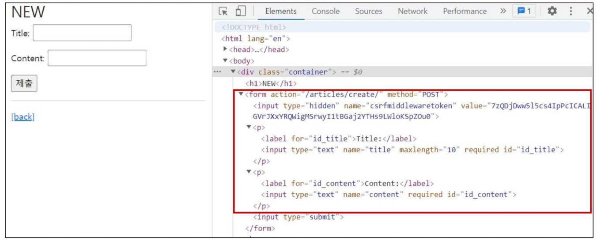
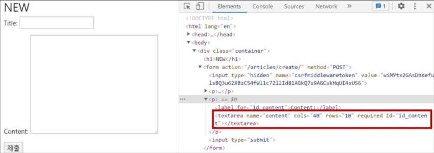
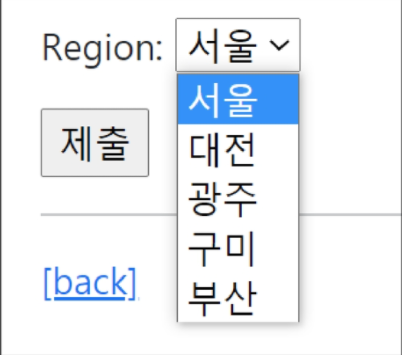
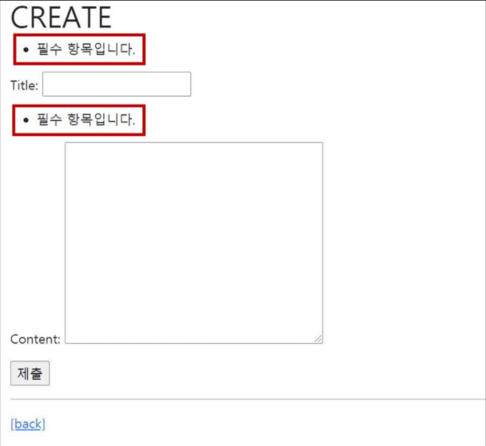
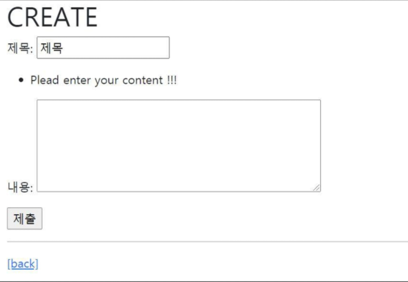

# 03_Django_Form

## Django Form

> Django는 일부 과중한 작업과 반복 코드를 줄여줌으로써, 이 작업을 훨씬 쉽게 만들어줌

**개념**

- Django는 Form에 관련된 작업의 아래 세 부분을 처리해 줌
  - 렌더링을 위한 데이터 준비 및 재구성
  - 데이터에 대한 HTML forms 생성
  - 클라이언트로부터 받은 데이터 수신 및 처리
- Form은 Django 프로젝트의 주요 유효성 검사 도구들 중 하나이며, 공격 및 우연한 데이터 손상에 대한 중요한 방어수단
- Django는 위와 같은  form 기능의 방대한 부분을 단순화하고 자동화 할 수 있으며, 프로그래머가 직접 작성한 코드에서 수행할 수 있는 것보다 더 안전하게 수행할 수 있음


## Django Form Class

> Django Form 관리 시스템의 핵심

**개념**

- form 내 field, field 배치, 디스플레이 widget, label, 초기값, 유효하지 않는 field에 관련된 에러 메세지를 결정
- Django는 사용자의 데이터를 받을 때 해야 할 과중한 작업(데이터 유효성 검증, 필요시 입력된 데이터 검증 결과 재출력, 유효한 데이터에 대해 요구되는 동작 수행 등)과 반복 코드를 줄여 줌


### Form 선언하기

```python
# articles/forms.py

from django import forms


class ArticleForm(forms.Form):
    title = forms.CharField(max_length=10)
    content = forms.CharField()
```

- Model을 선언하는 것과 유사하며 같은 필드타입을 사용 (또한, 일부 매개변수도 유사함)
- forms 라이브러리에서 파생된 Form 클래스를 상속받음


```python
# articles/views.py

from .forms import ArticleForm


def new(request):
    form = ArticleForm()
    context = {
        'form': form,
    }
    return render(request, 'articles/mew.html', context)
```

```django
<!--new.html-->




  <h1>NEW</h1>
  <form action="" method="POST">
    
    {{ form.as_p }}
    <button type="submit" class="btn btn-primary">
      Submit
    </button>
  </form>
  <hr>
  <a href="">[back]</a>

```




### From rendering options

- <label> & <input> 쌍에 대한 3가지 출력 옵션

**1. as_p()**

- 각 필드가 단락(<p>태그)으로 감싸져서 렌더링 됨

**2. as_ul()**

- 각 필드가 목록 항목(<li>태그)으로 감싸져서 렌더링 됨
- < ul >태그는 직접 작성해야 함

**3. as_table()**

- 각 필드가 테이블(<tr>태그)행으로 감싸져서 렌더링 됨
- < table >태그는 직접 작성해야 함


### Django의 HTML input 요소 표현 방법 2가지

##### 1. Form fields

- input에 대한 유효성 검사 로직을 처리하며 템플릿에서 직접 사용 됨

##### 2. Widgets

- 웹 페이지의 HTML input 요소 렌더링
- GET/POST 딕셔너리에서 데이터 추출
- 하지만 widgets은 반드시 form fields에 할당 됨


#### Widgets

> Django의 HTML input element 표현, HTML 렌더링을 처리

- 주의사항
  - Form Fields와 혼동되어서는 안됨
  - Form Fields는 input 유효성 검사를 처리
  - Widgets은 웹페이지에서 input element의 단순 raw한 렌더링 처리

```python
# articles/forms.py

from django import forms


class ArticleForm(forms.Form):
    title = forms.CharField(max_length=10)
    content = forms.CharField(widget=forms.Textarea)
```




#### Form field 및 widget 응용

```python
from django import forms


class ArticleForm(forms.Form):
    REGION_A = 'sl'
    REGION_B = 'dj'
    REGION_C = 'gj'
    REGION_D = 'gm'
    REGION_E = 'bs'
    REGION_CHOICES = [
        (REGION_A, '서울'),
        (REGION_B, '대전'),
        (REGION_C, '광주'),
        (REGION_D, '구미'),
        (REGION_E, '부산'),
    ]

    title = forms.CharField(max_length=10)
    content = forms.CharField(widget=forms.Textarea)
    region = forms.ChoiceField(choices=REGION_CHOICES, widget=forms.Select())
```




## ModelForm

> Model을 통해 Form Class를 만들 수 있는 Helper

**Intro**

- Article 모델이 있고 사용자가 게시글을 제출할 수 있는 양식을 만들고 싶은 경우 이미 모델에서 필드를 정의했기 때문에 form에서 필드를 재정의 하는 중복된 행위 발생
- 그래서 Django는 Model을 통해 Form Class를 만들 수 있는 Helper를 제공
  - "ModelForm"


### ModelForm 선언하기

```python
# articles/forms.py

from django import forms
from .models import Article


class ArticleForm(forms.ModelForm):
    
    class Meta:
        model = Article
        # fields = ('title', 'content',) # 수가 많아지면 일일이 써주기 힘듬
        fields = '__all__'
        # exclude = ('title',) # 제외하고 싶은 
```

- forms 라이브러리에서 파생된 ModelForm 클래스를 상속받음
- 정의한 클래스 안에 Meta  클래스를 선언하고, 어떤 모델을 기반으로 form을 작성할 것인지에 대한 정보를 Meta클래스에 지정


#### Meta class

> Model의 정보를 작성하는 곳

- ModelForm을 사용할 경우 사용할 모델이 있어야 하는데 Meta class가 이를 구성함
  - 해당 model에 정의한 field 정보를 Form에 적용하기 위함


- [참고] Inner class(Nested class)
  - 클래스 내에 선언된 다른 클래스
  - 관련 클래스를 함께 그룹화 하여 가독성 및 프로그램 유지 관리를 지원(논리적으로 묶어서 표현)
  - 외부에서 내부 클래스에 접근할 수 없으므로 코드의 복잡성을 줄일 수 있음
- [참고] Meta 데이터
  - "데이터에 대한 데이터"
  - ex) 사진 촬영 - 사진 데이터 - 사진의 메타 데이터 (촬영 시각, 렌즈, 조리개 값 등)


### create view 수정

```python
def create(request):
    form = ArticleForm(request.POST)
    if form.is_valid():
        article = form.save()
        return redirect('articles:detail', article.pk)
   	return redirect('articles:new')
```


#### is_valid method

- 유효성 검사를 실행하고, 데이터가 유효한지 여부를 boolean으로 반환
- 데이터 유효성 검사를 보장하기 위한 많은 테스트에 대해 django는 is_valid()를 제공


- [참고] 유효성 검사
  - 요청한 데이터가 특정 조건에 충족하는지 확인하는 작업
  - 데이터베이스 각 필드 조건에 올바르지 않은 데이터가 서버로 전송되거나, 저장되지 않도록 하는 것


#### The `save()` method

- form에 바인딩 된 데이터에서 데이터베이스 객체를 만들고 저장
- ModelForm의 하위(sub) 클래스는 기존 모델 인스턴스를 키워드 인자 `instance`로 받아 들일 수 있음
  - 이것이 제공되면 save() 는 해당 인스턴스를 업데이트(UPDATE)
  - 제공되지 않은 경우 save()는 지정된 모델의 새 인스턴스를 만듦(CREATE)
- form의 유효성이 확인되지 않은 경우(hasn't been validated) save()를 호출하면 form.errors를 확인하여 에러 확인 가능


### create view 함수 구조 변경

```python
def create(request):
    # create
    if request.method == 'POST':
        form = ArticleForm(request.POST)
        # 유효성 검사
        if form.is_valid():
            article = form.save()
            return redirect('articles:detail', article.pk)
    # new
    else:
        form = ArticleForm()
    context = {
        'form': form,
    }
    return render(request, 'articles/create.html', context)
```

> new view 함수, url path 삭제


```django
<!--create.html-->




  <h1>CREATE</h1>
  <form action="" method="POST">
    
    {{ form.as_p }}
    <button type="submit" class="btn btn-primary">
      Submit
    </button>
  </form>
  <hr>
  <a href="">[back]</a>

```

> new.html -> create.html 이름변경 / 이제는 action 값이 없어도 동작


**input 태그에 공백 데이터를 넣어보고 글 작성 -> 에러 메세지 출력 확인**




### Widgets 적용하기

- django의 HTML input element 표현
- HTML 렌더링을 처리
- 2가지 작성 방식을 가짐


```python
# django에서 권장하는 방법
# articles/forms.py


class ArticleForm(forms.ModelForm):
    title = forms.CharField(
        label='제목',
        widget=forms.TextInput(
            attrs={
                'class': 'my-title',
                'placeholder': 'Enter the title',
                'maxlength': 10,
            }
        ),
    )
    content = forms.CharField(
        label='내용',
        widget=forms.Textarea(
            attrs={
                'class': 'my-content',
                'placeholder': 'Enter the content',
                'rows': 5,
                'cols': 50,
            }
        ),
    )
    class Meta:
        model = Article
        # fields = ('title', 'content',) # 수가 많아지면 일일이 써주기 힘듬
        fields = '__all__'
        # exclude = ('title',) # 제외하고 싶은 
```




### DELETE

```python
# articles/views.py


def delete(request, pk):
    article = Article.objects.get(pk=pk)
    if request.method == 'POST':
        article.delete()
    	return redirect('articles:index')
    return redirect('articles:detail', article.pk)
```


### UPDATE

```python
#articles/views.py


def update(request, pk):
    # update
    article = Article.objects.get(pk=pk)
    if request.method == 'POST':
        form = ArticleForm(request.POST, instance=article)
        if form.is_valid():
            form.save()
            return redirect('articles:detail', article.pk)
    # edit
    else:
        form = ArticleForm(instance=article)
    context = {
        'article': article,
        'form': form,
    }
    return render(request, 'articles/update.html', context)
```


```django
<!-- update.html -->




  <h1>UPDATE</h1>
  <form action="" method="POST">
    
    {{ form.as_p }}
    <input type="submit">
  </form>
  <hr>
  <a href="">[back]</a>

```


### Form & ModelForm

- Form
  - 어떤 model에 저장해야 하는지 알 수 없으므로 유효성 검사 이후 cleaned_data 딕셔너리를 생성
  - cleaned_data 딕셔너리에서 데이터를 가져온 후 .save() 호출해야 함
  - model에 연관되지 않은 데이터를 받을 때 사용
- ModelForm
  - django가 해당 model에서 양식에 필요한 대부분의 정보를 이미 정의
  - 어떤 레코드를 만들어야 할 지 알고 있으므로 바로 .save()호출 가능

