# 배열과 객체


## 배열(Arrays)

> 배열의 정의와 특징

- 키와 속성들을 담고 있는 참조 타입의 객체(object)
- 순서를 보장하는 특징이 있음
- 주로 대괄호를 이용하여 생성하고, 0을 포함한 양의 정수 인덱스로 특정 값에 접근 가능
- 배열의 길이는 array.length 형태로 접근 가능
  - 배열의 마지막 원소는 array.length - 1 로 접근

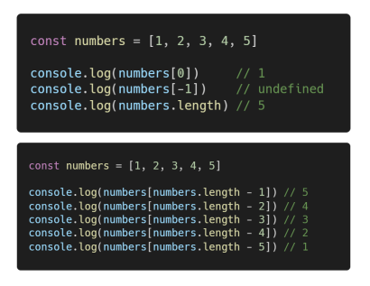


### I. 배열 관련 주요 메서드 목록 (1) - 기본편 (기본 배열 조작)

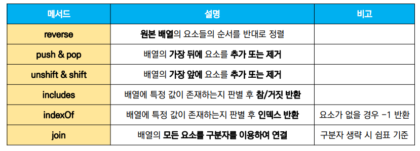


#### I - 1. reverse

- array.reverse()
  - 원본 배열의 요소들의 순서를 반대로 정렬

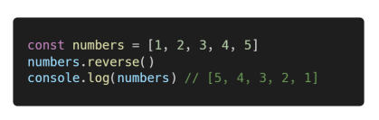


#### I - 2. push & pop

- array.push()
  - 배열의 가장 뒤에 요소 추가
- array.pop()
  - 배열의 마지막 요소 제거

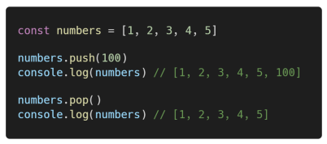


#### I - 3. unshift & shift

- array.unshift()
  - 배열의 가장 앞에 요소 추가
- array.shift()
  - 배열의 첫번째 요소 제거

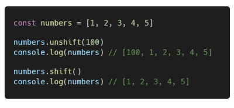


#### I - 4. includes

- array.includes(value)
  - 배열에 특정 값이 존재하는지 판별 후 참 또는 거짓 반환

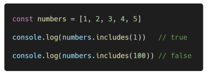


#### I - 5. indexOf

- array.indexOf(value)
  - 배열에 특정 값이 존재하는지 확인 후 가장 첫 번째로 찾은 요소의 인덱스 반환
  - 만약 해당 값이 없을 경우 -1 반환

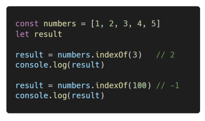


#### I - 6. join

- array.join([separator])
  - 배열의 모든 요소를 연결하여 반환
  - separator(구분자)는 선택적으로 지정 가능하며, 생략 시 쉼표를 기본값으로 사용

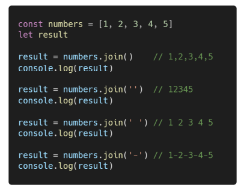

> 실습

```js
/*
	[배열 관련 주요 메서드 연습 1]
	
	주어진 배열의 요소 중 null 값을 제거한 새로운 배열을 만드세요.
*/

const homeworks = ['david.zip', null, 'maria.zip', 'tom.zip', null]

const result = []

for (let homework of homeworks) {
	if (homework) {
		result.push(homework)
	}
}
console.log(result)

/*
	[배열 관련 주요 메서드 연습 2]
	
	주어진 배열을 사용하여 아래 문자열을 완성하세요.

	'www.samsung.com/sec/buds/galaxy-buds-pro'

*/

const arr1 = ['www', 'samsung', 'com']
const arr2 = ['galaxy', 'buds', 'pro']
const arr3 = ['sec', 'buds']

const mainURL = arr1.join('.')
const model = arr2.join('-')
arr3.unshift(mainURL)
arr3.push(model)
const result = arr3.join('/')
console.log(result)

/*
	[배열 관련 주요 메서드 연습 3]

	주어진 배열의 요소 중 모든 'rainy' 요소를 'sunny'로 교체하세요
	- indexOf 메서드를 사용합니다.
*/

const weather = ['sunny', 'sunny', 'sunny', 'sunny', 'rainy', 'rainy', 'sunny']

for (let temp of weather) {
	if (temp == 'rainy') {
		let idx = weather.indexOf('rainy')
		weather[idx] = 'sunny'
	}
}

let idx = weather.indexOf('rainy')
while (idx > 0) {
	weather[idx] = 'sunny'
	idx = weather.indexOf('rainy')
}
console.log(weather)
```


### II. 배열 관련 주요 메서드 목록 (2) - 심화편 (Array Helper Methods)

- 배열을 순회하며 특정 로직을 수행하는 메서드
- 메서드 호출 시 인자로 callback 함수를 받는 것이 특징

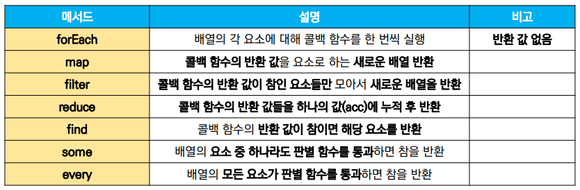


#### II - 1. forEach

- array.forEach(callback(element[, index[, array]]))
  - 배열의 각 요소에 대해 콜백 함수를 한 번씩 실행
  - 콜백 함수는 3가지 매개변수로 구성
    - element: 배열의 요소
    - index: 배열 요소의 인덱스
    - array: 배열 자체
  - 반환 값(return)이 없는 메서드

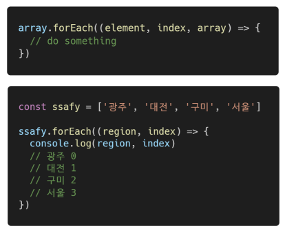


#### II - 2. map

- array.map(callback(element[, index[, array]]))
  - 배열의 각 요소에 대해 콜백 함수를 한 번씩 실행
  - 콜백 함수의 반환 값을 요소로 하는 새로운 배열 반환
  - 기존 배열 전체를 다른 형태로 바꿀 때 유용

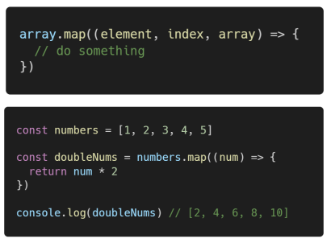


#### II - 3. filter

- array.filter(callback(element[, index[, array]]))
  - 배열의 각 요소에 대해 콜백 함수를 한 번씩 실행
  - 콜백 함수의 반환 값이 참인 요소들만 모아서 새로운 배열을 반환
  - 기존 배열의 요소들을 필터링할 때 유용

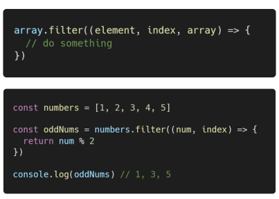


#### II - 4. reduce

- array.reduce(callback(acc, element, [index[, array]])[, intialValue])

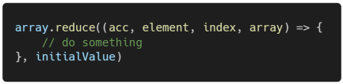

- 배열의 각 요소에 대해 콜백 함수를 한 번씩 실행
- 콜백 함수의 반환 값들을 하나의 값(acc)에 누적 후 반환
- reduce 메서드의 주요 매개변수
  - acc
    - 이전 callback 함수의 반환 값이 누적되는 변수
  - initialValue(optional)
    - 최초 callback 함수 호출 시 acc에 할당 되는 값, default 값을 배열의 첫 번째 값

> 예시

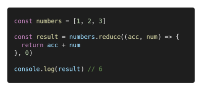

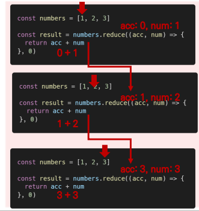


#### II - 5. find

- array.find(callback(element[, index[, array]]))
  - 배열의 각 요소에 대해 콜백 함수를 한 번씩 실행
  - 콜백 함수의 반환 값이 참이면 해당 요소를 반환
  - 찾는 값이 배열에 없으면 undefined 반환

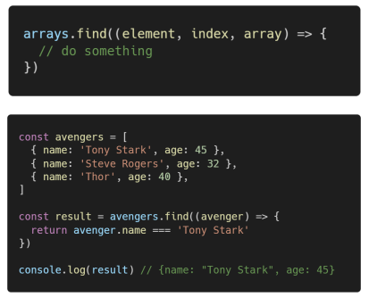


#### II - 6. some

- array.some(callback(element[, index[, array]]))
  - 배열의 요소 중 하나라도 주어진 판별 함수를 통과하면 참을 반환
  - 모든 요소가 통과하지 못하면 거짓 반환
  - 빈 배열은 항상 거짓 반환

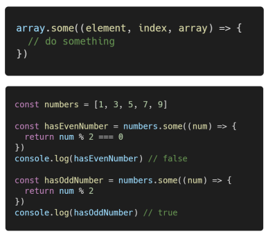


#### II - 7. every

- array.every(callback(element[, index[, array]]))
  - 배열의 모든 요소가 주어진 판별 함수를 통과하면 참을 반환
  - 모든 요소가 통과하지 못하면 거짓 반환
  - 빈 배열은 항상 참 반환

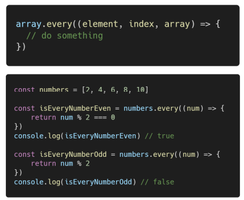


> 실습

```js
/*
 [배열 관련 주요 메서드 연습 심화 1]
 
 속력(distance/time)을 저장하는 배열 speeds를 만드세요.
 
*/

const trips = [
  { distance: 34, time: 10 },
  { distance: 90, time: 50 },
  { distance: 59, time: 25 },
]

const speeds = trips.map((trip) => {
  return trip.distance / trip.time
})
console.log(speeds)

/*
 [배열 관련 주요 메서드 연습 심화 2]
 
 주어진 배열의 요소 중 특정 문자(query)가 포함되는 요소만 모아서 새로운 배열을 반환하세요.
*/

const languages = ['python', 'javascript', 'html', 'java']
const query = 'java'

const results = languages.filter((language) => {
  return language.includes(query)
})
console.log(results)

/*
 [배열 관련 주요 메서드 연습 심화 3]
 
 주어진 배열을 사용하여 다음과 같은 객체를 만드세요.
 {
   smith: 90,
   peter: 80,
   anna: 85,
 }
*/

const scores = [
  { name: 'smith', score: 90 },
  { name: 'peter', score: 80 },
  { name: 'anna', score: 85 },
]

const result = scores.reduce((res, score) => {
  res[score.name] = score.score
  return res
}, {})
console.log(result)

/*
 [배열 관련 주요 메서드 연습 심화 4]
 
 주어진 accounts 배열에서 balance가 24,000인 사람을 찾으세요.
*/

const accounts = [
	{ name: 'justin', balance: 1200 },
	{ name: 'harry', balance: 50000 },
	{ name: 'jason', balance: 24000 },
]
const result = accounts.find((account) => {
  return account.balance === 24000
})
console.log(result)

/*
 [배열 관련 주요 메서드 연습 심화 5]
 
 주어진 requests 배열에서 status가 pending인 요청이 있는지 확인하세요.
*/

const requests = [
  { url: '/photos', status: 'complete' },
  { url: '/albums', status: 'pending' },
  { url: '/users', status: 'failed' },
]

const result = requests.some((req) => {
  return req.status === 'pending'
})
console.log(result)

/*
 [배열 관련 주요 메서드 연습 심화 6]
 
 주어진 users 배열을 통해 모든 유저의 상태가 submmited인지 여부를 확인하세요.
*/
const users = [
  { username: 'eric', submitted: true },
  { username: 'justin', submitted: true},
  { username: 'james', submitted: false},
]

const result = users.every((user) => {
  return user.submitted
})
console.log(result)


const key = 'regions'
const value = ['구미', '광주', '대전', '서울', '부울경']

const loca = {
  [key]: value,
}

console.log(loca)
```


## 객체 (Objects)

> 객체의 정의와 특징

- 객체는 속성(property)의 집합이며 중괄호 내부에 key와 value의 쌍으로 표현
- key는 문자열 타입만 가능
- value는 모든 타입 가능
- 객체 요소 접근은 점 또는 대괄호로 가능
  - key 이름에 띄어쓰기 같은 구분자가 있으면 대관호 접근만 가능


### I. 객체 관련 ES6 문법

#### I - 1. 속성명 축약 (shorthand)

- 객체를 정의할 때 key와 할당하는 변수의 이름이 같으면 예시와 같이 축약 가능

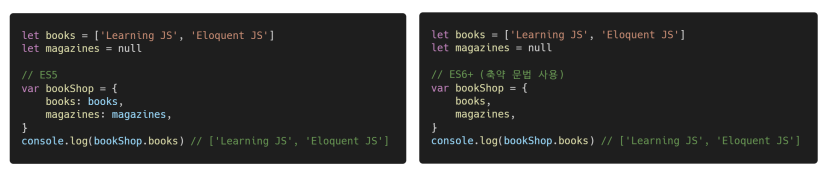


#### I - 2. 메서드명 축약(shorthand)

- 메서드 선언 시 function 키워드 생략 가능

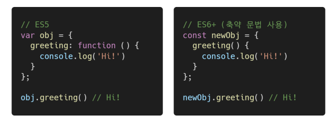


#### I - 3. 계산된 속성(computed property name)

- 객체를 정의할 때 key의 이름을 표현식을 이용하여 동적으로 생성 가능

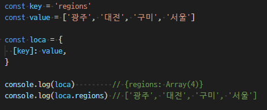


#### I - 4. 구조 분해 할당 (destructing assignment)

- 배열 또는 객체를 분해하여 속성을 변수에 쉽게 할당할 수 있는 문법

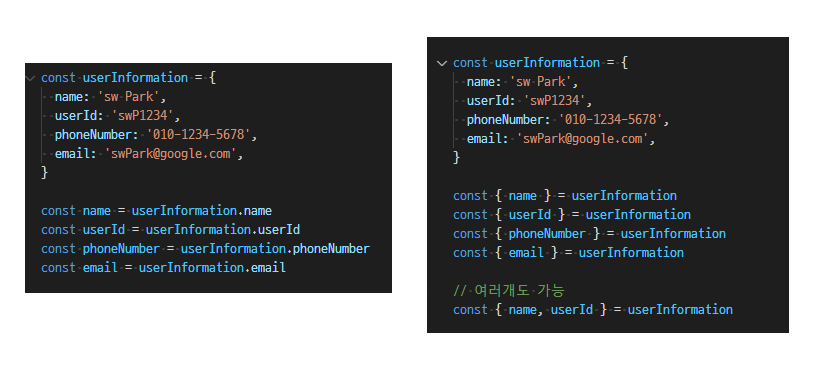


> 실습

```js
/*
  [Object 요소 접근 연습]
  
	주어진 객체에서 items의 첫번째 아이템의 name을 result 변수에 할당하세요.
*/

const data = {
  id: 42,
  items: [
    {
      id: 1,
      name: 'foo',
    },
    {
      id: 2,
      name: 'bar',
    },
  ],
}
const result = data.items[0].name
console.log(result)

/*
[Object 축약 문법]

아래 변수들을 속성으로 가지는 Object를 축약문법을 활용하여 작성하세요.
*/

const username = 'hailey'
const contact = '010-1234-5678'

const result = {
  username,
  contact
}
console.log(result)
/*
[Object Destructuring]

주어진 함수를 Object 축약 문법과, destructuring을 사용하여 재작성하세요.
*/

const users = [
  {
    name: 'hailey',
    contact: '010-1234-5678',
  },
  {
    name: 'paul',
    contact: '010-5678-1234',
  },
]

// 변경 후
function saveUserData(users) {
  // Destructuring
  // const { name, contact } = user
  const userData = users.map(({ name, contact }, id) => {
    // 축약 문법 키와 벨류의 이름이 같으면 하나로 작성 가능!
    return {id, name, contact}
  })
  return userData
}

// 변경 전
function saveUserData (users) {
  const userData = users.map((user, index) => {
    return { id: index, name: user.name, contact: user.contact }
  })

  return userData
}
```


### II. JSON (JavaScript Object Notation)

- key-value쌍의 형태로 데이터를 표기하는 언어 독립적 표준 포맷
- 자바스크립트의 객체와 유사하게 생겼으나 실제로는 문자열 타입
  - 따라서 JS의 객체로써 조작하기 위해서는 구문 분석(parsing)이 필수
- 자바스크립트에서는 JSON을 조작하기 위한 두 가지 내장 메서드 제공
  - JSON.parse()
    - JSON => 자바스크립트 객체
  - JSON.stringify()
    - 자바스크립트 객체 => JSON


> 예시

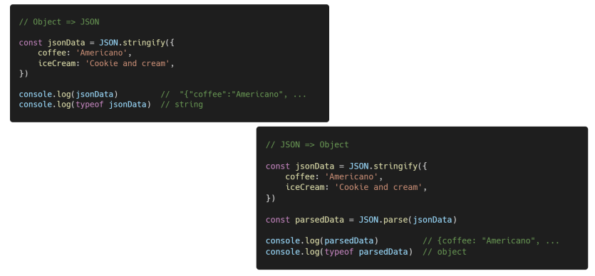

