# JavaScript Asynchronous

## I. AJAX

> AJAX (Asynchronous JavaScript And XML)

- 비동기식 JavaScript와 XML
- 서버와 통신하기 위해 XMLHttpRequest 객체를 활용
- JSON, XML, HTML 그리고 일반 텍스트 형식 등을 포함한 다양한 포맷을 주고 받을 수 있음

#### I - 1. AJAX 특징

- 페이지 전체를 reload(새로고침)를 하지 않고서도 수행되는 `비동기성`
  - 사용자의 event가 있으면 전체 페이지가 아닌 일부분만을 업데이트 할 수 있음
- AJAX의 주요 두가지 특징은 아래의 작업을 할 수 있게 해줌
  - 페이지 새로고침 없이 서버에 요청
  - 서버로부터 데이터를 받고 작업을 수행

#### I - 2. XMLHttpRequest 객체

- 서버와 상호작용하기 위해 사용되며 전체 페이지의 새로고침 없이 데이터를 받아올 수 있음
- 사용자의 작업을 방해하지 않으면서 페이지 일부를 업데이트 할 수 있음
- 주로 AJAX 프로그래밍에 사용
- 이름과 달리 XML뿐만 아니라 모든 종류의 데이터를 받아올 수 있음
- 생성자
  - XMLHttpRequest()

> 예시

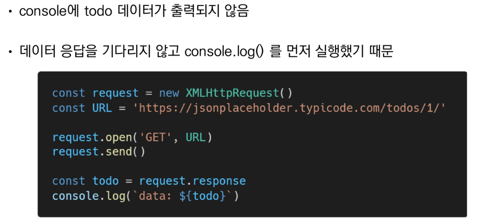

## II. Asynchronous JavaScript

#### II - 1. 동기식

- 순차적, 직렬적 Task 수행
- 요청을 보낸 후 응답을 받아야만 다음 동작이 이루어짐(blocking)

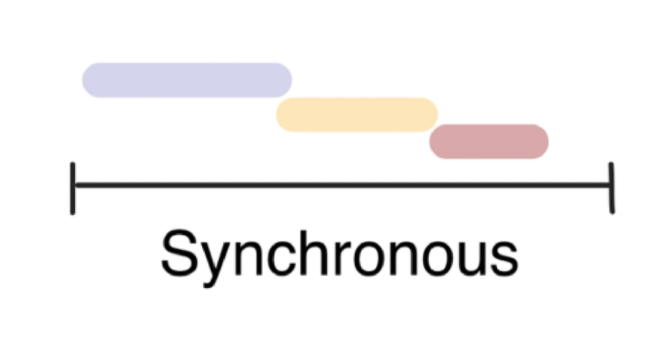

> 예시

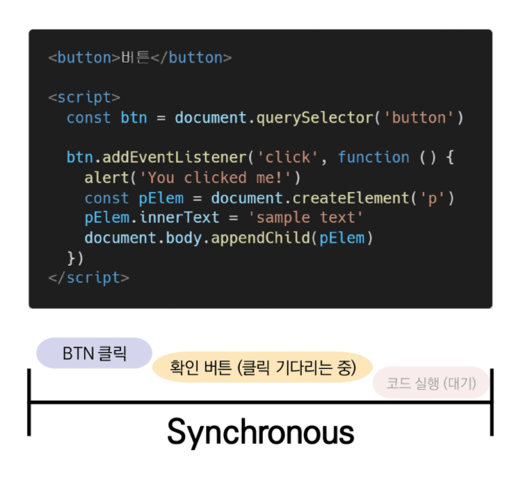

- 버튼 클릭 후 alert 메시지의 확인 버튼을 누를 때까지 문장이 만들어지지 않음

- 즉, alert 이후의 코드는 alert의 처리가 끝날 때까지 실행되지 않음

- 왜 이런 현상이 발생할까?

  `JavaScript는 single threaded`

#### II - 2. 비동기식

- 병렬적 Task 수행
- 요청을 보낸 후 응답을 기다리지 않고 다음 동작이 이루어짐(non-blocking)

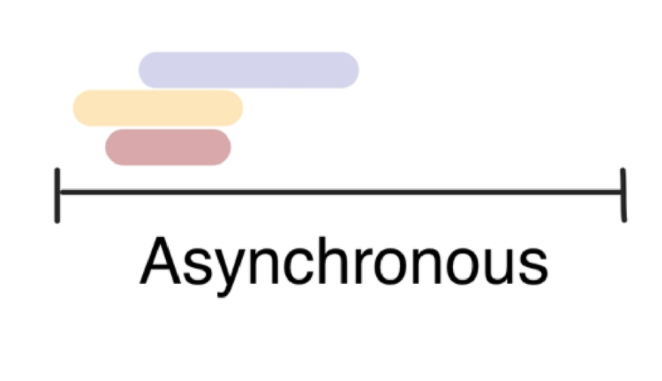

> 예시

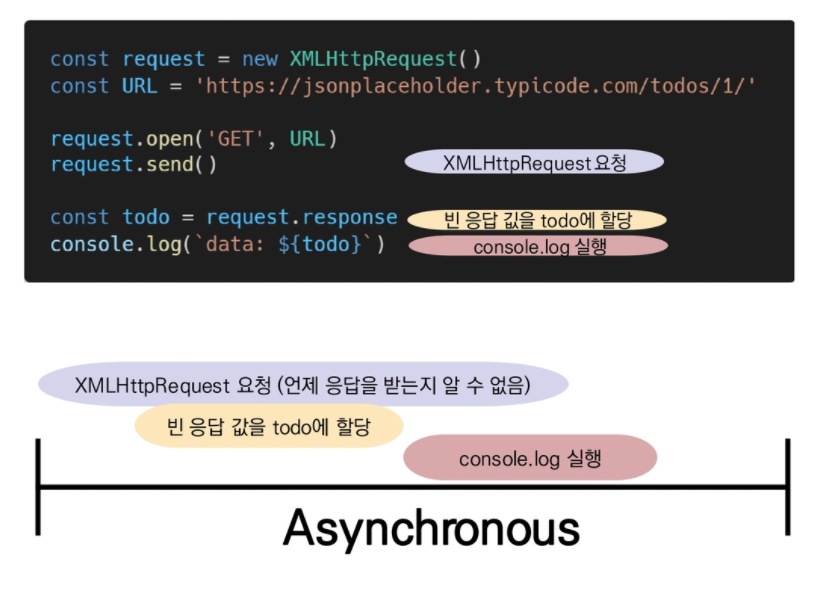

- 요청을 보내고 응답을 기다리지 않고 다음 코드가 실행됨

- 결과적으로 변수 todo에는 응답 데이터가 할당되지 않고 빈 문자열이 출력

- 그렇다면 JS는 왜 기다려주지 않는 방식으로 동작하는가?

  `JavaScript는 single threaded`

#### II - 3. 왜 비동기(Asynchronous)를 사용하는가?

- **"사용자 경험"**
  - 매우 큰 데이터를 동반하는 앱이 있다고 가정
  - 동기식 코드라면 데이터를 모두 불러온 뒤 앱이 실행됨
    - 즉, 데이터를 모두 불러올 때 까지는 앱이 모두 멈춘 것처럼 보임
    - 코드 실행을 차단하여 화면이 멈추고 응답하지 않는 것 같은 사용자 경험을 제공
  - 비동기식 코드라면 데이터를 요청하고 응답 받는 동안, 앱 실행을 함께 진행함
    - 데이터를 불러오는 동안 지속적으로 응답하는 화면을 보여줌으로써 더욱 쾌적한 사용자 경험을 제공
  - 때문에 많은 웹 API 기능은 현재 비동기 코드를 사용하여 실행됨

#### ※ Threads(스레드)

- 프로그램이 작업을 완료하기 위해 사용할 수 있는 단일 프로세스
- 각 thread(스레드)는 한 번에 하나의 작업만 수행할 수 있음
- ex) Task A -> Task B -> Task C
  - 다음 작업을 시작하려면 반드시 앞의 작업이 완료되어야함
  - 컴퓨터 CPU는 여러 코어를 가지고 있기 때문에 한 번에 여러 가지 일을 처리할 수 있음

#### II - 4. Blocking VS Non-Blocking

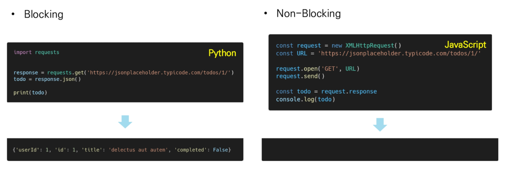

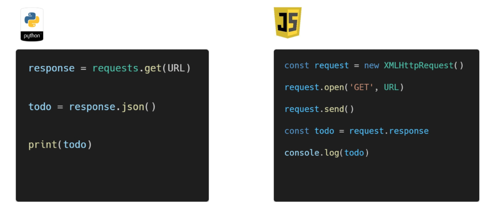

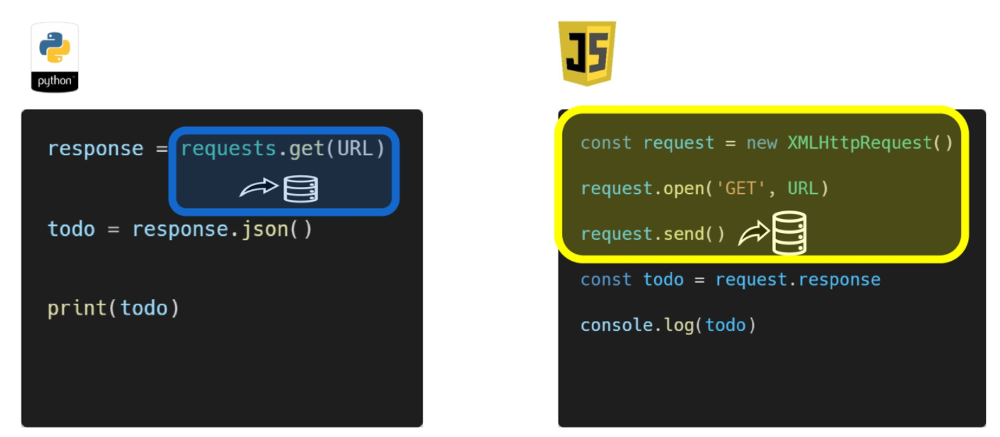

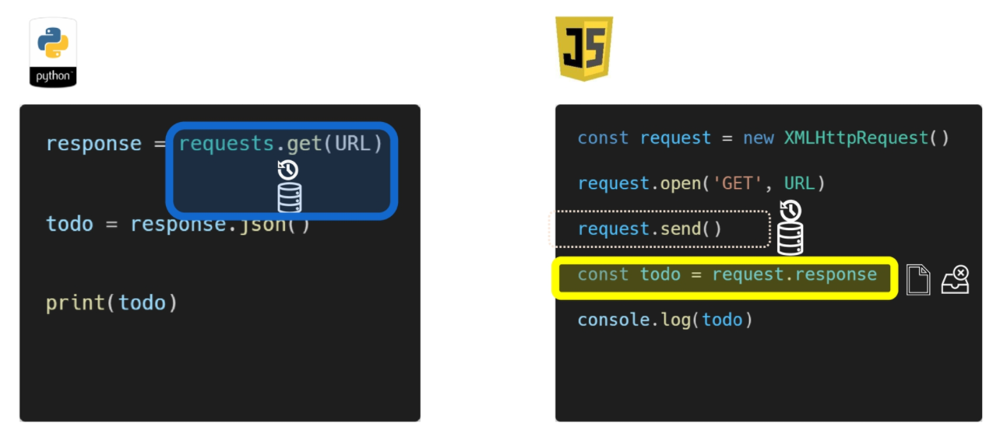

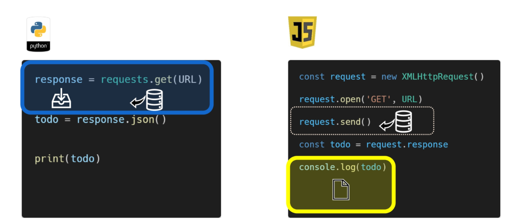

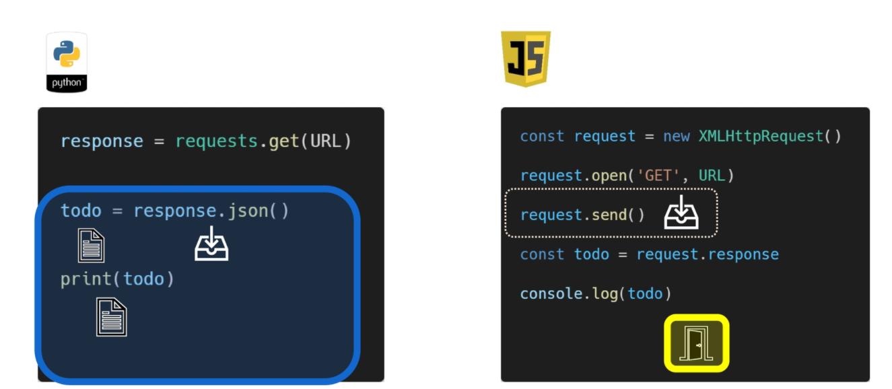

> "JavaScript는 single threaded 이다."

- 컴퓨터가 여러 개의 CPU를 가지고 있어도 main thread라 불리는 단일 스레드에서만 작업 수행
- 즉, 이벤트를 처리하는 Call Stack이 하나인 언어라는 의미
- 이 문제를 해결하기 위해 JavaScript는
  - 즉시 처리하지 못하는 이벤트들을 다른 곳(Web API)으로 보내서 처리하도록 하고,
  - 처리된 이벤트들은 처리된 순서대로 대기실(Task queue)에 줄을 세워 놓고
  - Call Stack이 비면 담당자(Event Loop)가 대기 줄에서 가장 오래된(제일 앞의) 이벤트를 Call Stack으로 보냄

### III . Concurrency model

> Event loop를 기반으로 하는 동시성 모델(Concurrency model)

#### III - 1. CallStack

- 요청이 들어올 때마다 해당 요청을 순차적으로 처리하는 Stack(LIFO) 형태의 자료 구조

#### III - 2. WebAPI(Browser API)

- JavaScript 엔진이 아닌 브라우저 영역에서 제공하는 API
- setTimeout(), DOM events 그리고 AJAX로 데이터를 가져오는 시간이 소요되는 일들을 처리

#### III - 3. Task Queue (Event Queue, Message Queue)

- 비동기 처리된 callback 함수가 대기하는 Queue(FIFO) 형태의 자료 구조
- main thread가 끝난 후 실행되어 후속 JavaScript 코드가 차단되는 것을 방지

#### III - 4. Event Loop

- Call Stack이 비어 있는지 확인
- 비어 있는 경우 Task Queue에서 실행 대기 중인 callback 함수가 있는지 확인
- Task Queue에 대기 중인 callback 함수가 있다면 가장 앞에 있는 callback 함수를 Call Stack으로 push

