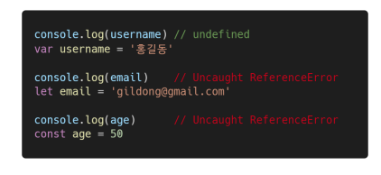

# 변수와 식별자(ES6)


## I. 변수와 식별자 개념

> 식별자 정의와 특징

- 식별자(identifier)는 변수를 구분할 수 있는 변수명을 말함
- 식별자는 반드시 문자, 달러($) 또는 밑줄(_)로 시작
- 대소문자를 구분하며, 클래스명 외에는 모두 소문자로 시작
- 예약어 사용 불가능
  - 예약어 예시: for, if, case 등


#### I - 1. 식별자 작성 스타일

- 카멜 케이스(camelCase, lower-camel-case)
  - 변수, 객체, 함수에 사용
- 파스칼 케이스(PascalCase, upper-camel-case)
  - 클래스, 생성자에 사용
- 대문자 스네이크 케이스(SNAKE_CASE)
  - 상수(constants)에 사용


```js
// 카멜 케이스 : 두 번째 단어의 첫 글자부터 대문자
// 변수
let dog
let variableName

// 객체
const userInfo = { name: 'juan', age: 27}

// 함수
function getPropertyName () {}
function onClick () {}
```


```js
// 파스칼 케이스 : 모든 단어의 첫 번째 글자를 대문자로 작성
// 클래스
class User {
    constructor(options) {
        this.name = options.name
    }
}

// 생성자
const good = new User({
    name: '홍길동',
})
```


```js
// 스네이크 케이스 : 모든 단어 대문자 작성 & 단어 사이에 언더스코어 삽입
// 상수
const API_KEY = 'SOMEKEY'
const PI = Math.PI

// 상수가 아닌 경우
const mutableCollection = new Set()
```


#### I - 2. 변수 선언 키워드 (let, const)


※ 선언, 할당, 초기화

```js
// 선언 : 변수를 생성하는 행위 또는 시점
let foo
console.log(foo) // undefined

// 할당 : 선언된 변수에 값을 저장하는 행위 또는 시점
foo = 11
console.log(foo) // 11

// 선언 + 할당
let bar = 0
console.log(bar) // 0

// 초기화 : 선언된 변수에 처음으로 값을 저장하는 행위 또는 시점
```


> 재할당


> 재선언


> 블록 스코프(block scope)

- if, for, 함수 등의 중괄호 내부를 가리킴
- 블록 스코프를 가지는 변수는 블록 바깥에서 접근 불가능


#### I - 3. 변수 선언 키워드 (var)

> var

-  var로 선언한 변수는 재선언 및 재할당 모두 가능
- ES6 이전에 변수를 선언할 때 사용되던 키워드
- 호이스팅되는 특성으로 인해 예기치 못한 문제 발생 가능
  - 따라서 ES6 이후부터는 var 대신 const와 let을 사용하는 것을 권장
- 함수 스코프


> 함수 스코프(function scope)

- 함수의 중괄호 내부를 가리킴
- 함수 스코프를 가지는 변수는 함수 바깥에서 접근 불가능


> 호이스팅

- 변수를 선언 이전에 참조할 수 있는 현상
- 변수 선언 이전의 위치에서 접근 시 undefined를 반환




> 실습

```js
/*
  [let 키워드 연습]
  
  1. let 키워드를 이용하여 home 변수를 작성하세요.
  2. home 변수에 '제주도'를 할당하세요.
  3. home 변수의 값을 현재 여러분의 지역으로 재할당하세요.
*/
let home = '제주도'
home = '구미'

/*
  [const 키워드 연습]
  
  1. const 키워드를 이용하여 phone 변수를 작성 'Galaxy S2'을 할당하세요.
  2. phone 변수의 값을 현재 여러분의 핸드폰 기종을 재할당하세요.
  3. 재할당 에러를 확인하세요.
*/
const phone = 'Galaxy S2'
phone = 'Galaxy Note 9'
// Uncaught TypeError: Assignment to constant variable.

/*
  [블록 스코프 - let 예시]
  
  아래 코드 실행 후 결과를 확인해보세요.
*/

let fullName = 'Brendan Eich'

if (fullName === 'Brendan Eich') {
  let fullName = 'Guido Van Rossum'
  console.log('블록 스코프:', fullName)
}

console.log('전역 스코프:', fullName)


/*
  [블록 스코프 - const 예시]
  
  아래 코드 실행 후 결과를 확인해보세요.
*/

let fullName = 'Brendan Eich'

if (fullName === 'Brendan Eich') {
  let fullName = 'Guido Van Rossum'
  const language = 'Python'
}

console.log(language)
// Uncaught ReferenceError: language is not defined

/*
  [var 키워드 연습]
  
  1. var 키워드를 이용하여 framework 변수를 작성하세요.
  2. framework 변수에 'Bootstrap'를 할당하세요.
  3. framework 변수에 'Django'를 재할당하세요.
  4. framework 변수를 재선언하고 'Vue'를 할당하세요.
*/
var framework = 'Bootstrap'
framework = 'Django'
var fremework = 'Vue'

/*
  [함수 스코프 - var 키워드 예시]
  
  아래 코드 실행 후 결과를 확인해보세요.
*/

function f1() {
  var message = 'You are doing great!'
}
console.log(message)
// Uncaught ReferenceError: message is not defined

/*
  [블록 스코프 - var 키워드 예시]

  Tip.
    if문은 블록 스코프를 생성합니다.
  
  아래 코드 실행 후 결과를 확인해보세요.
*/

const codeEditor = 'vscode'

if (codeEditor === 'vscode') {
  var theme = 'dark+'
}
console.log(theme)


/*
  [블록 스코프 - const, let 키워드 예시]
  
  Tip. 
    const와 let은 블록 스코프입니다.
    함수의 중괄호도 블록에 해당됩니다.
  
  아래 코드 실행 후 결과를 확인해보세요.
*/

function f2() {
  const stack = 'Last In, First Out'
}
console.log(stack)
// Uncaught ReferenceError: stack is not defined

function f3() {
  let queue = 'First In, First Out'
}
console.log(queue)
// Uncaught ReferenceError: queue is not defined

/*
  [호이스팅(hoisting)]
  
  아래 코드 실행 후 결과를 확인해보세요.
  그리고 const와 let의 경우와 비교해보세요.
*/

console.log(hoisted)
var hoisted = 'can you see me?'
// JS 에서 동작
// var hoisted
// console.log(hoisted) // 접근 가능
// hoisted = 'can you see me?'

console.log(lunch)
const lunch = '초밥'
// JS 에서 동작 
// const lunch
// TDZ (Temporal Dead Zone)
// console.log(lunch)
// lunch = '초밥'

console.log(dinner)
let dinner = '스테이크'
// JS 에서 동작
// let dinner
// TDZ (Temporal Dead Zone)
// console.log(dinner)
// dinner = '스테이크'
```


