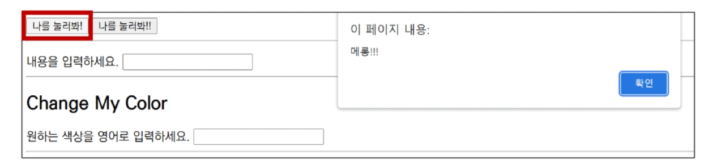
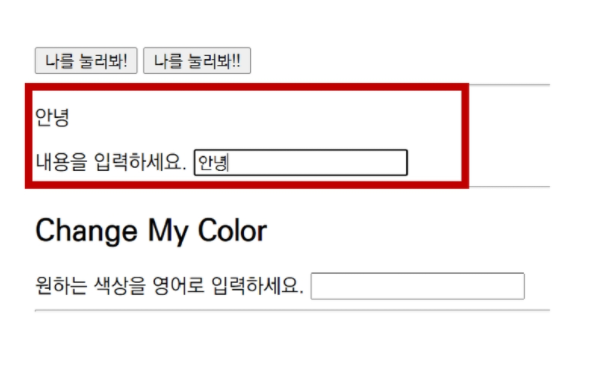

# JavaScript Event


## I. Event

> Event(이벤트) 개념

- 네트워크 활동이나 사용자와의 상호작용 같은 사건의 발생을 알리기 위한 객체
- 이벤트 발생
  - 마우스를 클릭하거나 키보드를 누르는 등 사용자 행동으로 발생할 수도 있음
  - 특정 메서드를 호출(Element.click()) 하여 프로그래밍적으로도 만들어 낼 수 있음


## II. Event 기반 인터페이스

- AnimationEvent, ClipboardEvent, DragEvent 등
- UIEvent
  - 간단한 사용자 인터페이스 이벤트
  - Event의 상속을 받음
  - MouseEvent, KeyboardEvent, InputEvent, FocusEvent 등의 부모 객체 역할을 함


## III. Event는 왜 필요할까?


## IV. Event의 역할

> "~ 하면 ~ 한다.", "클릭하면, 경고창을 띄운다.", "특정 이벤트가 발생하면, 할 일을 등록한다."


#### IV - 1. Event handler - addEventListener()

> EventTarget.addEventListner()

- 지정한 이벤트가 대상에 전달될 때마다 호출할 함수를 설정
- 이벤트를 지원하는 모든 객체(Element, Document, Window 등)를 대상으로 지정 가능


`target.addEventListener(type, listener[, options])`

- type
  - 반응 할 이벤트 유형 (대소문자 구분 문자열)
- listener
  - 지정된 타입의 이벤트가 발생했을 때 알림을 받는 객체
  - EventListener 인터페이스 혹은 JS function 객체(콜백 함수)여야 함


> DOM 관련 객체의 상속 구조 복습

- EventTarget
  - Event Listener를 가질 수 있는 객체가 구현하는 DOM 인터페이스


> addEventListner 예시


> 실습 1

```html
<button onclick="alertMessage()">나를 눌러봐!</button>
```

```js
const alertMessage = function () {
	alert('메롱!!!')
}
```




> 실습 2

```html
<button id="my-button">나를 눌러봐!!</button>
```

```js
const myButton = document.querySelector('#my-button')
myButton.addEventListener('click', alertMessage)
```


> 실습 3

```html
<p id="my-paragraph"></p>

<form action="#">
    <label for="my-text-input">내용을 입력하세요.</label>
    <input id="my-text-input" type="text">
</form>
```

```js
const myTextInput = document.querySelector('#my-text-input')
myTextInput.addEventListener('input', function (event) {
    console.log(event)
    const myPtag = document.querySelector('#my-paragraph')
    myPtag.innerText = event.target.value
})
```




> 실습 4

```html
<h2>Change My Color</h2>
<label for="change-color-input">원하는 색상을 영어로 입력하세요.</label>
<input id="change-color-input"></input>
```

```js
const colorInput = document.querySelector('#change-color-input')

const changeColor = function () {
    const h2Tag = document.querySelector('h2')
    h2Tag.style.color = event.target.value
}

colorInput.addEventListener('input', changeColor)
```


#### IV - 2. Event 취소

> Event.preventDefault()

- 현재 이벤트의 기본 동작을 중단
- 태그의 기본 동작을 작동하지 않게 막음
  - ex) a 태그의 기본 동작은 클릭 시 링크로 이동 /form 태그의 기본 동작은 form 데이터 전송
- 이벤트를 취소할 수 있는 경우, 이벤트의 전파를 막지 않고 그 이벤트를 취소


> 실습 1

```html
<input type="checkbox" id="my-checkbox">
```

```js
const checkBox = document.querySelector('#my-checkbox')

checkBox.addEventListener('click', function (event) {
    event.preventDefault()
    console.log(event)
})
```


> 실습 2

```html
<form action="/articles/" id="my-form">
    <input type="text">
    <input type="submit" value="제출!">
</form>
```

```js
const formTag = document.querySelector('#my-form')

formTag.addEventListener('submit', function (event) {
    console.log(event)
    event.preventDefault()
    event.target.reset()
})
```


> 실습 3

```html
<a href="https://google.com/" target="_blank" id="my-link">GoToGoogle</a>
```

```js
const aTag = document.querySelector('#my-link')

aTag.addEventListener('click', function (event) {
    console.log(event)
    event.preventDefault()
})
```


> 실습 4

```js
document.addEventListener('scroll', function (event) {
    console.log(event)
    event.preventDefault()
})
```


※ 취소 할 수 없는 이벤트도 존재

> 이벤트의 취소 가능 여부는 event.cancelable을 사용해 확인할 수 있음


