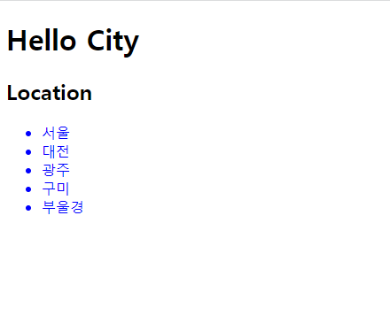
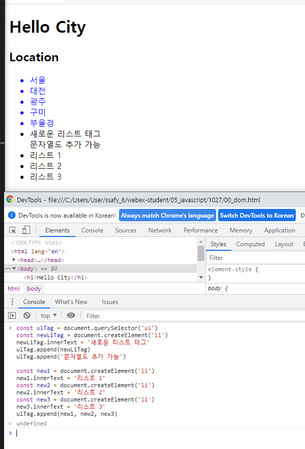

# JavaScript Intro


## I. JavaScript의 필요성

- 브라우저 화면을 **동적**으로 만들기 위함
- 브라우저를 조작할 수 있는 유일한 언어


#### Most Popular Programming Language in 2021 survey


## II. DOM(Document Object Model)

> DOM 이란?

- HTML, XML과 같은 문서를 다루기 위한 문서 프로그래밍 인터페이스
- 문서를 구조화하고 구조화된 구성 요소를 하나의 객체로 취급하여 다루는 논리적 트리 모델
- 문서가 구조화되어 있으며 각 요소는 객체(object)로 취급
- 단순한 속성 접근, 메서드 활용뿐만 아니라 프로그래밍 언어적 특성을 활용한 조작 가능
- 주요 객체
  - window : DOM을 표현하는 창. 가장 최상위 객체 (작성 시 생략 가능)
  - document : 페이지 컨텐츠의 Entry Point 역할을 하며, <body> 등과 같은 수많은 다른 요소들을 포함
  - navigator, location, history, screen


#### II-1. DOM - 해석

> 파싱(Parsing)

- 구문 분석, 해석
- 브라우저가 문자열을 해석하여 DOM Tree로 만드는 과정


#### II-2. DOM - 조작


> BOM(browser Object Model) 이란?

- 자바스크립트가 브라우저와 소통하기 위한 모델
- 브라우저의 창이나 프레임을 추상화해서 프로그래밍적으로 제어할 수 있도록 제공하는 수단
  - 버튼, URL 입력창, 타이틀 바 등 브라우저 윈도우 및 웹 페이지 일부분을 제어 가능
- window 객체는 모든 브라우저로부터 지원받으며 브라우저의 창(window)를 지칭


#### II - 3. BOM - 조작


> JavaScript Core

- 프로그래밍 언어


## III. DOM 조작

> DOM 조작 - 개념

- Document는 문서 한 장(HTML)에 해당하고 이를 조작
- DOM 조작 순서
  - 선택 (Select)
  - 변경 (Manipulation)


> DOM 조작 - Document 위치


> DOM 관련 객체의 상속 구조

- EventTarget
  - Event Listener를 가질 수 있는 객체가 구현하는 DOM 인터페이스

- Node
  - 여러 가지 DOM 타입들이 상속하는 인터페이스

- Element
  - Document 안의 모든 객체가 상속하는 가장 범용적인 기반 클래스
  - 부모인 Node와 그 부모인 EventTarget의 속성을 상속
- Document
  - 브라우저가 불러온 웹 페이지를 나타냄
  - DOM 트리의 진입점(entry point) 역할을 수행
- HTMLElement
  - 모든 종류의 HTML 요소
  - 부모 element의 속성 상속


> DOM 선택 - 선택 관련 메서드

- Document.querySelector(selector)
  - 제공한 선택자와 일치하는 element 하나 선택
  - 제공한 CSS selector를 만족하는 첫 번째 element 객체를 반환 (없다면 null)
- Document.querySelectorAll(selector)
  - 제공한 선택자와 일치하는 여러 element를 선택
  - 매칭 할 하나 이상의 셀렉터를 포함하는 유효한 CSS selector를 인자(문자열)로 받음
  - 지정된 셀렉터에 일치하는 NodeList를 반환
- getElementById(id)
- getElementsByTagName(name)
- getElementsByClassName(names)


※ querySelector(), querySelectorAll() 을 사용하는 이유

- id, class 그리고 tag 선택자 등을 모두 사용 가능하므로, 더 구체적이고 유연하게 선택 가능
  - ex) document.querySelector('#id'), document.querySelectAll('.name')


> DOM 선택 - 선택 메서드별 반환 타입

- 단일 element
  - getElementById()
  - querySelector()
- HTMLCollection
  - getElementsByTagName()
  - getElementsByClassName()
- NodeList
  - querySelectorAll()


> DOM 선택 - HTMLCollection & NodeList

- 둘 다 배열과 같이 각 항목에 접근하기 위한 index를 제공(유사 배열)
- HTMLCollection
  - name, id, index 속성으로 각 항목에 접근 가능
- NodeList
  - index로만 각 항목에 접근 가능
  - 단, HTMLCollection과 달리 배열에서 사용하는 forEach 함수 및 다양한 메서드 사용 가능
- 둘 다 Live Collection으로 DOM의 변경사항을 실시간으로 반영하지만, querySelectorAll()에 의해 반환되는 NodeList는 Static Collection으로 실시간으로 반영되지 않음


> DOM 선택 - Collection

- Live Collection
  - 문서가 바뀔 때 실시간으로 업데이트 됨
  - DOM의 변경사항을 실시간으로 collection에 반영
  - ex) HTMLCollection, NodeList
- Static Collection (non-live)
  - DOM이 변경되어도 collection 내용에는 영향을 주지 않음
  - querySelectorAll()의 반환 NodeList만 static collection


#### III - 1. DOM 선택 실습

##### Base.html

```js
<!DOCTYPE html>
<html lang="en">
<head>
  <meta charset="UTF-8">
  <meta http-equiv="X-UA-Compatible" content="IE=edge">
  <meta name="viewport" content="width=device-width, initial-scale=1.0">
  <title>Document</title>
  <style>
    .city-location {
      color: blue;
    }
  </style>
</head>
<body>
  <h1>Hello City</h1>
  <h2 id="location-header">Location</h2>
  <div>
    <ul>
      <li class="city-location">서울</li>
      <li class="city-location">대전</li>
      <li class="city-location">광주</li>
      <li class="city-location">구미</li>
      <li class="city-location">부울경</li>
    </ul>
  </div>
</body>
</html>
```



```js
// 1. Selection
// 1-1. window & document
console.log(window)
console.log(document)
console.log(window.document)
```


```js
// 1-2. querySelector
const h1 = document.querySelector('h1')
const h2 = document.querySelector('h2')
const secondH2 = document.querySelector('#location-header')
const selectUlTag = document.querySelector('div > ul')
```


```js
// 1-3. querySelectorAll
const liTags = document.querySelectorAll('li')
const secondLiTags = document.querySelectorAll('.city-location')
```


----

#### III - 2. DOM 변경 실습

```js
// 2. Creation & Append
// 2-1. createElement
const ulTag = document.querySelector('ul')
const newLiTag = document.createElement('li')
// 2-2. append
newLiTag.innerText = '새로운 리스트 태그'
ulTag.append(newLiTag)
ulTag.append('문자열도 추가 가능')

const new1 = document.createElement('li')
new1.innerText = '리스트 1'
const new2 = document.createElement('li')
new2.innerText = '리스트 2'
const new3 = document.createElement('li')
new3.innerText = '리스트 3'
ulTag.append(new1, new2, new3)
```




```js
// 2-3. appendChild
const ulTag = document.querySelector('ul')
const newLiTag = document.createElement('li')
newLiTag.innerText = '새로운 리스트 태그'
ulTag.appendChild(newLiTag)
ulTag.appendChild('문자열은 추가 불가')

const new1 = document.createElement('li')
new1.innerText = '리스트 1'
const new2 = document.createElement('li')
new2.innerText = '리스트 2'
ulTag.appendChild(new1, new2)
```


```js
// 2-4. innerText & innerHTML
const ulTag = document.querySelector('ul')
const liTag1 = document.createElement('li')
liTag1.innerText = '<li>춘천</li>'
const liTag2 = document.createElement('li')
liTag2.innerHTML = '<li>춘천</li>'
ulTag.append(liTag1, liTag2)

const ulTag = document.querySelector('ul')
ulTag.innerHTML = '<li><a href="javascript:alert(\'당신의 개인정보 유출\')">춘천</a></li>'
```


----

#### III - 3. DOM 삭제 실습

```js
// 3. Delete
// 3-1. remove
const header = document.querySelector('#location-header')
header.remove()

// 3-2. removeChild
const parent = document.querySelector('ul')
const child = document.querySelector('ul > li')
const removedChild = parent.removeChild(child)
console.log(removedChild)
```


-----

#### III - 4. DOM 속성 실습

```js
// 4. 속성
// 4-1. setAttribute
const header = document.querySelector('#location-header')
header.setAttribute('class', 'city-location')

// 4-2. getAttribute
const getAttr = document.querySelector('.city-location')
getAttr.getAttribute('class')
getAttr.getAttribute('style')
```


