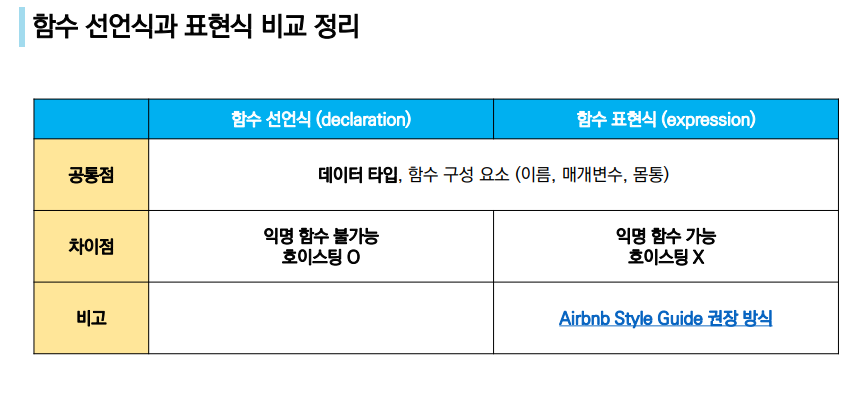

# JavaScript Functions


## I. Functions

- 참조 타입중 하나로써 function 타입에 속함
- JavaScript에서 함수를 정의하는 방법은 주로 2가지로 구분
  - 함수 선언식
  - 함수 표현식
- JavaScript의 함수는 일급 객체에 해당
  - 일급 객체 : 다음의 조건들을 만족하는 객체를 의미함
    - 변수에 할당 가능
    - 함수의 매개변수로 전달 가능
    - 함수의 반환 값으로 사용 가능


#### I - 1. 함수 선언식

- 함수의 이름과 함께 정의하는 방식
- 3가지 부분으로 구성
  - 함수의 이름 (name)
  - 매개변수 (args)
  - 몸통 (중괄호 내부)


#### I - 2. 함수 표현식

- 함수를 표현식내에서 정의하는 방식
- 함수의 이름을 생략하고 익명 함수로 정의 가능
- 3가지 부분으로 구성
  - 함수의 이름(생략 가능)
  - 매개변수 (args)
  - 몸통 (중괄호 내부)


#### I - 3. 기본 인자

- 인자 작성 시 '=' 문자 뒤 기본 인자 선언 가능





#### I - 4. 함수의 타입

- 선언식 함수와 표현식 함수 모두 타입은 function으로 동일


#### I - 5. 호이스팅 - 함수 선언식

- 함수 선언식으로 선언한 함수는 var로 정의한 변수처럼 hoisting 발생
- 함수 호출 이후에 선언해도 동작


#### I - 6. 호이스팅 - 함수 표현식

- 함수 표현식으로 선언한 함수는 함수 정의 전에 호출 시 에러 발생
- 함수 표현식으로 정의된 함수는 변수로 평가되어 변수의 scope 규칙을 따름


## II. Arrow Function

> 화살표 함수 (Arrow Function)

- 함수를 비교적 간결하게 정의할 수 있는 문법
- function 키워드 생략 가능
- 함수의 매개변수가 단 하나 뿐이라면, '( )' 도 생략 가능
- 함수 몸통이 표현식 하나라면 '{ }'과 return도 생략 가능


> 실습

```js
/*
	[함수 선언식 연습]
	
	인자의 길이에 따라 true 혹은 false를 반환하는 함수 `isValid`를 작성하세요.
	- `password` 인자의 값의 길이가 8 미만이면 false를 반환합니다.
	- `password` 인자의 값의 길이가 8 이상이면 true를 반환합니다.
	- 함수는 선언식으로 작성합니다.
	- 예시) isValid('abcd')  // false
*/
function isValid(password) {	
	if (password.length >= 8) {
		return true
	} else {
		return false
	}
}
isValid('abcd')


/*
	[함수 표현식 연습]
	
	문자열로 구성된 배열을 특정 문자를 기준으로 하나의 문자열로 합치는 함수 `join`을 작성하세요.
	- 첫번째 인자 `array`는 문자열로 구성된 배열입니다.
	- 두번째 인자 `separator`는 문자열입니다.
	- 함수는 표현식으로 작성합니다.
	- 예시) join(['010', '1234', '5678'], '-')  // '010-1234-5678'
*/

const join = function (array, separator) {
	let phone_number = ''
	let len = array.length
	for (let num of array) {
		phone_number += num
		len--
		if (len > 0) {
			phone_number += separator
		}
	}
	return phone_number
}

join(['010', '1234', '5678'], '-')

/*
	[함수 기본인자 연습]
	
	주문을 받아서 주문서를 반환하는 함수 `makeOrder`를 작성하세요.
	- 첫번째 인자 `menu`는 문자열입니다.
	- 두번째 인자 `size`는 문자열이며, 기본인자는 'regular'입니다.
	- 함수는 각 인자를 속성으로 갖는 객체를 반환합니다.
	
	예시) makeOrder('mocha') // { menu: 'mocha', size: 'regular' }
*/

const makeOrder = function (menu, size = 'regular') {
	let result = {
		menu: menu,
		size: size
	}
	return result
}
makeOrder('mocha')

/*
	[화살표 함수 연습]
	
	- 아래 celsiusToFahrenheit 함수는 섭씨 온도를 화씨 온도로 바꾸는 함수입니다. 
  - 선언식으로 작성된 함수를 "화살표 함수"로 다시 작성해보세요.
	
  function celsiusToFahrenheit (celsius) {
		const fahrenheit = celsius * 9/5 + 32
		return fahrenheit
	}

*/

const celsiusToFahrenheit = celsius => celsius * 9/5 + 32

```

