# JavaScript 데이터 타입


## I. 데이터 타입


#### I - 1. 데이터 타입 종류

- 자바 스크립트의 모든 값은 특정한 데이터 타입을 가짐
- 크게 원시 타입(Primitive type)과 참조 타입(Reference type)으로 분류됨

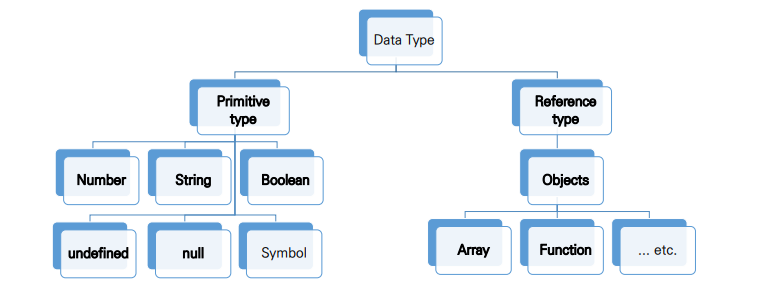


> 원시 타입과 참조 타입 비교

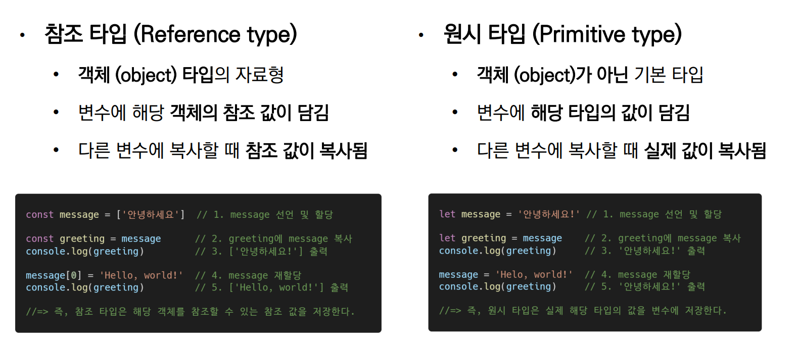


#### I - 2. 원시 타입(Primitive type)

> 숫자 타입

- 정수, 실수 구분 없는 하나의 숫자 타입
- 부동소수점 형식을 따름
- NaN(Not-A-Number) : 계산 불가능한 경우 반환 되는 값
  - ex) 'Angel' / 1004 => NaN

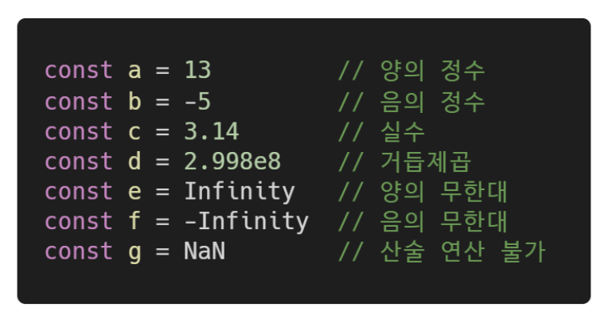


> 문자열 (String) 타입

- 텍스트 데이터를 나타내는 타입
- 16비트 유니코드 문자의 집합
- 작은따옴표 또는 큰따옴표 모두 가능
- 템플릿 리터럴(Template Literal)
  - ES6부터 지원
  - 따옴표 대신 backtick(``)으로 표현
  - ${ expression } 형태로 표현식 삽입 가능

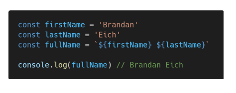


> undefined

- 변수의 값이 없음을 나타내는 데이터 타입
- 변수 선언 이후 직접 값을 할당하지 않으면 자동으로 undefined가 할당됨

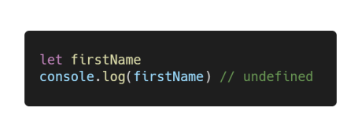


> null

- 변수의 값이 없음을 의도적으로 표현할 때 사용하는 데이터 타입
- null 타입과 typeof 연산자
  - typeof 연산자 : 자료형 평가를 위한 연산자
  - null 타입은 원시타입의 정의에 따라 원시 타입에 속하지만, typeof 연산자의 결과는 객체(object)로 표현됨

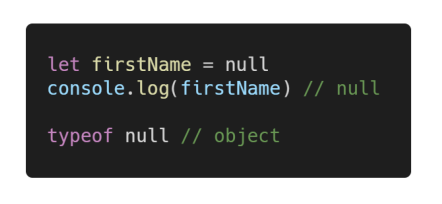


> undefined 타입과 null 타입 비교

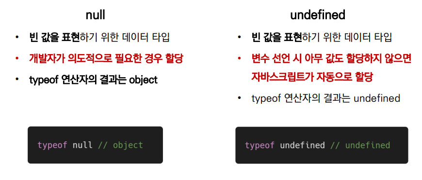


> Boolean 타입

- 논리적 참 또는 거짓을 나타내는 타입
- true 또는 false로 표현
- 조건문 또는 반복문에서 유용하게 사용

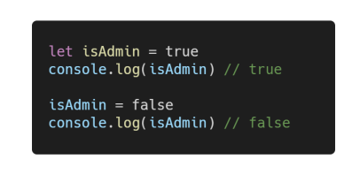


>ToBoolean Conversions(자동 형변환) 정리

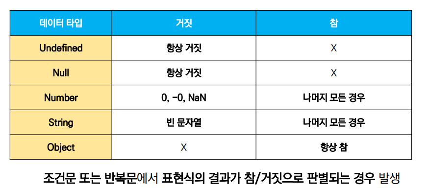


## II. 연산자

> 할당 연산자

- 오른쪽에 있는 피연산자의 평가 결과를 왼쪽 피연산자에 할당하는 연산자
- 다양한 연산에 대한 단축 연산자 지원

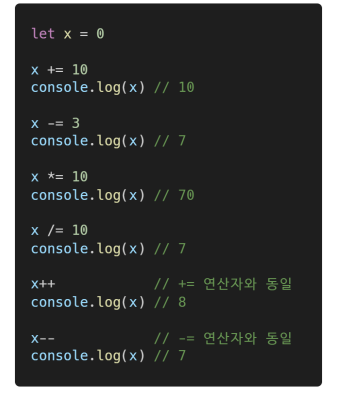


>비교 연산자

- 피연산자들(숫자, 문자, Boolean 등)을 비교하고 결과값을 boolean으로 반환하는 연산자
- 문자열은 유니코드 값을 사용하며 표준 사전 순서를 기반으로 비교
  - ex) 알파벳끼리 비교할 경우 (ASCII 코드 기반)
    - 알파벳 순서상 후순위가 더 크다
    - 소문자가 대문자보다 더 크다


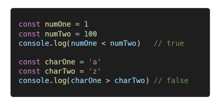


> 동등 비교 연산자 (==)

- 두 피연산자가 같은 값으로 평가되는지 비교 후 boolean 값을 반환
- 비교할 때 암묵적 타입 변환을 통해 타입을 일치시킨 후 같은 값인지 비교
- 두 피연산자가 모두 객체일 경우 메모리의 같은 객체를 바라보는지 판별
- 예상치 못한 결과가 발생할 수 있으므로 특별한 경우를 제외하고 사용하지 않음

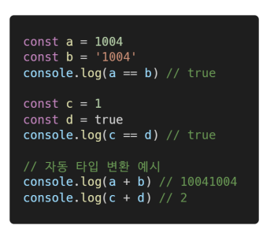


> 일치 비교 연산자(===)

- 두 피연산자가 같은 값으로 평가되는지 비교 후 boolean 값을 반환
- 엄격한 비교가 이뤄지며 암묵적 타입 변환이 발생하지 않음
- 두 피연산자가 모두 객체일 경우 메모리의 같은 객체를 바라보는지 판별

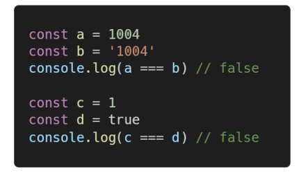


> 논리 연산자

- 세 가지 논리 연산자로 구성
  - and 연산은 && 연산자를 이용
  - or 연산은 || 연산자를 이용
  - not 연산은 ! 연산자를 이용
- 단축 평가 지원
  - ex) false && true => false
  - ex) true || false => true

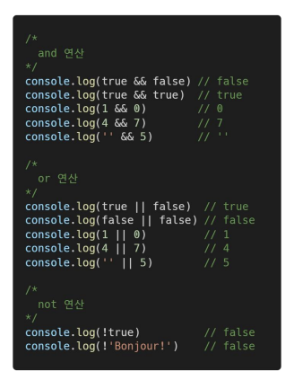


> 삼항 연산자 (Ternary Operator)

- 세 개의 피연산자를 사용하여 조건에 따라 값을 반환하는 연산자
- 가장 왼쪽의 조건식이 참이면 콜론(:) 앞의 값을 사용하고 그렇지 않으면 콜론(:) 뒤의 값을 사용
- 삼항 연산자의 결과는 변수에 할당 가능

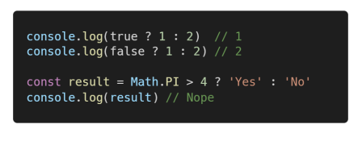


> 실습

```js
/*
  [Number 타입 연습]

  - hour 변수에 현재 시간의 "시(hour)를 초(second)로 바꿔서" 저장하세요.
  - minute 변수에 현재 시간의 "분(minute)을 초(second)로 바꿔서" 저장하세요. 
  - curTime 변수에 hour와 minute의 합을 저장 후 출력해보세요.
*/
let hour = 11 * 60 * 60
let minute = 22 * 60
let curTime = hour + minute
console.log(curTime)

/*
  [String 타입 연습]

  - username 변수에 여러분의 이름을 입력하세요.
  - message 변수에 인사말을 작성하세요.
  - username 변수에 message를 할당 연산자로 이어붙인 후 출력해보세요. 
*/
let username = 'ED'
let msg = 'Hello'

username += msg
console.log(username)


/*
  [String 타입 연습]

  템플릿 리터럴(Template Literal) 활용

  - viewCnt 변수를 활용하여 예시와 같은 문장을 만들어보세요.
  - 예시) 조회수 500회
*/

const viewCnt = 500
console.log(`조회수 ${viewCnt}회`)

/*
  [undefined vs. null]

  Tip.
    - undefined는 변수 선언 시 값을 할당하지 않을 때 할당되는 값입니다.
    - null은 개발자가 의도적으로 값이 없음을 표현할 때 할당하는 값입니다. 

  아래 코드 실행 후 결과를 확인해보세요.
*/

let unknown
console.log(unknown)
console.log(typeof unknown)

const nullValue = null 
console.log(nullValue)
console.log(typeof nullValue)


/*
  [Boolean 타입 연습]

  Tip.
    파이썬과 다르게 자바스크립트의 Boolean 타입은 
    첫 단어가 소문자임에 주의하세요.

  - isLoggedIn 변수에 false를 할당하세요.
  - isLoggedIn 변수의 값을 true로 바꾸고 출력해보세요.
*/
let isLoggedIn = false
isLoggedIn = true
console.log(isLoggedIn)

/*
  [삼항(Ternary) 연산자 연습]
  
  Tip.
    condition ? expression if true : expression if false

  아래의 조건을 만족하는 삼항 연산자를 작성해보세요.
  - 조건문에서 subscribed 변수의 참/거짓 여부를 판별합니다.
  - 조건이 참이면 '구독취소'를 반환합니다.
  - 조건이 거짓이면 '구독중'을 반환합니다.
  - 삼항 연산자의 반환값을 message 변수에 할당 후 출력합니다.
*/

const subscribed = true

let message = subscribed ? '구독취소' : '구독중'
console.log(message)
```


