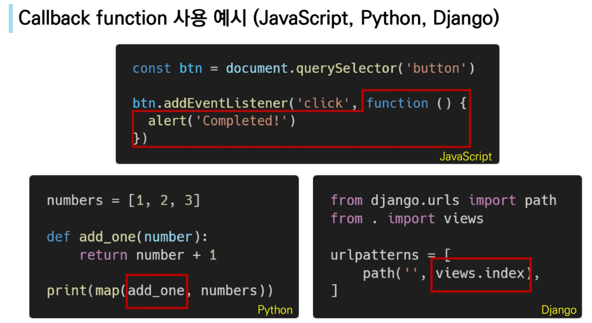
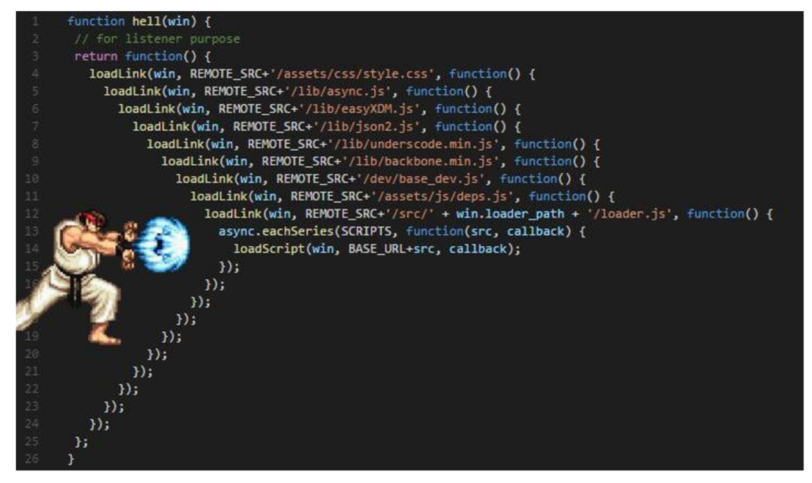
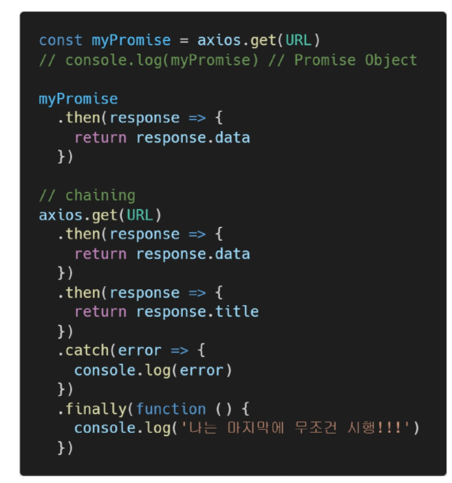
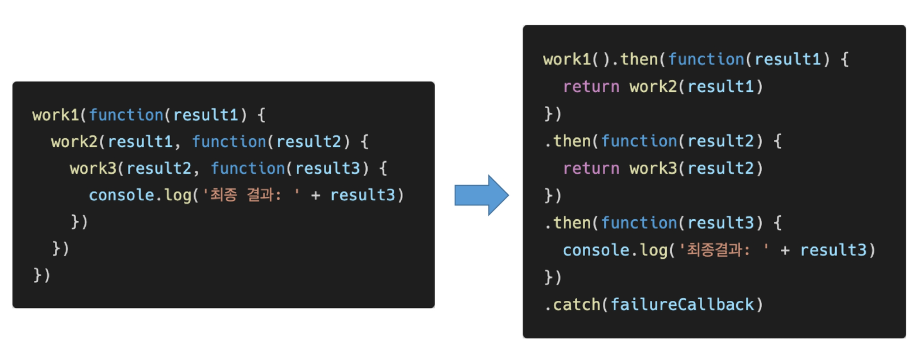

# 순차적인 비동기 처리하기

- Web API로 들어오는 순서는 중요하지 않고, 어떤 이벤트가 먼저 처리되느냐가 중요 ( 즉, 실행 순서 불명확 )
- 이를 해결하기 위해 순차적인 비동기 처리를 위한 2가지 작성 방식

1. Async callbacks
   - 백그라운드에서 실행을 시작할 함수를 호출할 때 인자로 지정된 함수
   - ex) addEventListner() 의 두 번째 인자
2. promise-style
   - Modern Web APIs 에서의 새로운 코드 스타일
   - XMLHttpRequest 객체를 사용하는 구조보다 조금 더 현대적인 버전

## I. Callback Function

- 다른 함수에 인자로 전달된 함수
- 외부 함수 내에서 호출되어 일종의 루틴 또는 작업을 완료함
- 동기식, 비동기식 모두 사용됨
  - 그러나 비동기 작업이 완료된 후 코드 실행을 계속하는 데 주로 사용됨
- 비동기 작업이 완료된 후 코드 실행을 계속하는 데 사용되는 경우를 비동기 콜백(asynchronous callback)이라고 함

> JavaScript의 함수는 "일급 객체 (First Class Objects)"

- 일급 객체 (일급 함수)
  - 다른 객체들에 적용할 수 있는 연산을 모두 지원하는 객체(함수)
- 일급 객체의 조건
  - 인자로 넘길 수 있어야 함
  - 함수의 반환 값으로 사용할 수 있어야 함
  - 변수에 할당할 수 있어야 함

#### I - 1. Async callbacks

- 백그라운드에서 코드 실행을 시작할 함수를 호출할 때 인자로 지정된 함수
- 백그라운드 코드 실행이 끝나면 callback 함수를 호출하여 작업이 완료되었음을 알리거나, 다음 작업을 실행하게 할 수 있음
  - ex) addEventListner() 의 두 번째 매개변수
- callback 함수를 다른 함수의 인수로 전달할 때, 함수의 참조를 인수로 전달할 뿐이지 즉시 실행되지 않고, 함수의 body에서 "called back" 됨. 정의된 함수는 때가 되면 callback 함수를 실행하는 역할을 함

> Why use callback?

- callback 함수는 명시적인 호출이 아닌 특정 루틴 혹은 action에 의해 호출되는 함수
- Django 의 경우 "요청이 들어오면", event의 경우 "특정 이벤트가 발생하면" 이라는 조건으로 함수를 호출할 수 있었던 건 'Callback function' 개념 때문에 가능
- 비동기 로직을 수행할 때 callback 함수는 필수
  - 명시적인 호출이 아니라 다른 함수의 매개변수로 전달하여 해당 함수 내에서 특정 시점에 호출

#### I - 2. callback Hell!

- 순차적인 연쇄 비동기 작업을 처리하기 위해 "callback 함수를 호출 하고, 그 다음 callback 함수를 호출하고, 또 그 함수의 callback 함수를 호출하고..."의 패턴이 지속적으로 반복됨
- 즉, 여러 개의 연쇄 비동기 작업을 할 때 마주하는 상황
- 이를 callback Hell(콜백 지옥) 혹은 pyramid of doom(파멸의 피라미드)이라 함
- 위와 같은 상황이 벌어질 경우 아래 사항들을 통제하기 어려움
  - 디버깅
  - 코드 가독성

> callback Hell 해결하기

- Keep your code shallow (코드의 깊이를 얕게 유지)
- Modularize (모듈화)
- Handle every single error (모든 단일 오류 처리)
- Promise callbacks (Promise 콜백 방식 사용)

## II. Promise

#### II - 1. Promise object

- 비동기 작업의 최종 완료 또는 실패를 나타내는 객체
  - 미래의 완료 또는 실패와 그 결과 값을 나타냄
  - 미래의 어떤 상황에 대한 약속
- 성공(이행)에 대한 약속
  - `.then()`
- 실패(거절)에 대한 약속
  - `.catch()`

#### II - 2. Promise methods

> .then (callback)

- 이전 작업(promise) 이 성공했을 때(이행했을 때) 수행할 작업을 나타내는 callback 함수
- 그리고 각 callback 함수는 이전 작업의 성공 결과를 인자로 전달받음
- 따라서 성공했을 때의 코드를 callback 함수 안에 작성

> .catch (callback)

- .then 이 하나라도 실패하면 (거부 되면) 동작 (동기식의 'try - except' 구문과 유사)
- 이전 작업의 실패로 인해 생성된 error 객체는 catch 블록 안에서 사용할 수 있음

> 각각의 .then() 블록은 서로 다른 promise를 반환

- 즉, .then() 을 여러개 사용(chaining) 하여 연쇄적인 작업을 수행할 수 있음
- 결국 여러 비동기 작업을 차례대로 수행할 수 있다는 뜻

> .then()과 .catch() 메서드는 모두 promise를 반환하기 때문에 chaining 가능

- 주의
  - 반환 값이 반드시 있어야함
  - 없다면 callback 함수가 이전의 promise 결과를 받을 수 없음

> .finally (callback)

- Promise 객체를 반환
- 결과와 상관없이 무조건 지정된 callback 함수가 실행
- 어떠한 인자도 전달받지 않음
  - Promise가 성공되었는지 거절되었는지 판단할 수 없기 때문
- 무조건 실행되어야 하는 절에서 활용
  - .then() 과 .catch() 블록에서의 코드 중복을 방지

> callback Hell => Promise

> 

