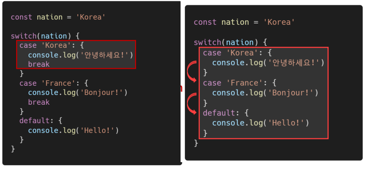

# 조건문과 반복문


## I. 조건문

#### I - 1. 조건문의 종류와 특징

- if statement
  - 조건 표현식의 결과값을 Boolean 타입으로 변환 후 참/거짓을 판단
- switch statement
  - 조건 표현식의 결과값이 어느 값(case)에 해당하는지 판별
  - 주로 특정 변수의 값에 따라 조건을 분기할 때 활용
    - 조건이 많아질 경우 if문보다 가독성이 좋을 수 있음


#### I - 2. if

- if, else if, else
  - 조건은 소괄호(condition) 안에 작성
  - 실행할 코드는 중괄호{} 안에 작성
  - 블록 스코프 생성


> 예시


#### I - 3. switch

- 표현식(expression)의 결과값을 이용한 조건문
- 표현식의 결과값과 case문의 오른쪽 값을 비교
- break 및 default문은 [선택적]으로 사용 가능
- break문이 없는 경우 break문을 만나거나 default문을 실행할 때까지 다음 조건문 실행
- 블록 스코프 생성


> 예시 - break가 있는 경우


> 예시 - break가 없는 경우





> if vs switch


> 실습

```js
/*
  [if문 연습]
  
  username 변수의 값에 따라 다른 메세지를 출력하세요.
  - 관리자(admin)일 경우 "관리자님 환영합니다."
  - 매니저(manager)일 경우 "매니저님 환영합니다."
  - 그 외 모든 경우 "{username}님 환영합니다"
*/

const username = 'admin'

if (username === 'admin') {
  console.log('관리자님 환영합니다.')
} else if (username === 'manager') {
  console.log('매니저님 환영합니다.')
} else {
  console.log(`${username}님 환영합니다.`)
}


/*
  [switch문 연습]

  operator 변수의 값에 따라 다른 계산을 하는 조건을 작성하세요.
  - '+'는 두 숫자의 합을 출력합니다.
  - '-'는 두 숫자의 차이를 출력합니다.
  - '*'는 두 숫자의 곲을 출력합니다.
  - '/'는 두 숫자의 나눗셈 결과를 출력합니다.
  - 만약 위 4가지 경우에 해당하지 않는 operator라면,
    "유효하지 않은 연산자입니다."라는 메세지를 출력하세요.
*/

const numOne = 10
const numTwo = 100
const operator = '-'

switch (operator) {
  case '+': {
    console.log(numOne + numTwo)
    // break
  }
  case '-': {
    console.log(numOne - numTwo)
    // break
  }
  case '*': {
    console.log(numOne * numTwo)
    // break
  }
  case '/': {
    console.log(numOne / numTwo)
    // break
  }
  default : {
    console.log('유효하지않은 연산자 입니다.')
  }
}
```


## II. 반복문

#### II - 1. 반복문의 종류와 특징

- while
- for
- for ... in
  - 주로 객체(object)의 속성들을 순회할 때 사용
  - 배열도 순회 가능하지만 인덱스 순으로 순회한다는 보장이 없으므로 권장하지 않음
- for ... of
  - 반복 가능한(iterable) 객체를 순회하며 값을 꺼낼 때 사용
    - 반복 가능한(iterable) 객체의 종류 : Array, Map, Set, String 등\


#### II - 2. while

- 조건문이 참(true)인 동안 반복 시행
- 조건은 소괄호안에 작성
- 실행할 코드는 중괄호{} 안에 작성
- 블록 스코프 생성


> 예시


#### II - 3. for

- 세미콜론(;)으로 구분되는 세 부분으로 구성
- initialization
  - 최초 반복문 진입시 1회만 실행되는 부분
- condition
  - 매 반복 시행 전 평가되는 부분
- expression
  - 매 반복 시행 이후 평가되는 부분
- 블록 스코프 생성


> 예시


#### II - 4. for ... in

- 객체(object)의 속성들을 순회할 때 사용
- 배열도 순회 가능하지만 권장하지 않음
- 실행할 코드는 중괄호 안에 작성
- 블록 스코프 생성


> 예시


#### II - 5. for ... of

- 반복 가능한(iterable) 객체를 순회하며 값을 꺼낼 때 사용
- 실행할 코드는 중괄호 안에 작성
- 블록 스코프 생성


> 예시


#### II - 6. for ... in VS for ... of


## III 정리


> 실습

```js
/*
  [while문 연습]
  
  아래의 조건을 만족하는 while문을 작성하세요.
  - 주어진 변수 evenNumber를 2씩 증가시키고, 해당 값을 출력합니다.
  - evenNumber가 6이 되면 반복문을 종료합니다.
*/

let evenNumber = 0
while (evenNumber < 6) {
  console.log(evenNumber)
  evenNumber += 2
}


/*
  [for문 연습]
  
  아래의 조건을 만족하는 for문을 작성하세요.
  - oddNumber라는 이름의 변수를 선언 및 1로 초기화합니다.
  - 매 시행마다 oddNumber를 2씩 증가시키고, 해당 값을 출력합니다.
  - oddNumber가 5가 되면 반복문을 종료합니다.
*/
for (let oddNumber = 1; oddNumber < 5; oddNumber += 2) {
  console.log(oddNumber)
}


/*
  [for... in 연습]

  Tip.
    JS 객체의 value는 점(.) 또는 대괄호 표기법을 이용하여 
    key값을 통해 접근 가능합니다. ex) obj.key, obj[key]
  
  - 주어진 객체를 순회하면서 예시와 같이 출력합니다.
  - 예시) title: '벤자민 버튼의 시간은 거꾸로 간다'
*/

const bestMovie = {
  title: '벤자민 버튼의 시간은 거꾸로 간다',
  releaseYear: 2008,
  actors: ['브래드 피트', '케이트 블란쳇'],
  genres: ['romance', 'fantasy'],
}

for (let movie in bestMovie) {
  console.log(`${movie} : ${bestMovie[movie]}`)
}

/*
  [for... of 연습]
  
  Tip.
    JS 객체의 value는 점(.) 또는 대괄호 표기법을 이용하여
    key값을 통해 접근 가능합니다. ex) obj.key, obj[key]

  - 주어진 배열을 순회하면서 예시와 같이 출력합니다.
  - 예시) title: '어바웃 타임'
*/

const movies = [
  {title: '어바웃 타임'},
  {title: '굿 윌 헌팅'},
  {title: '인턴'},
]

for (let movie of movies) {
  console.log(`title: '${movie.title}'`)
}
```

