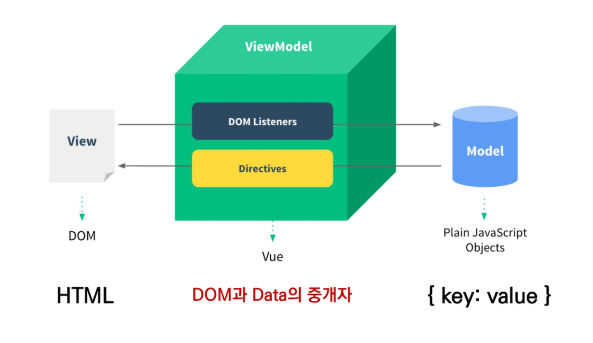

# Concepts of Vue.js

## I. Why Vue.js

- Vanilla JS
  - 한 유저가 100만 개의 게시글을 작성했다고 가정
  - 이 유저가 닉네임을 변경하면, 게시글 100만 개의 작성자 이름이 모두 수정되어야 함
  - '모든 요소'를 선택해서 '이벤트'를 등록하고 값을 변경해야 함
- Vue.js
  - DOM과 Data가 연결되어 있으면
  - Data를 변경하면 이에 연결된 DOM은 알아서 변경
  - 즉, 우리가 신경 써야 할 것은 오직 Data에 대한 관리

## II. MVVM Pattern

- 애플리케이션 로직을 UI로부터 분리하기 위해 설계된 디자인 패턴

- 구성 요소
  - Model
  - View
  - View Model

> MVVM Pattern in Vue.js

> MVVM

- Model
  - "Vue에서 Model은 JavaScript Object 다."
  - JavaScript의 Object 자료 구조
  - 이 Object는 Vue Instance 내부에서 data로 사용되는데, 이 값이 바뀌면 View(DOM)가 반응

- View
  - "Vue에서 View는 DOM(HTML)이다."
  - Data의 변화에 따라서 바뀌는 대상
- ViewModel
  - "Vue에서 ViewModel은 모든 Vue Instance이다."
  - View와 Model 사이에서 Data와 DOM에 관련된 모든 일을 처리
  - ViewModel을 활용해 Data를 얼마만큼 잘 처리해서 보여줄 것인지(DOM)를 고민하는 것

