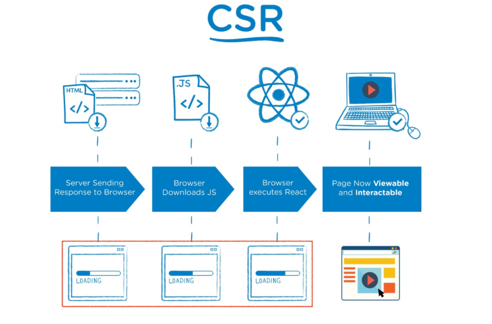
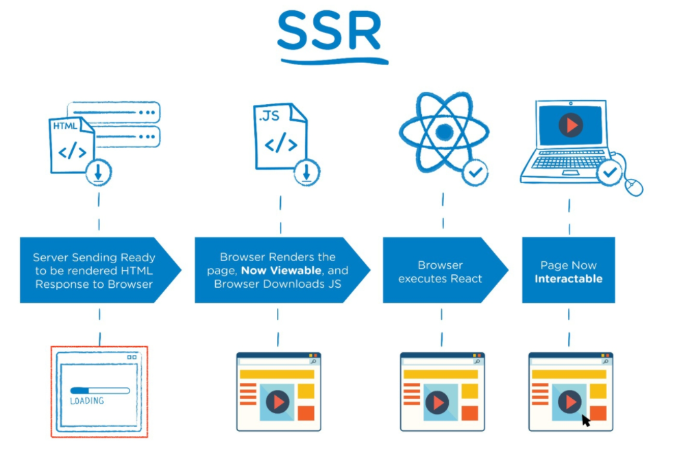
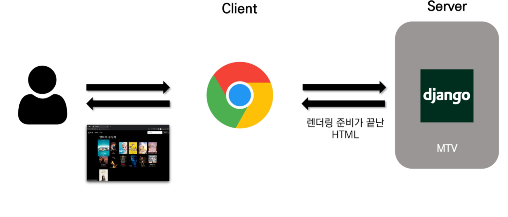
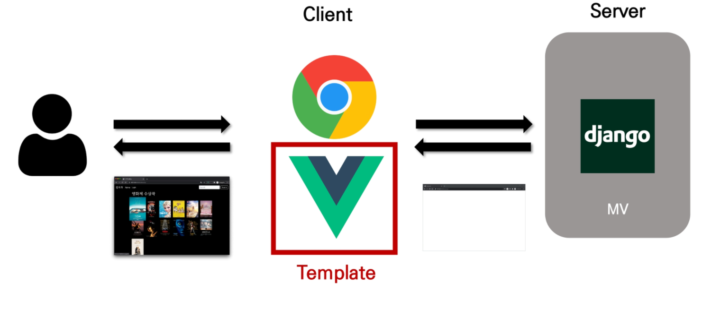

# Vue.js - Intro

> Vue.js

- 사용자 인터페이스를 만들기 위한 진보적인 자바스크립트 프레임워크
- 현대적인 tool과 다양한 라이브러리를 통해 SPA(Single Page Application) 를 완벽하게 지원

### I - 1. SPA

- Single Page Application(단일 페이지 애플리케이션)
- 현재 페이지를 동적으로 렌더링함으로써 사용자와 소통하는 웹 애플리케이션

- 단일 페이지로 구성되며 서버로부터 최초에만 페이지를 다운로드하고, 이후에는 동적으로 DOM을 구성
  - 처음 페이지를 받은 이후부터는 서버로부터 새로운 전체 페이지를 불러오는 것이 아닌, 현재 페이지 중 필요한 부분만 동적으로 다시 작성함
- 연속되는 페이지 간의 사용자 경험(UX)을 향상
  - 모바일 사용량이 증가하고 있는 현재 트래픽의 감소와 속도, 사용성, 반응성의 향상은 매우 중요하기 때문
- 동작 원리의 일부가 CSR(Client Side Rendering)의 구조를 따름

### I - 2. CSR

- Client Side Rendering
- 서버에서 화면을 구성하는 SSR 방식과 달리 클라이언트에서 화면을 구성
- 최초 요청 시 HTML, CSS, JS 등 데이터를 제외한 각종 리소스를 응답받고 이후 클라이언트에서는 필요한 데이터만 요청해 JS로 DOM을 렌더링하는 방식
- 즉, 처음엔 뼈대만 받고 브라우저에서 동적으로 DOM을 그림
- SPA가 사용하는 렌더링 방식

> 장점

- 서버와 클라이언트 간 트래픽 감소
  - 웹 애플리케이션에 필요한 모든 정적 리소스를 최초에 한 번 다운로드 후 필요한 데이터만 갱신
- 사용자 경험(UX) 향상
  - 전체 페이지를 다시 렌더링하지 않고 변경되는 부분만을 갱신하기 때문

> 단점

- SSR에 비해 전체 페이지 렌더링 시점이 느림
- SEO(검색 엔진 최적화)에 어려움이 있음 (최초 문서에 데이터가 없기 때문)

### I - 3. SSR

- Server Side Rendering
- 서버에서 클라이언트에게 보여줄 페이지를 모두 구성하여 전달하는 방식
- JS 웹 프레임워크 이전에 사용되던 전통적인 렌더링 방식

> 장점

- 초기 구동 속도가 빠름
  - 클라이언트가 빠르게 컨텐츠를 볼 수 있음
- SEO(검색 엔진 최적화) 에 적합
  - DOM에 이미 모든 데이터가 작성되어있기 때문

> 단점

- 모든 요청마다 새로운 페이지를 구성하여 전달
  - 반복되는 전체 새로고침으로 인해 사용자 경험이 떨어짐
  - 상대적으로 트래픽이 많아 서버의 부담이 클 수 있음

## II. SSR & CSR

- 두 방식의 차이는 렌더링의 주최가 누구인가에 따라 결정
- 즉, 화면을 그리는 것(렌더링)을 서버가 한다면 SSR / 클라이언트가 한다면 CSR
- SSR과 CSR을 단순 비교하여 '어떤 것이 더 좋다'가 아니라, 내 서비스 또는 프로젝트 구성에 맞는 방법을 적절하게 선택하는 것이 중요 ( 하나 혹은 SSR, CSR을 섞어서 구성할 수도 있음)

- 예를 들어, Django에서 Axios를 활용한 좋아요/팔로우 로직의 경우, 대부분은 Server에서 완성된 HTML을 제공하는 구조(SSR)
- 단, 특정 요소(좋아요/팔로우)만 JS(AJAX & DOM조작)를 활용 (CSR)
  - AJAX를 활용해 비동기 요청으로 필요한 데이터를 클라이언트에서 서버로 직접 요청을 보내 받아오고 JS를 활용해 DOM을 조작

> Vue.js 역할

