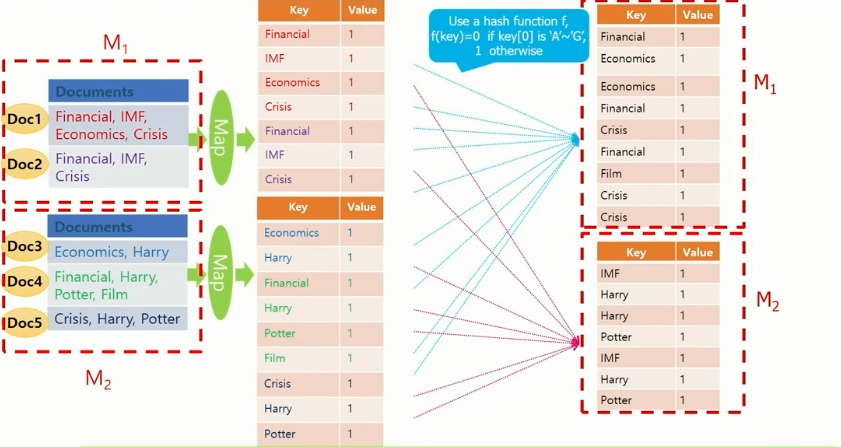
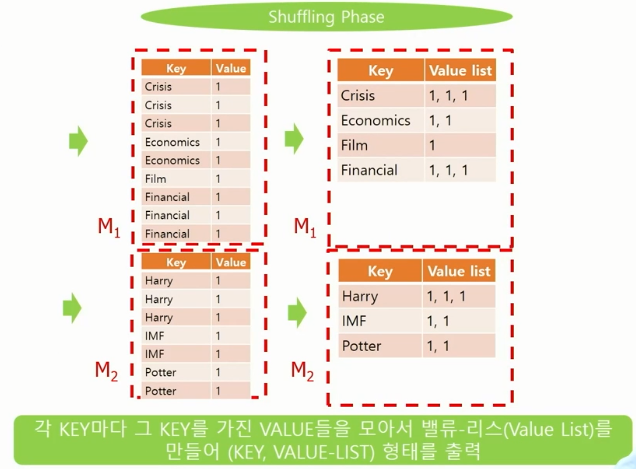

# Hadoop - day01

### 목표

> 병렬 분산 알고리즘 구현이 가능한 맵리듀스 프레임워크 이해
>
> 맵리듀스 프레임워크를 사용할 수 있는 Hadoop설치 및 맵리듀스 알고리즘 코드를 실행한다.
>
> 하둡을 이용하여 빅데이터 분석 및 처리용 맵리듀스 알고리즘을 구현하는데 필요한 지식과 코딩 능력을 배양한다.

### 왜 병렬 분산 알고리즘?

- Scale-out
  - 아주 많은 값싼 서버들을 이용함
- Scale-up
  - 적은 수의 값비싼 서버들을 이용함
- 데잍터 중심 어플리케이션 분야에서는 아주 많은 값싼 서버들을 많이 이용하는 것을 선호함
- 고가의 서버들은 가격에 관점에서는 선형으로 성능이 증가하지 않음
  - 두 배의 성능의 프로세서 한 개를 가진 컴퓨터의 가격이 일반적인 프로세서 한 개를 가진 컴퓨터 가격의 두 배보다 훨씬 더 비쌈 >> 성능에 정비례하여 비용이 올라가는 것이 아닌 그 이상의 비용이 필요

- 데이터 중심 프로세싱(Data-intensive processing)
  - 한대의 컴퓨터의 능력으로 처리가 어려움
  - 근본적으로 수 십대, 수 백대 혹은 수 천대의 컴퓨터를 묶어서 처리해야함
  - **맵리듀스(MapReduce) 프레임 워크**가 하는 것이 바로 이것!
- 맵리듀스는 빅데이터를 이용한 효율적인 계산이 가능한 첫 번째 프로그래밍 모델
  - 기존에 존재하는 여러 가지 다른 병렬 컴퓨팅 방법에서는 프로그래머가 낮은 레벨의 시스템 세부 내용까지 아주 잘 알고 많은 시간을 쏟아야만 함

## MapReduce Framework - I

- 빅 데이터를 이용하는 응용분야에서 최근에 주목 받고 있음
- 값싼 컴퓨터들을 모아서 클러스터를 만들고 여기에서 빅 데이터를 처리하기 위한 스케일러블(scalable) 병렬 소프트웨어의 구현 쉽게 할 수 있도록 도와주는 간단한 프로그래밍 모델
  - 'scalable하다' 라는 말은 사용자 수가 급증하거나 데이터가 급증해도 프로그램이 멈추거나 성능이 크게 떨어지는 일이 없다는 뜻
- 구글이 맵리듀스(MapReduce) 또는 오픈소스인 하둡(Hadoop)은 맵리듀스 프레임워크(MapReduce Framework)의 우수한 구현의 형태임
- 드라이버에 해당하는 메인 함수가 맵(map) 함수와 리듀스(reduce) 함수를 호출해서 처리

### MapReduce Programming Model

- 함수형 프로그래밍 언어의 형태
- 유저는 아래 3가지 함수를 구현해서 제공해야함
  - Main 함수
  - Map 함수 : (key1, val1) => [(key2, val2)]
  - Reduce 함수 : (key2, [val2]) => [(key3, val3)]

## MapReduce Framework - II

- 맵리듀스 프레임워크에서는 각각의 레코드(record) 또는 튜플(tuple)은 키-밸류 (KEY, VALUE) 쌍으로 표현된다.
- 맵리듀스 프레임워크는 메인(main) 함수를 한 개의 마스터 머신(master machine) 에서 수행하는데 이 머신은 맵 함수를 수행하기 전에 전처리를 하거나 리듀스 함수의 결과를 후처리 하는데 사용될 수 있다.
- 컴퓨팅은 맵(map)과 리듀스(reduce)라는 유저가 정의한 함수 한 쌍으로 이루어진 맵리듀스 페이즈(phase)를 한번 수행하거나 여러 번 반복해서 수행할 수 있다.
- 한번의 맵리듀스 페이즈는 맵 함수를 먼저 호출하고 그 다음에 리듀스 함수를 호출하는데 대에 따라서는 맵 함수가 끝난 후에 컴바인(combine)함수를 중간에 수행할 수 있다.
- 드라이버에 해당하는 메인(main) 프로그램에서 맵리듀스 페이즈를 수행시킨다.

### MapReduce Phase (3 단계로 수행)

- 맵(Map) 페이즈
  - 제일 먼저 수행되며 데이터의 여러 파티션(partition)에 병렬 분산으로 호출되어 수행된다.
  - 각 머신마다 수행된 Mapper는 맵 함수가 입력 데이터의 한 줄 마다 맵(Map) 함수를 호출한다.
  - Map 함수는 (KEY, VALUE)쌍 형태로 결과를 출력하고 여러 머신에 나누어 보내며 같은 KEY를 가진 (KEY, VALUE) 쌍은 같은 머신으로 보내진다.
- 셔플링(Shuffling) 페이즈
  - 모든 머신에서 맵 페이즈가 다 끝나면 시작된다.
  - 맵 페이즈에서 각각의 머신으로 보내진 (KEY, VALUE)  쌍을 KEY를 이용해서 정렬(Sorting)을 한 후에 각각의 KEY 마다 같은 KEY를 가진 (KEY, VALUE) 쌍을 모아서 밸류-리스트(VALUE-LIST)를 만든 다음에 (KEY, VALUE-LIST) 형태로 KEY에 따라서 여러 머신에 분산해서 보낸다.
- 리듀스(Reduce) 페이즈
  - 모든 머신에서 셔플링 페이즈가 다 끝나면 각 머신마다 리듀스 페이즈가 시작된다.
  - 각각의 머신에서는 셔플링 페이즈에서 해당 머신으로 보내진 각각의 (KEY, VALUE-LIST) 쌍 마다 리듀스 함수가 호출되며 하나의 리듀스 함수가 끝나면 다음 (KEY, VALUE-LIST) 쌍 에 리듀스 함수가 호출된다.
  - 출력이 있다면 (KEY, VALUE) 쌍 형태로 출력한다.

### Hadoop

- Apache 프로젝트의 맵리듀스 프레임워크의 오픈 소스
- 하둡 분산 파일 시스템(Hadoop Distributed File System -HDFS)
  - 빅 데이터 파일을 여러 대의 컴퓨터에 나누어서 저장함
  - 각 파일은 여러 개의 순차적인 블록으로 저장함
  - 하나의 파일의 각각의 블록은 폴트 톨러런스(fault tolerance)를 위해서 여러 개로 복사되어 여러 머신의 여기저기 저장됨
    - 폴트 톨러런스는 시스템을 구성하는 부품의 일부에서 결함(fault) 또는 고장(failure)이 발생하여도 정상적 혹은 부분적으로 기능을 수행할 수 있는 것을 말함
- 빅 데이터를 수천 대의 값싼 컴퓨터에 병렬 처리하기 위해 분산함

- 주요 구성 요소들
  - MapReduce - 소프트웨어의 수행을 분산함
  - Hadoop Distributed File System (HDFS) - 데이터를 분산함
- 한 개의 Namenode (master)와 여러 개의 Datanode (slaves)
  - Namenode
    - 파일 시스템을 관리하고 클라이언트가 파일에 접근할 수 있게 함
  - Datanode
    - 컴퓨터에 들어있는 데이터를 접근할 수 있게 함
- 자바 프로그래밍 언어로 맵리듀스 알고리즘을 구현

### MapReduce의 함수

- 맵 함수
  - `org.apache.hadoop.mapreduce` 라는 패키지에 있는 Mapper 클래스를 상속받아서 맵 메소드(method)를 수정한다.
  - 입력 텍스트 파일에서 라인 단위로 호출되고 입력은 키-밸류 (KEY, VALUE-LIST)의 형태
  - KEY는 입력 텍스트 파일에서 맨 앞 문자(character)를 기준으로 맵 함수가 호출된 해당 라인의 첫 번째 문자까지의 오프셋(offset)
  - VALUE는 텍스트의 해당 라인 전체가 들어있다.
- 리듀스 함수
  - `org.apache.hadoop.mapreduce`라는 패키지에 있는 Reducer 클새를 상속받아서 reduce 메소드(method)를 수정한다.
  - 셔플링 페이즈의 출력을 입력으로 받는데 키-밸류 (KEY, VALUE-LIST)의 형태
  - VALUE-LIST는 맵 함수의 출력에서 KEY를 갖는 (KEY, VALUE) 쌍들의 VALUE들의 리스트
- 컴바인(Combine) 함수
  - 리듀스 함수와 유사한 함수인데 각 머신에서 맵 페이즈에서 맵 함수의 출력 크기를 줄여서 셔플링 페이즈와 리듀스 페이즈의 비용을 줄여주는데 사용된다.

### 예제

> Word Counting

- Map phase

- Shuffling phase

