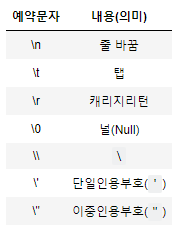
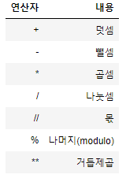
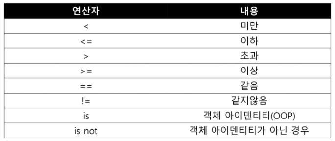
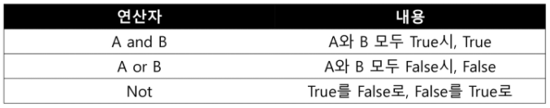
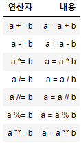
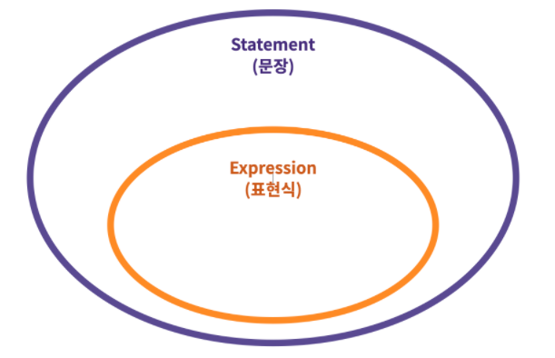
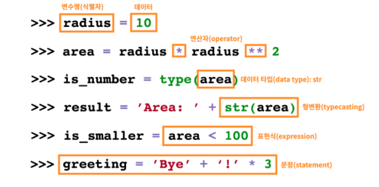

######  *210719(월)*

## python : 데이터 & 제어문

### 1. 기초 문법(Syntax)

#### 1.1 코드 스타일 가이드

```python
print('hello')
print("world") 				#''와 ""중 하나로 통일

a = 'apple'

if True:
    	print(True)			#들여쓰기
else:
    		print(False)	#들여쓰기

b='banana'					#변수와 연산자 사이에 띄어쓰기
```

```python
#코드 스타일 적용 후

print('hello')
print('world') 

a = 'apple'

if True:
    	print(True)
else:
    		print(False)

b = 'banana'
```


#### 1.2 주석(Comment)

- 한 줄 주석은 #으로 표현한다.
- 특수한 형태의 주석 - docstring
  - 함수/클래스의 설명을 작성

```python
# 주석(comment)입니다.
"""
multiline comment
docstring을 위해 활용
"""
#docstring 예시
def foo():
    """이 함수는 foo입니다.
    docstring으로 함수나 클래스의 기능을 설명합니다."""

foo.__doc__
#'이 함수는 foo입니다.\n    docstring으로 함수나 클래스의 기능을 설명합니다.'
```


#### 1.3 코드 라인

- 파이썬 코드는 '1줄에 1문장(statment)'이 원칙입니다.
- 문장(statement)은 파이썬이 실행 가능(executable)한 최소한의 코드 단위입니다.
- 기본적으로 파이썬에서는 `;`을 작성하지 않습니다.
- 한 줄로 표기할때는 `;`을 작성하여 표기할 수 있습니다.

```python
print('hello')print('world') #오류 발생
print('hello');print('world') 
# hello
# world
```


### 2. 변수(Variable)

#### 2.1 변수

##### 2.1.1 할당 연산자(Assignment Operator): `=`

- 변수는 `=`을 통해 할당(assignment) 됩니다.
- 해당 데이터 타입을 확인하기 위해서는 `type()`을 활용합니다.
- 해당 값의 메모리 주소를 확인하기 위해서는 `id()`를 활용합니다.

```python
x = y = 1004
print(x, y)
# 1004 1004

x, y = 1, 2
print(x, y)
# 1 2

x, y = 1        #오류발생
x, y = 1, 2, 3  #오류발생
```


##### 2.1.2 값 swap

- x = 10 y = 20 일 때,

  각각 값을 바꿔서 자장하는 코드를 작성하시오.

```python
x, y = 10, 20

#방법 1 : 임시 변수 활용 (기존에 사용하던 방법)
tmp = x
x = y
y = ymp
print(x, y) # 20 10

#방법 2 : Pythonic! (파이썬 다운 방법)
y, x = x, y
print(x, y) # 20 10
```


##### 3.1.2 식별자(Identifiers)

파이썬에서 식별자는 변수, 함수, 모듈, 클래스 등을 식별하는데 사용되는 이름(name)입니다.

- 식별자의 이름은 영문알파벳(대문자와 소문자), 언더스코어(_), 숫자로 구성됩니다.
- 첫 글자에 숫자가 올 수 없습니다.
- 길이에 제한이 없습니다.
- 대소문자(case)를 구별합니다.
- 아래의 키워드는 사용할 수 없습니다. [파이썬 문서](https://docs.python.org/ko/3/reference/lexical_analysis.html#keywords)

```
False, None, True, and, as, assert, async, await, break, class, continue, def, del, elif, else, except, finally, for, from, global, if, import, in, is, lambda, nonlocal, not, or, pass, raise, return, try, while, with, yield
```


### 3. 데이터 타입(Data Type)

- **숫자**(Number) 타입
- **문자열**(String) 타입
- **참/거짓**(Boolean) 타입

#### 3.1 숫자(Number) 타입

##### 3.1.1 `int`(정수, ingteger)

모든 정수는 `int`로 표현됩니다.

Python3에서는 `long` 타입은 없고 모두 `int` 타입으로 표기 됩니다.

- 보통 프로그래밍 언어 및 Python2에서의 long은 OS 기준 32/64비트입니다.
- Python3에서는 모두 int로 통합되었습니다.

8진수 : `0o` / 2진수 : `0b` / 16진수: `0x` 로도 표현 가능합니다.

```python
a = 3
type(a)
#<class 'int'>
0b10 # 2
0o30 # 24
0x10 # 16
```


**파이썬에서 표현할 수 있는 가장 큰 수**

- 파이썬은 기존 C 계열 프로그래밍 언어와 다르게 정수 자료형(integer)에서 오버플로우가 없습니다.
- 임의 정밀도 산술(arbitrary-precision arithmetic)을 사용하기 때문입니다.

> **오버플로우(overflow)**

- 데이터 타입 별로 사용할 수 있는 메모리의 크기가 제한되어 있습니다.
- 표현할 수 있는 수의 범위를 넘어가는 연산을 하게 되면, 기대했던 값이 출력되지 않는 현상, 즉 메모리를 넘어선 상황을 의미합니다.

> **임의 정밀도 산술(arbitrary-precision arithmetic)**

- 사용할 수 있는 메모리양이 정해져 있는 기존의 방식과 달리, 현재 남아있는 만큼의 가용 메모리를 모두 수 표현에 끌어다 쓸 수 있는 형태를 의미합니다.
- 특정 값을 나타내는데 4바이트가 부족하다면 5바이트, 더 부족하면 6바이트까지 사용할 수 있게 유동적으로 운용합니다.

```python
import sys
sys.maxsize # 파이썬에서 가장 큰 숫자를 활용하기 위해 sys 모듈을 불러와 maxsize 호출
# 9223372036854775807

sys.maxsize ** 10
# 4455508415646675013373597242420117818453694838130159772560668808816707086990958982033203334310070688731662890013605553436739351074980172000127431349940128178077122187317837794167991459381249

type(sys.maxsize**10)
# <class 'int'>
```


##### 3.1.2 `float` (부동소수점, 실수, floating point number)

실수는 `float`로 표현됩니다.

다만, 실수를 컴퓨터가 표현하는 과정에서 부동소수점을 사용하며, 항상 같은 값으로 일치되지 않습니다. (floating point rounding error)

이는 컴퓨터가 2진수(비트)를 통해 숫자를 표현하는 과정에서 생기는 오류이며, 대부분의 경우는 중요하지 않으나 값을 같은지 비교하는 과정에서 문제가 발생할 수 있습니다.

```python
3.14 - 3.02 == 0.12
# False

3.14 - 3.02
# 0.1200000000000001
```

- 따라서 다음과 같은 방법으로 처리 할 수 있습니다. (이외에 다양한 방법이 있음)

```python
import sys
a = 3.14 - 3.02
b = 0.12
abs(a - b) <= sys.float_info.epsilon
# True

import math
math.isclose(a, b)
# True
```


##### 3.1.3 `complex` (복소수, complex number)

각각 실수로 표현되는 실수부와 허수부를 가집니다.

복소수는 허수부를 `j`로 표현합니다.

```python
a = 3+4j
print(type(a))
# <class 'complex'

a.real  #실수부
# 3.0

a.imag  #허수부
# 4.0
```


#### 3.2 문자열(String) 타입

##### 기본 활용법

- 문자열은 Single quotes(`'`)나 Double quotes(`"`)을 활용하여 표현 가능합니다.
  - 작은따옴표: `'"큰" 따옴표를 담을 수 있습니다'`
  - 큰따옴표: `"'작은' 따옴표를 담을 수 있습니다"`
  - 삼중 따옴표: `'''세 개의 작은따옴표'''`, `"""세 개의 큰따옴표"""`

- 단, 문자열을 묶을 때 동일한 문장부호를 활용해야하며, `PEP-8`에서는 **하나의 문장부호를 선택**하여 유지하도록 하고 있습니다. (Pick a rule and Stick to it)


#####  이스케이프 시퀀스

문자열을 활용하는 경우 특수문자 혹은 조작을 하기 위하여 사용되는 것으로 `\`를 활용하여 이를 구분합니다.



#####  String interpolation

- `%-formatting`
  - `%d` : 정수
  - `%f` : 실수
  - `%s` : 문자열
- [`str.format()`](https://pyformat.info/)
- [`f-strings`](https://www.python.org/dev/peps/pep-0498/) : 파이썬 3.6 이후 버전에서 지원

```python
print('Hello, %s' % name)
print('내 성적은 %d' % score)
print('내 성적은 %f' % score)
# Hello, Kim
# 내 성적은 4
# 내 성적은 4.500000

print('Hello, {}! 성적은 {}'.format(name, score))
# Hello, Kim! 성적은 4.5

print(f'Hello, {name}! 성적은 {score}')
# Hello, Kim! 성적은 4.5
```

- f-strings에서는 형식을 지정할 수 있습니다.

```python
import datetime
today = datetime.datetime.now()
print(today)
# 2021-07-19 20:43:40.295254

print(f'오늘은 {today:%y}년 {today:%m}월 {today:%d}일 {today:%A}')
# 오늘은 21년 07월 19일 Monday

pi = 3.141592
print(f'원주율은 {pi:.3}. 반지름이 2일때 원의 넓이는 {pi*2*2}')
# 원주율은 3.14. 반지름이 2일때 원의 넓이는 12.566368
```


#### 3.3 참/거짓(Boolean) 타입

##### 3.3.1 참/거짓(Boolean) 타입

파이썬에는 `True`와 `False`로 이뤄진 `bool` 타입이 있습니다.

비교/논리 연산을 수행 등에서 활용됩니다.

다음은 `False`로 변환됩니다.

```
0, 0.0, (), [], {}, '', None
```


##### 3.3.2 `None` 타입

파이썬에서는 값이 없음을 표현하기 위해 `None` 타입이 존재합니다.

```python
print(type(None))
# <class 'NoneType'>

a = None
print(a)
# None
```


#### 3.4 형변환(Type conversion, Typecasting)

파이썬에서 데이터타입은 서로 변환할 수 있습니다.

- 암시적 형변환

- 명시적 형변환

  

##### 3.4.1 암시적 형변환(Implicit Type Conversion)

사용자가 의도하지 않았지만, 파이썬 내부적으로 자동으로 형변환 하는 경우입니다. 아래의 상황에서만 가능합니다.

- bool
- Numbers (int, float, complex)

```python
True + 3
# 4

3 + 5.0
# 8.0

3 + 4j + 5
# (8 + 4j)
```


##### 3.4.2 명시적 형변환(Explicit Type Conversion)

위의 상황을 제외하고는 모두 명시적으로 형변환을 해주어야합니다.

- string -> intger : 형식에 맞는 숫자만 가능
- integer -> string : 모두 가능

암시적 형변환이 되는 모든 경우도 명시적으로 형변환이 가능합니다.

- `int()` : string, float를 int로 변환
- `float()` : string, int를 float로 변환
- `str()` : int, float, list, tuple, dictionary를 문자열로 변환

```python
#int

#문자열은 암시적 타입 변환이 되지 않음
'3' + 4         #에러발생
int('3') + 4    #명시적 타입 변환이 필요함
# 7
int('3.5') + 4  #에러발생 >> 정수 형식이 아닌 경우 타입 변환할 수 없음

#float

float('3')
# 3.0
float('3/4') + 5.3 #에러발생 >> float 형식이 아닌 경우 타입 변활할 수 없음
```


###  4. 연산자(Operator)

- 산술 연산자
- 비교 연산자
- 논리 연산자
- 복합 연산자
- 기타 연산자

#### 4.1 산술 연산자

Python에서는 기본적인 사칙연산이 가능합니다.



- 나눗셈 (`/`) 은 항상 float를 돌려줍니다.
- 정수 나눗셈 으로 (소수부 없이) 정수 결과를 얻으려면 `//` 연산자를 사용합니다.

```python
print(divmod(5,2))
# (2, 1)
quotient, remainder = divmod(5,2)
print(quotient, remainder)
# 2 1
```


#### 4.2 비교 연산자

- 값을 비교하며, True / False 값을 리턴함



```python
3 > 6    		# False
3.0 == 3 		# True
'3' != 3 		# True
'Hi' == 'hi'	# False

x = 3
x is None       # 특정 변수가 비어있는지 확인할 때, x == None(x) >> x is None (사용권장)
# False
```


#### 4.3 논리 연산자



```python
print(True and True)   #True
print(True and False)  #False

print(True or False)   #True
print(False or False)  #False

print(not True)        #False
print(not 0)		   #True
print(not 'hi')		   #False
```


#### 4.3.1 단축평가

- 첫 번째 값이 확실할 때, 두 번째 값은 확인 하지 않습니다.
- 조건문에서 뒷 부분을 판단하지 않아도 되기 때문에 속도가 향상됩니다.

```python
a = 5 and 4	# 4
b = 5 or 3	# 5
c = 0 and 5	# 0
d = 5 or 0	# 5
```

- `and` 는 둘 다 True일 경우만 True이기 때문에 첫번째 값이 True라도 두번째 값을 확인해야 하기 때문에 'b'가 반환됩니다.
- `or` 는 하나만 True라도 True이기 때문에 True를 만나면 해당 값을 바로 반환합니다.


#### 4.4 복합 연산자

복합 연산자는 연산과 대입이 함께 이뤄집니다.

가장 많이 활용되는 경우는 반복문을 통해서 갯수를 카운트하거나 할 때 활용됩니다.




#### 4.5 기타 주요 연산자

##### 4.5.1 Concatenation

숫자가 아닌 자료형은 `+` 연산자를 통해 합칠 수 있습니다.

```python
'hello, ' + 'world!'
# hello, world!
```


#### 4.5.2 Containment Test

`in` 연산자를 통해 요소가 속해있는지 여부를 확인할 수 있습니다.

```python
'a' in 'apple'
# True
```


##### 4.5.3  Identity

`is` 연산자를 통해 동일한 object인지 확인할 수 있습니다. (OOP 파트에서 다시 학습하게 됩니다.)

```python
# 파이썬에서 -5 부터 256 까지의 id는 동일합니다.
# 변수 a에는 3을 변수 b에는 3을 할당해봅시다.
# 그리고 a 와 b 가 동일한 object인지 확인해봅시다.
a = 3
b = 3
print(a is b)
print(id(a), id(b))

# True
# 1881135409520 1881135409520

# 257 이후의 id 는 다릅니다.
# 변수 a에는 257을 변수 b에는 257을 할당해봅시다.
# 그리고 a 와 b 가 동일한 object인지 확인해봅시다.
```


##### 4.5.4  Indexing/Slicing

`[]`를 통한 값을 접근하고, `[:]`을 통해 슬라이싱할 수 있습니다. (Container 파트에서 자세하게 학습합니다.)

```python
'hello, world!'[0]
# 'h'
'hello, world!'[1:5]
# 'ello'
```


#### 4.6 연산자 우선순위

1. `()`을 통한 grouping
2. Slicing
3. Indexing
4. 제곱연산자 `**`
5. 단항연산자 `+`, `-` (음수/양수 부호)
6. 산술연산자 `*`, `/`, `%`
7. 산술연산자 `+`, `-`
8. 비교연산자, `in`, `is`
9. `not`
10. `and`
11. `or`


##### 4.6.2 표현식(Expression)

> 표현식 => `evaluate` => 값

- 하나의 값(value)으로 환원(reduce)될 수 있는 문장을 의미합니다.
- `식별자`, `값`(리터럴), `연산자`로 구성됩니다.
- 표현식을 만드는 문법(syntax)은 일반적인 (중위표기) 수식의 규칙과 유사합니다.


##### 4.6.3 문장(Statement)

- 파이썬이 실행 가능한 최소한의 코드 단위 (a syntatic unit of programming)




### 5 정리

#### 5.1 변수(Variable)와 자료형(Data Type)




