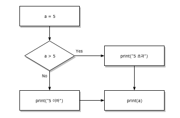
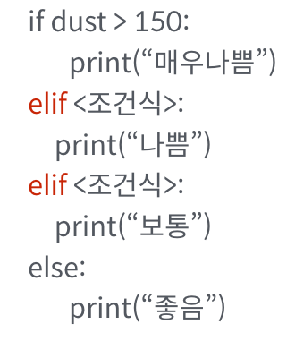
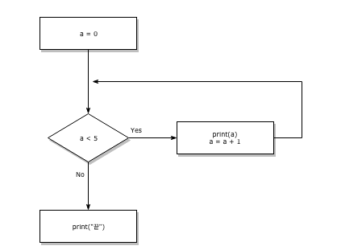
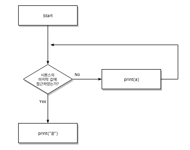

# 제어문(Control Statement)

지금까지 우리는 위에서부터 아래로 순차적으로 명령을 수행하는 프로그램을 작성하였습니다.

특정 상황에 따라 코드를 선택적으로 실행(분기)하거나 동일한 코드를 계속해서 실행해야하려면 어떻게 해야할까요?

이 경우, **코드 실행의 순차적인 흐름을 제어**(Control Flow)할 필요가 있습니다.

이러한 순차적인 코드의 흐름을 제어하는 것을 제어문이라고 하고, 제어문은 크게 **조건문**과 **반복문**으로 나눌 수 있습니다.

제어문을 통해 다음과 순서도(Flow Chart)를 코드로 표현할 수 있습니다.



```python
# 위의 Flow Chart를 조건문으로 작성해봅시다.
# if 문을 활용해봅시다.

a = 5
if a > 5:
    print('5 초과')
else:
    print('5 이하')
print(a)
# 5 이하
# 5
```


### 1. 조건문(Conditional Statement)

#### `if` 조건문의 구성

- **문법**

```python
if <expression>:
    <코드 블럭>
else:
    <코드 블럭>

#예시
if a > 0:
    print('양수입니다.')
else:
    print('음수입니다.')
```

- `expression`에는 일반적으로 참/거짓에 대한 조건식이 들어갑니다.
- **조건**이 **참**인 경우 `:` 이후의 문장을 수행합니다.
- **조건**이 **거짓**인 경우 `else:` 이후의 문장을 수행합니다.
- 여러 개의 `elif` 부가 있을 수 있고(없거나), `else`는 선택적으로 사용합니다.

- 이때 반드시 들여쓰기를 유의해야합니다.
  - 파이썬에서는 코드 블록을 자바나 C언어의 `{}`와 달리 **들여쓰기**로 판단하기 때문입니다.
- 앞으로 우리는 [PEP 8](https://www.python.org/dev/peps/pep-0008/#indentation)에서 권장하는 **4spaces**를 사용합니다.

```python
is_christmas = input('날짜를 입력해주세요 ex)12/24 : ')
if is_christmas == '12/25':
    print('크리스마스입니다 :)')
else:
    print('크리스마스가 아닙니다 :(')
   
# 날짜를 입력해주세요 ex)12/24 : 12/25
# 크리스마스입니다 :)

num = int(input('숫자를 입력하세요 : '))
if num % 2:
    print('홀수입니다.')
else:
    print('짝수입니다.')
    
# 숫자를 입력하세요 : 4
# 짝수입니다.
```

#### `elif` 복수 조건

2개 이상의 조건을 활용할 경우 `elif <조건>:`을 활용합니다.



```python
score = int(input('점수를 입력하세요 : '))
if score >= 90:
    print('A')
elif score >= 80:
    print('B')
elif score >= 70:
    print('C')
elif score >= 60:
    print('D')
else:
    print('F')

# 점수를 입력하세요 : 98
# A

# 조건문은 순서대로 조건식을 검증하므로 순서에 유의해야 한다.
# score 가 80점이지만 조건문의 순서에 따라 'B'를 출력하지 못하고 'D학점 이상'을 출력한다.

score = 80

if score >= 90:
    print('A')
elif score >= 60:
    print('D학점 이상')
elif score >= 80:
    print('B')
# D학점 이상
```


#### 중첩 조건문(Nested Conditional Statement)

```python
score = 96
if score >= 90:
    print('A')
    if score >= 95:
        print('참 잘했어요.')
elif score >= 80:
    print('B')
elif score >= 70:
    print('C')
elif score >= 60:
    print('D')
else:
    print('F')
# A
# 참 잘했어요.
```


#### 조건 표현식(Conditional Expression)

- 조건 표현식은 일반적으로 조건에 따라 값을 정할 때 활용됩니다.
- **삼항 연산자(Ternary Operator)**라고 부르기도 합니다.

**활용법**

```python
true_value if <조건식> else false_value
```

```python
num = int(input('숫자를 입력하세요 : '))
print('0 보다 큼') if num > 0 else print('0 보다 크지않음')
# 숫자를 입력하세요 : 10
# 0 보다 큼

# 아래의 코드는 무엇을 위한 코드일까요? 절대값 출력
num = int(input('숫자를 입력하세요 : '))
value = num if num >= 0 else -num
print(value)
# 숫자를 입력하세요 : -5
# 5

num = 2
result = '홀수입니다.' if num % 2 else '짝수입니다.'
print(result)
# 짝수입니다.
```


### 2. 반복문(Loop Statement)

- while
- for

#### `while` 반복문

`while` 문은 조건식이 참(`True`)인 경우 반복적으로 코드를 실행합니다.

- **문법**

```python
while <조건식>:
    <코드 블럭>
#예시
while True:
    print('조건식이 참일 때까지')
    print('계속 반복')
```

- `while` 문 역시 조건식 뒤에 콜론(`:`)이 반드시 필요하며, 이후 실행될 코드 블럭은 **4spaces**로 **들여쓰기**를 합니다.
- **반드시 종료조건을 설정해야 합니다.**



```python
a = 0
while a < 5:
    print(a)
    a += 1
print('끝')
# 0
# 1
# 2
# 3
# 4
# 끝

user_input = ''
while user_input != '안녕':
    print('안녕?')
    user_input = input('말해봐 : ')
# 안녕?
# 말해봐 : 안녕?
# 안녕?
# 말해봐 : 안녕 ㅠ
# 안녕?
# 말해봐 : 안녕

num = int(input())
i = 1
while num >= i:
    result += i
    i += 1
print(result)
# 10
# 55


num = int(input())
while num:
    print(num%10)
    num = num // 10
# 185
# 5
# 8
# 1
```

#### `for` 문

`for` 문은 시퀀스(string, tuple, list, range)를 포함한 순회가능한 객체(iterable)의 요소들을 순회합니다.

- **문법**

```python
for <임시변수> in <순회가능한데이터(iterable)>:
    <코드 블럭>
# 예시
for menu in ['김밥', '햄버거', '피자', '라면']:
    print(menu)
```



```python
for a in [1, 2, 3, 4, 5]:
    print(a)
print("끝")
# 1
# 2
# 3
# 4
# 5
# 끝
```

`for` 문에서 요소 값에 다른 값을 할당해도 다음 반복구문에 영향을 주지 않습니다.

다음 요소 값에 의해 덮어 씌워지기 때문입니다.

```python
for i in range(10):
    print(i)
    i = 5 
# 0
# 1
# 2
# 3
# 4
# 5
# 6
# 7
# 8
# 9
```

```python
chars = input('문자를 입력하세요 : ')
for char in chars:
    print(char)
# 문자를 입력하세요 : 안녕!
# 안
# 녕
# !

for i in range(1,31):
    if i % 2:
        print(i)
# 1
# 3
# 5
# 7
# 9
# 11
# 13
# 15
# 17
# 19
# 21
# 23
# 25
# 27
# 29

lunch = ['짜장면', '초밥', '피자']
for i in range(len(lunch)):
    print(lunch[i])
# 짜장면
# 초밥
# 피자
for i in range(len(lunch)):
    print(f'{i+1}번째 메뉴: {lunch[i]}')
# 1번째 메뉴: 짜장면
# 2번째 메뉴: 초밥
# 3번째 메뉴: 피자
```

##### `enumerate()`

인덱스(index)와 값(value)을 함께 활용 가능합니다.

> `enumerate()`를 활용하면, 추가적인 변수를 활용할 수 있습니다.

```python
# enumerate()를 활용해서 출력해봅시다.
lunch = ['짜장면', '초밥', '피자']
for idx, menu in enumerate(lunch):
    print(idx, menu)
# 0 짜장면
# 1 초밥
# 2 피자
print(enumerate(lunch))
print(list(enumerate(lunch)))
# <enumerate object at 0x0000020C862452C0>
# [(0, '짜장면'), (1, '초밥'), (2, '피자')]
print(list(enumerate(lunch))[0])
print(type(list(enumerate(lunch))[0]))
# (0, '짜장면')
# <class 'tuple'>

# 숫자를 1부터 카운트 할 수도 있습니다.
for idx, menu in enumerate(lunch, start=1):
    print(idx, menu)
# 1 짜장면
# 2 초밥
# 3 피자
```


#### 반복제어(`break`, `continue`, `for-else`)

##### `break`

반복문을 종료합니다.

- `for` 나 `while` 문에서 빠져나갑니다.

```python
# 종료 조건이 없는 while 문을 break 를 활용해서 종료시키는 코드를 작성해봅시다.
n = 0
while True:
    if n == 3:
        break
    print(n)
    n += 1
# 0
# 1
# 2

# 0부터 9까지 순회하는 for 반복문 안에서 
# 1을 초과하는 경우 '1 초과' 를 출력하며 종료하는 코드를 작성해봅시다.

for i in range(10):
    if(i > 1):
        print('1 초과')
        break
# 1초과
```


##### `continue`

`continue`문은 continue 이후의 코드를 수행하지 않고 *다음 요소부터 계속(continue)하여* 반복을 수행합니다.

```python
for i in range(6):
    if i % 2 == 0:
        continue
        # continue 이후의 코드는 실행되지 않습니다.
    print(f'{i}는 홀수다.')
# 1는 홀수다.
# 3는 홀수다.
# 5는 홀수다.

ages = [10, 23, 8, 30, 25, 31]
for age in ages:
    if age < 20:
        continue
    print(f'{age}살은 성인입니다.')
# 23살은 성인입니다.
# 30살은 성인입니다.
# 25살은 성인입니다.
# 31살은 성인입니다.
```

##### `else`

끝까지 반복문을 실행한 이후에 실행됩니다.

- 반복에서 리스트의 소진이나 (`for` 의 경우) 조건이 거짓이 돼서 (`while` 의 경우) 종료할 때 실행됩니다.
- 하지만 반복문이 **`break` 문으로 종료될 때는 실행되지 않습니다.** (즉, `break`를 통해 중간에 종료되지 않은 경우만 실행)

```python
# break가 안되는 상황을 확인해봅시다.
for i in range(3):
    print(i)
    if i == 100:
        print(f'{i}에서 break 실행됨.')
        break
else:
    print("break 실행안됨.")
# 0
# 1
# 2
# break 실행안됨.

# break가 되는 상황을 확인해봅시다.
for i in range(3):
    print(i)
    if i == 1:
        print(f'{i}에서 break 시행됨.')
        break
else:
    print('break 시행안됨.')
# 0
# 1
# 1에서 break 시행됨.

numbers = [1, 3, 7, 9]
for number in numbers:
    if number == 4:
        print('True')
        break
else:
    print('False')
# False
```

##### `pass`

아무것도 하지 않습니다. (더미 코드)

- 문법적으로 문장이 필요하지만, 프로그램이 특별히 할 일이 없을 때 자리를 채우는 용도로 사용할 수 있다.

```python
# pass 와 continue 차이

# pass
# 0부터 4의 범위를 순회하며 출력하는 반복문 안에서 3이 나오는 경우 pass 하는 조건문을 작성해봅시다.
for i in range(5):
    if i == 3:
        pass
    print(i)
# 0
# 1
# 2
# 3
# 4

# continue
# 0부터 4의 범위를 순회하며 출력하는 반복문 안에서 3이 나오는 경우 continue 하는 조건문을 작성해봅시다.
for i in range(5):
    if i == 3:
        continue
    print(i)
# 0
# 1
# 2
# 4
```

