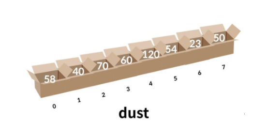
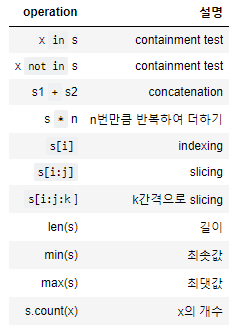
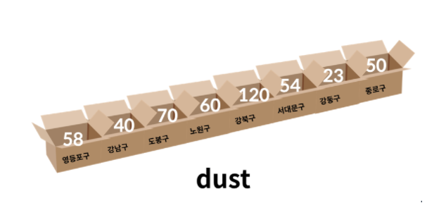
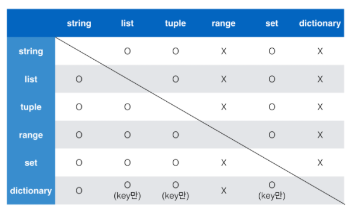
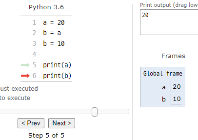
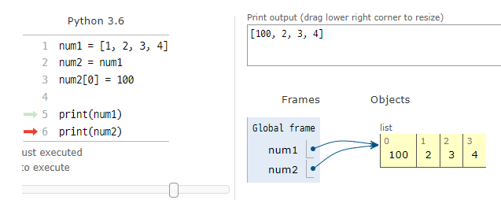
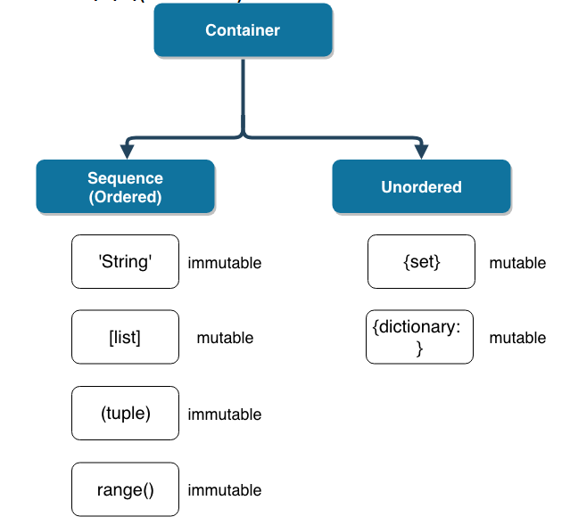

# 컨테이너(Container)

- 여러 개의 값을 저장할 수 있는 것(객체)

### 시퀀스(sequence)형 

- 순서가 있는(ordered) 데이터 (★★★index로 접근 가능하다!★★★)
- 순서가 있다 != 정렬되어 있다
- 리스트(list), 튜플(tuple), 레인지(range), 문자형(string), 바이너리(binary)

##### 리스트(list)

- 리스트는 순서가 있는 시퀀스로 인덱스를 통해 접근
- 인덱스는 0부터 시작



```python
[1, 2, 3]				# [1, 2, 3]
list((1, 2, 3))			# [1, 2, 3]
print(type([1, 2, 3]))	# <class 'list'>

# 값 접근
a = [1, 2, 3]
print(a[0])				# 1

# 값 변경
a[0] = '1'
print(a)				# ['1', 2, 3]  << 서로 다른 타입의 데이터를 저장할 수 있음

#중첩 리스트
a = [[1, 2], [3, 5]]
a[0][1]					# 2
```

##### 튜플(tuple)

- 튜플은 수정 불가능한(immutable) 시퀀스로 인덱스로 접근

```python
(1, 2, 3, 1)				# (1, 2, 3, 1)
tuple((1, 2, 3, 1))			# (1, 2, 3, 1)
print(type((1, 2, 3, 1)))	# <class 'tuple'>

# 값 접근
a = (1, 2, 3, 1)
print(a[1])				# 2

# 값 변경 >> 불가능
a[1] = '3'				# 에러발생

x, y = (1, 2)			# 실제로 tuple로 처리
print(x, y)				# 1 2

print(type(divmod(5,2)))# <class 'tuple'>
```

- 하나의 항목으로 구성된 튜플은 생성시 값 뒤에 쉼표를 붙여야 함

```python
a = (1)
print(type(a))			# <class 'int'>
b = (1, )
print(type(b))			# <class 'tuple'>
```

##### 레인지(range)

- range는 숫자의 시퀀스를 나타내기 위해 사용
  - 기본형 : range(n) 	>> 	0 ~ n-1
  - 범위지정 : range(n,m)    >>    n ~ m-1
  - 범위 및 스텝 지정 : range(n, m, s)     >>    n부터 m-1까지 s만큼 증가시키며 숫자의 시퀀스

```python
list(range(4))			# [0, 1, 2, 3]
print(type(range(4)))	# <class 'range'>

list(range(3))			# [0, 1, 2]
list(range(1,5))		# [1, 2, 3, 4]
list(range(1,5,2))		# [1, 3]

list(range(6, 1, -1))	# [6, 5, 4, 3, 2]
list(range(1, 3, -1))	# []
list(range(6, 1, 1))	# []
```

### 시퀀스에서 활용하는 연산자 / 함수

##### containment test

- 시퀀스 포함 여부 확인 ( in , not in)



```python
my_string = 'string'
print('a' in my_string)
# False

my_list = [1, 2, 3, 5, 1]
print(3 in my_list)
#True

print('안녕' + '하세요')
print((1, 2) + (5, 6))
# 안녕하세요
# (1, 2, 5, 6)

num_list = [0] * 6
print(num_list)
# [0, 0, 0, 0, 0, 0]

location = ['서울', '대전', '구미', '광주', '부울경']
print(location[0])
# 서울

print(location[1:3])
print(location[-4:-2])
# ['대전', '구미']
# ['대전', '구미']

num_list = list(range(0,31))
print(num_list)
#[0, 1, 2, 3, 4, 5, 6, 7, 8, 9, 10, 11, 12, 13, 14, 15, 16, 17, 18, 19, 20, 21, 22, 23, 24, 25, 26, 27, 28, 29, 30]
slice_list = num_list[::3]
print(num_list[0:31:3])
print(num_list[::3])
# [0, 3, 6, 9, 12, 15, 18, 21, 24, 27, 30]
# [0, 3, 6, 9, 12, 15, 18, 21, 24, 27, 30]
print(len(slice_list))
# 11
print(min(slice_list))
print(max(slice_list))
# 0
# 30
sample_list = [1, 2, 1, 3, 1, 5]
print(sample_list.count(1))
# 3
```

### 비 시퀀스형(Non-sequence) 컨테이너

- 세트(set)
- 딕셔너리(dictionary)
- 순서가 없는(unordered) 데이터

##### set

`set`은 순서가 없고 중복된 값이 없는 자료구조입니다.

- `set`은 수학에서의 집합과 동일하게 처리됩니다.
- `set`은 중괄호`{}`를 통해 만들며, 순서가 없고 중복된 값이 없습니다.
- 빈 세트를 만들려면 `set()`을 사용해야 합니다. (`{}`로 사용 불가능)
- 활용 가능한 연산자는 차집합(`-`), 합집합(`|`), 교집합(`&`)입니다.

```python
# set_a와 set_b의 차집합을 구해봅시다.
set_a = {1, 2, 3}
set_b = {3, 6, 9}
print(set_a - set_b)
# {1, 2}

# set_a와 set_b의 합집합을 구해봅시다.
print(set_a | set_b)
# {1, 2, 3, 6, 9}

# set_a와 set_b의 교집합을 구해봅시다.
print(set_a & set_b)
# {3}

# set은 중복된 값이 있을 수 없습니다.
set_c = {1, 1, 1}
print(set_c)
# {1}
# ★★★★★★★★★★★★★★★★★★★★★★★★★★★★★★★★★★★
# ★ set을 활용하면 list의 중복된 값을 손쉽게 제거할 수 있습니다.★★
# ★ 단, set으로 변환하는 순간 순서를 보장할 수 없습니다.★★★★★★★
# ★★★★★★★★★★★★★★★★★★★★★★★★★★★★★★★★★★★★★

num_list = [1, 2, 3, 1, 1, 2]
num_list = set(num_list)
print(num_list)
# {1, 2, 3}
num_list = list(num_list)
print(num_list)
# [1, 2, 3]
```


##### dictionary

`dictionary`는 `key`와 `value`가 쌍으로 이뤄져있습니다.



- `{}`를 통해 만들며, `dict()`로 만들 수 있습니다.
- `key`는 **변경 불가능(immutable)한 데이터**만 가능합니다. (immutable : string, integer, float, boolean, tuple, range)
- `value`는 `list`, `dictionary`를 포함한 모든 것이 가능합니다.

```python
a = {}
b = dict()
print(type(a), type(b))
# <class 'dict'> <class 'dict'>

dict_a = {1: 1, 2: 2, 3: 3, 1: 4}    #가장 마지막 키 1 의 value 인 4가 덮어씌워 저장됨
print(dict_a)
# {1: 4, 2: 2, 3: 3}

phone_book = {
    '서울' : '02',
    '대전' : '042',
    '구미' : '054',
    '광주' : '062',
    '부울경' : '051'
}
print(phone_book.keys())
# dict_keys(['서울', '대전', '구미', '광주', '부울경'])
print(phone_book.values())
# dict_values(['02', '042', '054', '062', '051'])
print(phone_book.items())
# dict_items([('서울', '02'), ('대전', '042'), ('구미', '054'), ('광주', '062'), ('부울경',
# '051')])
```


### 컨테이너형 형변환

파이썬에서 컨테이너는 서로 변환할 수 있습니다.



```python
# list를 형변환 해봅시다.
l = [1, 2, 3, 4]
print(str(l))
print(tuple(l))
print(set(l))
# range(l)		# 오류 발생
# dict(l)		# 오류 발생
# [1, 2, 3, 4]
# (1, 2, 3, 4)
# {1, 2, 3, 4}

# tuple을 형변환 해봅시다.
t = (1, 2, 3, 4)
print(str(t))
print(list(t))
print(set(t))
# range(t)		# 오류 발생
# dict(t)		# 오류 발생
# (1, 2, 3, 4)
# [1, 2, 3, 4]
# {1, 2, 3, 4}

# range를 형변환 해봅시다.
r = range(1, 5)
print(str(r))
print(list(r))
print(set(r))
print(tuple(r))
# dict(r)		# 오류 발생
# range(1, 5)
# [1, 2, 3, 4]
# {1, 2, 3, 4}
# (1, 2, 3, 4)

# set을 형변환 해봅시다.
s = {1, 2, 3, 4}
print(str(s))
print(list(s))
print(tuple(s))
# range(s)		# 오류 발생
# dict(s)		# 오류 발생
# {1, 2, 3, 4}
# [1, 2, 3, 4]
# (1, 2, 3, 4)

# dictionary를 형변환 해봅시다.
d = {'name': 'sw', 'year': 2020}
print(str(d))
print(list(d))
print(tuple(d))
print(set(d))
# range(d)		# 오류 발생
# {'name': 'sw', 'year': 2020}
# ['name', 'year']
# ('name', 'year')
# {'year', 'name'}
```


### 데이터의 분류

###### mutable vs immutable

데이터는 크게 변경 가능한 것(`mutable`)들과 변경 불가능한 것(`immutable`)으로 나뉘며, python은 각각을 다르게 다룹니다.


##### 변경 불가능한(`immutable`) 데이터

- 리터럴(literal)
  - 숫자(Number)
  - 글자(String)
  - 참/거짓(Bool)
- range()
- tuple()
- frozenset()

```python
# immutable 데이터의 복사는 어떻게 이루어질까?
num1 = 20
num2 = num1 
num2 = 10

print(num1)
print(num2)
# 20
# 10

# 아래 코드 블럭을 실행하여 복사 과정을 확인해 봅시다.
%%html
<iframe width="800" height="500" frameborder="0" src="http://pythontutor.com/iframe-embed.html#code=a%20%3D%2020%0Ab%20%3D%20a%0Ab%20%3D%2010%0A%0Aprint%28a%29%0Aprint%28b%29&codeDivHeight=400&codeDivWidth=350&cumulative=false&curInstr=0&heapPrimitives=nevernest&origin=opt-frontend.js&py=3&rawInputLstJSON=%5B%5D&textReferences=false"> </iframe>
```




##### 변경 가능한(`mutable`) 데이터

- `list`
- `dict`
- `set`

```python
# mutable 데이터의 복사는 어떻게 이루어질까?
num1 = [1, 2, 3, 4]
num2 = num1
num2[0] = 100

print(num1)
print(num2)
# [100, 2, 3, 4]
# [100, 2, 3, 4]

# 아래 코드 블럭을 실행하여 복사 과정을 확인해 봅시다.
%%html
<iframe width="800" height="500" frameborder="0" src="http://pythontutor.com/iframe-embed.html#code=num1%20%3D%20%5B1,%202,%203,%204%5D%0Anum2%20%3D%20num1%0Anum2%5B0%5D%20%3D%20100%0A%0Aprint%28num1%29%0Aprint%28num2%29&codeDivHeight=400&codeDivWidth=350&cumulative=false&curInstr=0&heapPrimitives=nevernest&origin=opt-frontend.js&py=3&rawInputLstJSON=%5B%5D&textReferences=false"> </iframe>
```




# 정리 (Container)




