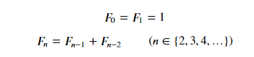

# **함수(function) II**

## 1. 함수와 스코프(scope)

함수는 코드 내부에 스코프(scope)를 생성합니다. 함수로 생성된 공간은 `지역 스코프(local scope)`라고 불리며, 그 외의 공간인 `전역 스코프(global scope)`와 구분됩니다.

- **전역 스코프(`global scope`)**: 코드 어디에서든 참조할 수 있는 공간
- **지역 스코프(`local scope`)**: 함수가 만든 스코프로 함수 내부에서만 참조할 수 있는 공간

- **전역 변수(`global variable`)**: 전역 스코프에 정의된 변수
- **지역 변수(`local variable`)**: 로컬 스코프에 정의된 변수

```python
a = 10 # 전역 변수(global)

def func(b):
    a = 30 # 지역 변수(local variable)
    print(a)
    
func(a)
print(a)
```

##### 1.0.1 변수의 수명주기(lifecycle)

변수의 이름은 각자의 `수명주기(lifecycle)`가 있습니다.

- **빌트인 스코프`(built-in scope)`**: 파이썬이 실행된 이후부터 영원히 유지

- **전역 스코프`(global scope)`**: 모듈이 호출된 시점 이후 혹은 이름 선언된 이후부터 인터프리터가 끝날 때 까지 유지

- **지역(함수) 스코프`(local scope)`**: 함수가 호출될 때 생성되고, 함수가 종료될 때까지 유지 (함수 내에서 처리되지 않는 예외를 일으킬 때 삭제됨)


### 1.1 이름 검색(resolution) 규칙

파이썬에서 사용되는 이름(식별자)들은 이름공간(namespace)에 저장되어 있습니다.

아래와 같은 순서로 이름을 찾아나가며, `LEGB Rule` 이라고 부릅니다.

- `L`ocal scope: 함수

- `E`nclosed scope: 특정 함수의 상위 함수

- `G`lobal scope: 함수 밖의 변수 혹은 import된 모듈

- `B`uilt-in scope: 파이썬안에 내장되어 있는 함수 또는 속성

```python
# 아래 코드를 실행하여 오류를 확인해보세요.

print = 'hello'
print(3)

# 출력 결과
---------------------------------------------------------------------------
TypeError                                 Traceback (most recent call last)
~\AppData\Local\Temp/ipykernel_9284/486329229.py in <module>
      2 
      3 print = 'hello'
----> 4 print(3)

TypeError: 'str' object is not callable
```


### 1.2

1.  `print()` 코드가 실행되면
2.  함수에서 실행된 코드가 아니기 때문에 `L`, `E` 를 건너 뛰고,
3.  `print`라는 식별자를 Global scope에서 찾아서 `print = hello`를 가져오고,
4.  이는 함수가 아니라 변수이기 때문에 `not callable`하다라는 오류를 내뱉게 됩니다.
5.  우리가 원하는 `print()`은 Built-in scope에 있기 때문입니다.

```python
# Global scope와 Local scope를 알아봅시다.
# 함수 밖의 변수 a는 전역 변수에 해당하고, 함수 내부의 변수 a는 지역 변수에 해당합니다.
# 함수의 실행 결과로 어떤 변수의 값이 반환되는지 확인해보세요.
a = 1
def func1(b):
    return a

print(func1(3))
# 1
```

```python
# LEGB Rule을 자세히 알아봅시다.

# 아래 코드를 실행시켜보고 print문에서 출력되는 
# 각 변수가 어느 스코프에 해당하는 변수인지 확인해보고 왜 그렇게 되는지 고민해보세요.

a = 10
b = 20
def enclosed():
    a = 30
    def local():
        c = 40
        print(a, b, c) # 30 20 40
    local()
    a = 50
enclosed()
```

```python
# 기본적으로 지역 스코프에서 전역 스코프의 변수를 바꿀 수는 없습니다.
# 아래 코드에서 함수 내부의 global_num은 지역 변수로 생성됩니다.
# 코드를 실행시킨 뒤 결과를 확인해보세요.

global_num = 3
def local_scope():
    global_num = 5

local_scope()
print(global_num)
# 3
```

```python
# global 키워드를 사용하여 지역 스코프에서 전역 변수의 값을 바꿀 수 있습니다.
# 코드를 실행시킨 뒤 결과를 확인해보세요.

global_num = 3
def local_scope():
    global global_num
    global_num = 5

local_scope()
print(global_num)
```

- 기본적으로 함수에서 선언된 변수는 Local scope에 생성되며, 함수 종료 시 사라집니다.
- 해당 스코프에 변수가 없는 경우 LEGB rule에 의해 이름을 검색합니다.
  - 변수에 접근은 가능하지만, 해당 변수를 수정할 수는 없습니다.
  - 값을 할당하는 경우 해당 스코프의 이름공간에 새롭게 생성되기 때문입니다.
  - **단, 함수 내에서 필요한 상위 스코프 변수는 인자로 넘겨서 활용합니다.** (클로저 제외)
- 상위 스코프에 있는 변수를 수정하고 싶다면 global, nonlocal 키워드를 활용 가능합니다.
  - 단, 코드가 복잡해지면서 변수의 변경을 추적하기 어렵고, 예기치 못한 오류가 발생합니다.


## 2 재귀 함수(recursive function)

재귀 함수는 함수 내부에서 자기 자신을 호출 하는 함수를 뜻합니다.

알고리즘을 설계 및 구현에서 유용하게 활용됩니다.


### 2.1 팩토리얼 계산

##### 2.1.1 반복문을 이용한 팩토리얼 계산

```python
# 팩토리얼을 반복문을 이용하여 구현해봅시다.
def fact(n):
    result = 1
    for i in range(1, n+1):
        result *= i
    return result
fact(5)
# 120
```


##### 2.1.2 재귀를 이용한 팩토리얼 계산

```python
# 재귀를 이용하여 팩토리얼을 구현해봅시다.
def factorial(n):
    if n == 1:
        return 1
    return n * factorial(n-1)
factorial(5)
# 120
```


### 2.2 반복문과 재귀함수

- 두 코드 모두 원리는 같습니다!

1. 반복문 코드
   - n이 1보다 큰 경우 반복문을 돌며, n은 1씩 감소합니다.
   - 마지막에 n이 1이면 더 이상 반복문을 돌지 않습니다.

1. 재귀 함수 코드
   - 재귀 함수를 호출하며, n은 1씩 감소합니다.
   - 마지막에 n이 1이면 더 이상 추가 함수를 호출하지 않습니다.


- 재귀함수는 기본적으로 같은 문제이지만 점점 범위가 줄어드는 문제를 풀게 됩니다.
- 재귀함수를 작성시에는 반드시, `base case`가 존재 하여야 합니다.
- `base case`는 점점 범위가 줄어들어 반복되지 않는 최종적으로 도달하는 곳을 의미합니다.
- 재귀를 이용한 팩토리얼 계산에서의 base case는 **n이 1일때, 함수가 아닌 정수 반환하는 것**입니다.

- 자기 자신을 호출하는 재귀함수는 알고리즘 구현시 많이 사용됩니다.
- **코드가 더 직관적이고 이해하기 쉬운 경우가 있습니다.**
- 팩토리얼 재귀함수를 [Python Tutor](https://goo.gl/k1hQYz)에서 확인해보면, 함수가 호출될 때마다 메모리 공간에 쌓이는 것을 볼 수 있습니다.
- 이 경우, **메모리 스택이 넘치거나(Stack overflow) 프로그램 실행 속도가 늘어지는 단점**이 생깁니다.
- 파이썬에서는 이를 방지하기 위해 1,000번이 넘어가게 되면 더이상 함수를 호출하지 않고, 종료됩니다. (최대 재귀 깊이)


### 2.3 [실습] 피보나치 수열

> 피보나치 수열은 다음과 같은 점화식이 있습니다.
>
> 피보나치 값을 리턴하는 두가지 방식의 코드를 모두 작성해주세요.




```python
# 반복문(for문)을 이용한 코드 fib_loop() 를 작성하세요.
def fib_loop(n):
    fib_list = [0, 1]
    for i in range(2, n+1):
        fib_list += [fib_list[i-1] + fib_list[i-2]]
    return fib_list[-1]
fib_loop(10)
# 55
```

```python
# 재귀를 이용한 코드 fib() 를 작성하세요.
def fib(n):
    if n <= 2:
        return 1
    return fib(n-1) + fib(n-2)
fib(10)
# 55
```


### 2.4 반복문과 재귀 함수의 차이

- 알고리즘 자체가 재귀적인 표현이 자연스러운 경우 재귀함수를 사용합니다.
- 재귀 호출은 `변수 사용` 을 줄여줄 수 있습니다.

```python
# 재귀 호출은 입력 값이 커질 수록 연산 속도가 오래걸립니다.
# fib() 함수에 10 이상의 값을 넣어보고 실행한 뒤 연산 시간을 확인해보세요.
```

```python
from timeit import default_timer as timer
from datetime import timedelta

t0 = timer()
fib(40)
t1 = timer()

total = timedelta(seconds=t1-t0)
print(total)
# 0:00:13.975504
```

```python
# 반복문은 재귀로 구현된 함수보다 연산 속도가 빠른 편입니다.
# fib_loop() 함수에 10 이상의 값을 넣어보고 실행한 뒤 연산 시간을 확인해보세요.
# 그리고 100배 더 큰 1000 이상의 값도 넣어보고 실행한 뒤 연산 시간을 확인해보세요.
```

```python
from timeit import default_timer as timer
from datetime import timedelta

t0 = timer()
fib_loop(40)
t1 = timer()

total = timedelta(seconds=t1-t0)
print(total)
# 0:00:00.000043
```

