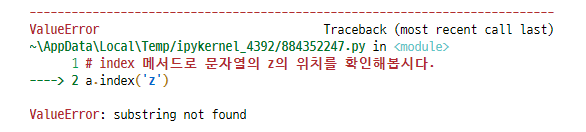

# **데이터 구조(Data Structure) I**

데이터 구조(Data Structure)란 데이터에 편리하게 접근하고, 변경하기 위해서 데이터를 저장하거나 조작하는 방법을 말한다.

> **Program = Data Structure + Algorithm**
>
> - Niklaus Wirth

- 알고리즘에 빈번히 활용되는 순서가 있는(ordered) 데이터 구조
  - 문자열(String)
  - 리스트(List)
- 데이터 구조에 적용 가능한 Built-in Function


## 1. 문자열(String)

변경할 수 없고(immutable), 순서가 있고(ordered), 순회 가능한(iterable)


### 1.1 조회 / 탐색

#### 1.1.1 `.find(x)`

x의 **첫 번째 위치**를 반환합니다. 없으면, `-1`을 반환합니다.

```python
a = 'apple'
a.find('p')
# 1
a.find('z')
# -1
```


#### 1.1.2 `.index(x)`

x의 **첫번째 위치**를 반환합니다. 없으면, 오류가 발생합니다.

```python
a = 'apple'
a.index('p')
# 1
a.index('z')
```




### 1.2 문자열 변경

#### 1.2.1 `.replace(old, new[, count])`

바꿀 대상 글자를 새로운 글자로 바꿔서 반환합니다.

count를 지정하면 해당 갯수만큼만 시행합니다.

```python
a = 'yaya!'
b = 'wooooowoo'
print(a.replace('y','h'))
print(a)
# haha!
# yaya!

print(b.replace('o','_',2))
# 'w__ooowoo'
```


#### 1.2.2 `.strip([chars])`

특정한 문자들을 지정하면, 양쪽을 제거하거나 왼쪽을 제거하거나(lstrip), 오른쪽을 제거합니다(rstrip).

지정하지 않으면 공백을 제거합니다.

```python
a = '   hello!  \n'
b = 'hihihihahahahihi'

print(a)
print(a.strip())
#    hello!  
# hello!

print(a.lstrip())
# hello!  << 우측 공백 존재

print(b.rstrip('hi'))
# hihihihahaha
```


#### 1.2.3 `.split([chars])`

문자열을 특정한 단위로 나누어 리스트로 반환합니다.

```python
a = 'a_b_c'
print(a.split('_'))
# ['a', 'b', 'c']

i = input()
print(i.split())
# park seung won
# ['park', 'seung', 'won']
```


#### 1.2.4 `'separator'.join(iterable)`

특정한 문자열로 만들어 반환합니다.

반복가능한(iterable) 컨테이너의 요소들을 separator(구분자)로 합쳐(`join()`) 문자열로 반환합니다.

```python
word = '배고파'
words = ['안녕', 'hello']
'!'.join(word)
# '배!고!파'

' '.join(words)
# '안녕 hello'
```


#### 1.2.5 `.capitalize()`, `.title()`, `.upper()`

- `.capitalize()` : 앞글자를 대문자로 만들어 반환합니다.
- `.title()` : 어포스트로피나 공백 이후를 대문자로 만들어 반환합니다.
- `.upper()` : 모두 대문자로 만들어 반환합니다.

````python
a = 'hI! Everyone, I\'m kim'
print(a.capitalize())
print(a.title())
print(a.upper())
print(a)
# Hi! everyone, i'm kim
# Hi! Everyone, I'M Kim
# HI! EVERYONE, I'M KIM
# hI! Everyone, I'm kim
````


#### 1.2.6 `.lower()`, `.swapcase()`

- `lower()` : 모두 소문자로 만들어 반환합니다.
- `swapcase()` : 대 <-> 소문자로 변경하여 반환합니다.

```python
a = 'hI! Everyone, I\'m kim'
print(a.lower())
print(a.swapcase())
print(a)
# hi! everyone, i'm kim
# Hi! eVERYONE, i'M KIM
# hI! Everyone, I'm kim
```


#### 1.2.7 기타 문자열 관련 검증 메소드 : 참/거짓 반환

```py
.isalpha(), .isdecimal(), .isdigit(), .isnumeric(), .isspace(), .isupper(), .istitle(), .islower()
```


## 2 리스트(List)

> 변경 가능하고(mutable), 순서가 있고(ordered), 순회 가능한(iterable)

데이터 구조로서의 리스트(list)와 조작법(method)

### 2.1 값 추가 및 삭제

#### 2.1.1 `.append(x)`

리스트에 값을 추가할 수 있습니다.

```python
cafe = ['starbucks', 'tomntoms', 'hollys']
print(cafe)
# ['starbucks', 'tomntoms', 'hollys']
cafe.append('banapresso')
print(cafe)
# ['starbucks', 'tomntoms', 'hollys', 'banapresso']
```


#### 2.1.2 `.extend(iterable)`

리스트에 iterable(list, range, tuple, string 값을 붙일 수가 있습니다.

```python
cafe.extend(['wcafe', '빽다방'])
print(cafe)
# ['starbucks', 'tomntoms', 'hollys', 'banapresso', 'wcafe', '빽다방']

cafe += ['mc_cafe', 'droptop']
print(cafe)
# ['starbucks', 'tomntoms', 'hollys', 'banapresso', 'wcafe', '빽다방', 'mc_cafe', 'droptop']

cafe.append(['coffeenie'])
print(cafe)
# ['starbucks', 'tomntoms', 'hollys', 'banapresso', 'wcafe', '빽다방', 'mc_cafe', 'droptop', ['coffeenie']]

cafe.extend(['twosome_place'])
print(cafe)
# ['starbucks', 'tomntoms', 'hollys', 'banapresso', 'wcafe', '빽다방', 'mc_cafe', 'droptop', ['coffeenie'], 'twosome_place']

cafe.extend('ediya')
print(cafe)
# ['starbucks', 'tomntoms', 'hollys', 'banapresso', 'wcafe', '빽다방', 'mc_cafe', 'droptop', ['coffeenie'], 'twosome_place', 'e', 'd', 'i', 'y', 'a']
```


#### 2.1.3 `.insert(i, x)`

정해진 위치 `i`에 값을 추가합니다.

```python
cafe.insert(0,'start')
print(cafe)
# ['start', 'starbucks', 'tomntoms', 'hollys', 'banapresso', 'wcafe', '빽다방', 'mc_cafe', # 'droptop', ['coffeenie'], 'twosome_place', 'e', 'd', 'i', 'y', 'a']

length = len(cafe)
cafe.insert(length, 'end')
print(cafe)
# ['start', 'starbucks', 'tomntoms', 'hollys', 'banapresso', 'wcafe', '빽다방', 'mc_cafe', # 'droptop', ['coffeenie'], 'twosome_place', 'e', 'd', 'i', 'y', 'a', 'end']

cafe.insert(10000000,'!')
print(cafe)
# ['start', 'starbucks', 'tomntoms', 'hollys', 'banapresso', 'wcafe', '빽다방', 'mc_cafe', # 'droptop', ['coffeenie'], 'twosome_place', 'e', 'd', 'i', 'y', 'a', 'end', '!']
```


#### 2.1.4 `.remove(x)`

리스트에서 값이 x인 것을 삭제합니다.

```python
numbers = [1, 2, 3, 1, 2]
print(numbers.remove(1))
print(numbers)
# None
# [2, 3, 1, 2]

print(numbers.remove(1))
print(numbers)
# None
# [2, 3, 2]

# remove는 값이 없으면 오류가 발생합니다. 확인해봅시다.
print(numbers.remove(1)
```


#### 2.1.5 `.pop(i)`

정해진 위치 `i`에 있는 값을 삭제하며, 그 항목을 반환합니다.

`i`가 지정되지 않으면 마지막 항목을 삭제하고 되돌려줍니다.

```python
numbers = [1, 2, 3, 4, 5, 6]
numbers.pop(0)
print(numbers)
# [2, 3, 4, 5, 6]

a = numbers.pop()
print(a, numbers)
# 6 [2, 3, 4, 5]
```


#### 2.1.6 `.clear()`

리스트의 모든 항목을 삭제합니다.

```python
numbers = [1, 2, 3, 4, 5, 6]
print(numbers.clear())
print(numbers)
# None
# []
```


### 2.2 탐색 및 정렬

#### 2.2.1 `.index(x)`

x 값을 찾아 해당 index 값을 반환합니다.

```python
a = [1, 2, 3, 4, 5]
print(a.index(3))
# 2

print(a.index(100))
```


#### 2.2.2 `.count(x)`

원하는 값의 개수를 반환합니다.

```python
a = [1, 2, 5, 1, 5, 1]
print(a.count(1))
# 3

a = [1, 2, 1, 3, 4]
target_value = 1
for i in range(a.count(target_value)):
    a.remove(target_value)
print(a)
# [2, 3, 4]
```


#### 2.2.3 `.sort()`

정렬을 합니다.

내장함수 `sorted()` 와는 다르게 **원본 list를 변형**시키고, **`None`**을 리턴합니다.

```python
import random
lotto = random.sample(range(1, 46), 6)
print(lotto)
# [8, 41, 6, 3, 34, 10]

lotto.sort()
print(lotto)
# [3, 6, 8, 10, 34, 41]

print(lotto.sort(reverse = True))
print(lotto)
# None
# [44, 40, 35, 17, 11, 10]

lotto2 = random.sample(range(1,46),6)
print(lotto2)
# [31, 15, 32, 37, 43, 19]

print(sorted(lotto2, reverse=True))
print(lotto2)
# [43, 37, 32, 31, 19, 15]
# [31, 15, 32, 37, 43, 19]

import random
lotto = random.sample(range(1, 46), 6)
print(lotto, sorted(lotto))
# [35, 11, 17, 10, 40, 44] [10, 11, 17, 35, 40, 44]
```


#### 2.2.4 `.reverse()`

반대로 뒤집습니다. **(정렬 아님)**

```python
classroom = ['Tom', 'David', 'Justin']
print(classroom)
# ['Tom', 'David', 'Justin']

classroom.reverse()
print(classroom)
# ['Justin', 'David', 'Tom']
```


### 2.3 리스트 복사

```python
original_list = [1, 2, 3]
copy_list = original_list
print(copy_list)
# [1, 2, 3]

copy_list[0] = 5
print(original_list)
# [5, 2, 3]

id(copy_list) == id(original_list)
# True
```


### 2.4 리스트 복사 방법

#### 2.4.1 slice 연산자 사용 `[:]`

```python
a = [1, 2, 3]
b = a[:]
b[0] = 5
print(a)
# [1, 2, 3]
```


#### 2.5.2 `list()` 활용

```python
a = [1, 2, 3]
b = list(a)
b[0] = 5
print(a)
# [1, 2, 3]
```


#### 2.5.3 copy 모듈활용

```python
import copy

a = [1, 2, 3]
b = copy.copy(a)
b[0] = 10
print(a)
# [1, 2, 3]
```

- 하지만, 이렇게 하는 것도 일부 상황에만 서로 `다른 얕은 복사(shallow copy)`입니다.

```python
a = [1, 2, [1, 2]]
b = a[:]
b[2][0] = 5
print(a)
# [1, 2, [5, 2]]
```

- 만일 중첩된 상황에서 복사를 하고 싶다면, `깊은 복사(deep copy)`를 해야합니다.
- 즉, 내부에 있는 모든 객체까지 새롭게 값이 변경됩니다.

```python
import copy

a = [1, 2, [1, 2]]
b = copy.deepcopy(a)

b[2][0] = 3
print(a)
# [1, 2, [1, 2]]
```


### 2.6 List Comprehension

List Comprehension은 표현식과 제어문을 통해 리스트를 생성합니다.

여러 줄의 코드를 한 줄로 줄일 수 있습니다.


#### 2.6.1 활용법

```python
[expression for 변수 in iterable]

list(expression for 변수 in iterable)
```


#### 2.6.2 세제곱 리스트

> 다음의 리스트를 작성하세요.

- 1~10까지의 숫자로 만든 세제곱 담긴 리스트 `cubic_list`

```python
numbers = range(1, 11)
cube_list = []
for i in numbers:
    cube_list.append(i**3)
print(cube_list)
# [1, 8, 27, 64, 125, 216, 343, 512, 729, 1000]

cubic_list = [i**3 for i in numbers]
print(cubic_list)
# [1, 8, 27, 64, 125, 216, 343, 512, 729, 1000]
```


### 2.7 List Comprehension + 조건문

조건문에 참인 식으로 리스트를 생성합니다.

------

**활용법**

```python
[expression for 변수 in iterable if 조건식]
```

#### 2.7.1 [연습] 짝수리스트

> 다음의 리스트를 작성하세요.

- 1~10까지의 숫자중 짝수만 담긴 리스트 `even_list`
- 여러개의 `for` 혹은 `if`문을 중첩적으로 사용 가능합니다.

```python
even_list1 = []
for i in range(1,11):
    if(i % 2 == 0):
        even_list1.append(i)
print(even_list1)
# [2, 4, 6, 8, 10]

even_list = [i for i in range(1,11) if i % 2 == 0]
print(even_list)
# [2, 4, 6, 8, 10]
```


#### 2.7.2 [실습] 곱집합

> 주어진 두 list의 가능한 모든 조합을 담은 `pair` 리스트를 작성하세요.

1. 반복문 활용
2. list comprehension 활용

```python
girls = ['jane', 'ashley', 'mary']
boys = ['justin', 'eric', 'david']

pair1 = []
for i in range(3):
    for j in range(3):
        pair1.append((boys[i], girls[j]))
print(pair1)
# [('justin', 'jane'), ('justin', 'ashley'), ('justin', 'mary'), ('eric', 'jane'), ('eric', 'ashley'), ('eric', 'mary'), ('david', 'jane'), ('david', 'ashley'), ('david', 'mary')]

pair = [(boys[i], girls[j]) for i in range(3) for j in range(3)]
print(pair)
# [('justin', 'jane'), ('justin', 'ashley'), ('justin', 'mary'), ('eric', 'jane'), ('eric', 'ashley'), ('eric', 'mary'), ('david', 'jane'), ('david', 'ashley'), ('david', 'mary')]
```


#### 2.7.3 [응용] 피타고라스 정리

> 주어진 조건(x < y < z < 50) 내에서 피타고라스 방정식의 해를 찾으세요.

1. 반복문 활용
2. list comprehension 활용

```python
result = []
for i in range(1, 50):
    for j in range(i+1, 50):
        for k in range(j+1, 50):
            if i**2 + j**2 == k**2:
                result.append((i, j, k))
print(result)
# [(3, 4, 5), (5, 12, 13), (6, 8, 10), (7, 24, 25), (8, 15, 17), (9, 12, 15), (9, 40, 41), (10, 24, 26), (12, 16, 20), (12, 35, 37), (15, 20, 25), (15, 36, 39), (16, 30, 34), (18, 24, 30), (20, 21, 29), (21, 28, 35), (24, 32, 40), (27, 36, 45)]

result = [(i, j, k) for i in range(1,50) for j in range(i+1,50) for k in range(j+1,50) if i**2 + j**2 == k**2]
print(result)
# [(3, 4, 5), (5, 12, 13), (6, 8, 10), (7, 24, 25), (8, 15, 17), (9, 12, 15), (9, 40, 41), (10, 24, 26), (12, 16, 20), (12, 35, 37), (15, 20, 25), (15, 36, 39), (16, 30, 34), (18, 24, 30), (20, 21, 29), (21, 28, 35), (24, 32, 40), (27, 36, 45)]
```


## 3 데이터 구조에 적용가능한 Built-in Function

순회 가능한(iterable) 데이터 구조에 적용가능한 Built-in Function

> iterable 타입 - `list`, `dict`, `set`, `str`, `bytes`, `tuple`, `range`

- `map()`
- `filter()`
- `zip()`
- ~~`reduce()`~~


### 3.1 `map(function, iterable)`

- 순회가능한 데이터 구조(iterable)의 모든 요소에 function을 적용한 후 그 결과를 돌려준다.

- return은 `map_object` 형태이다.

```python
# 위의 변수 numbers를 문자열 '123'으로 만드세요.
numbers = [1, 2, 3]
new_numbers = ''.join([str(num)for num in numbers])
print(new_numbers)
# 123

new_numbers = ''.join(list(map(str, numbers)))
print(new_numbers)
# 123
```

`map()` 함수는 입력값을 처리할 때 자주 활용됩니다.

```python
# 변수 numbers를 정수로 구성된 리스트 [1, 2, 3]으로 만드세요.
numbers = ['1', '2', '3']
new_numbers = [int(num) for num in numbers]
print(new_numbers)
# [1, 2, 3]

new_numbers = list(map(int, numbers))
print(new_numbers)
# [1, 2, 3]
```

첫번째 인자 function은 사용자 정의 함수도 가능합니다.

```python
# 세제곱의 결과를 나타내는 함수가 있습니다.
def cube(n):
    return n ** 3
numbers = [1, 2, 3]
new_numbers = list(map(cube, numbers))
print(new_numbers)
# [1, 8, 27]
```


### 3.2 `filter(function, iterable)`

- iterable에서 function의 반환된 결과가 `True` 인 것들만 구성하여 반환합니다.

- `filter object` 를 반환합니다.

```python
def odd(n):
    return n % 2
numbers = [1, 2, 3]
new_numbers = list(filter(odd, numbers))
print(new_numbers)
# [1, 3]

new_numbers = [num for num in numbers if num % 2]
print(new_numbers)
# [1, 3]
```


### 3.3 `zip(*iterables)`

- 복수의 iterable 객체를 모아(`zip()`)줍니다.

- 결과는 튜플의 모음으로 구성된 `zip object` 를 반환합니다.

```python
girls = ['jane', 'ashley', 'mary']
boys = ['justin', 'eric', 'david']
pair = list(zip(girls, boys))
print(pair)
# [('jane', 'justin'), ('ashley', 'eric'), ('mary', 'david')]

last_name = ['jane', 'ashley', 'mary']
first_name = ['justin', 'eric', 'david']

result = [(idx, ' '.join(name)) for idx, name in enumerate(zip(last_name, first_name))]
print(result)
# [(0, 'jane justin'), (1, 'ashley eric'), (2, 'mary david')]

last_name = ['jane', 'ashley', 'mary']
first_name = ['justin', 'eric', 'david']

def full_name(*args):
    name_list = [' '.join(name) for name in zip(*args)]
    return name_list

result = full_name(last_name, first_name)
print(result)
# ['jane justin', 'ashley eric', 'mary david']

# 전치 행렬
a = [
    [1, 2, 3],
    [4, 5, 6],
    [7, 8, 9],
]

b = list(zip(*a))
print(b)
# [(1, 4, 7), (2, 5, 8), (3, 6, 9)]

key_list = ['key1', 'key2', 'key3']
value_list = ['justin', 'eric', 'david']

easy_dict = dict(zip(key_list, value_list))
print(easy_dict)
# {'key1': 'justin', 'key2': 'eric', 'key3': 'david'}
```


