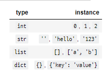
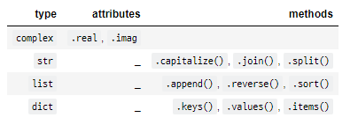
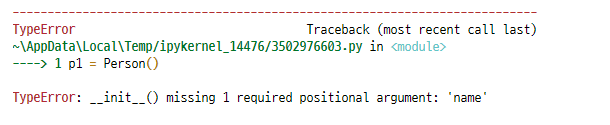
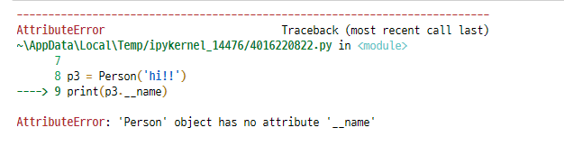

# OOP I

- 객체(Object)
- 객체지향프로그래밍(Object Oriented Programming)
- 클래스(Class)와 객체(Object)

## 1 객체(Object)

> Python에서 **모든 것은 객체(object)**입니다.

> 모든 객체는 **타입(type), 속성(attribute), 조작법(method)**을 가집니다.

객체(Object)의 특징

- **타입(type)**: 어떤 연산자(operator)와 조작(method)이 가능한가?
- **속성(attribute)**: 어떤 상태(데이터)를 가지는가?
- **조작법(method)**: 어떤 행위(함수)를 할 수 있는가?

### 1.1 타입(Type)과 인스턴스(Instance)



#### 1.1.1 타입(Type)

- 공통된 속성(attribute)과 조작법(method)을 가진 객체들의 분류


#### 1.1.2 인스턴스(Instance)

- 특정 타입(type)의 실제 데이터 예시(instance)입니다.
- 파이썬에서 모든 것은 객체이고, **모든 객체는 특정 타입의 인스턴스**입니다.

```python
a = 10
b = 20
# a, b 는 객체
# a, b 는 int 타입(type)의 인스턴스
```

```python
a = 10
print(type(a) is int)
# True

isinstance(a, int)
# True
```


### 1.2 속성(Attribute)과 메서드(Method)

객체의 속성(상태, 데이터)과 조작법(함수)을 명확히 구분해 봅시다.




#### 1.2.1 속성(Attribute)

- 속성(attribute)은 객체(object)의 상태/데이터를 뜻합니다.

**활용법**

```py
<객체>.<속성>
```

**예시**

```py
3+4j.real
```

- `complex` 타입 인스턴스가 가진 속성을 확인해봅시다.

```python
img_number = 3 + 4j
print(type(img_number))
# <class 'complex'>

print(img_number.real)
print(img_number.imag)
# 3.0
# 4.0
```


#### 1.2.2 메서드(Method)

- 특정 객체에 적용할 수 있는 행위(behavior)를 뜻 합니다.

**활용법**

```py
<객체>.<메서드>()
```

**예시**

```py
[3, 2, 1].sort()
```

- `list` type의 인스턴스에 적용 가능한 조작법(method)을 확인해 봅시다.

```python
a = [1, 3, 5, 2, 4]
a.sort()
print(a)
# [1, 2, 3, 4, 5]

# list 타입의 객체들이 할 수 있는 것들을 알아봅시다. (list 타입 객체가 가지고 있는 모든 속성과 메서드를 보여줍니다.)
print(dir(list))
# ['__add__', '__class__', '__class_getitem__', '__contains__', '__delattr__', '__delitem__', '__dir__', '__doc__', '__eq__', '__format__', '__ge__', '__getattribute__', '__getitem__', '__gt__', '__hash__', '__iadd__', '__imul__', '__init__', '__init_subclass__', '__iter__', '__le__', '__len__', '__lt__', '__mul__', '__ne__', '__new__', '__reduce__', '__reduce_ex__', '__repr__', '__reversed__', '__rmul__', '__setattr__', '__setitem__', '__sizeof__', '__str__', '__subclasshook__', 'append', 'clear', 'copy', 'count', 'extend', 'index', 'insert', 'pop', 'remove', 'reverse', 'sort']
```


## 2 객체 지향 프로그래밍(Object-Oriented Programming)

Object가 중심(oriented)이 되는 프로그래밍

**<wikipedia - 객체지향 프로그래밍>**

> 객체 지향 프로그래밍(영어: Object-Oriented Programming, OOP)은 컴퓨터 프로그래밍의 패러다임의 하나입니다.
>
> 객체 지향 프로그래밍은 컴퓨터 프로그램을 명령어의 목록으로 보는 시각에서 벗어나 여러 개의 독립된 단위, 즉 "객체"들의 모임으로 파악하고자 하는 것입니다.


### 2.1 절차 중심 vs. Object 중심

> 프로그래밍 패러다임: 어떻게 프로그램을 작성할 것인가


### 2.2 Object 중심의 장점

**<wikipedia - 객체지향 프로그래밍>**

> 객체 지향 프로그래밍은 프로그램을 유연하고 변경이 용이하게 만들기 때문에 대규모 소프트웨어 개발에 많이 사용됩니다.
>
> 또한 프로그래밍을 더 배우기 쉽게 하고 소프트웨어 개발과 보수를 간편하게 하며,
>
> 보다 직관적인 코드 분석을 가능하게 하는 장점을 갖고 있습니다.

- 코드의 **직관성**
- 활용의 **용이성**
- 변경의 **유연성**


## 3 클래스(Class)와 인스턴스(Instance)

> `class`: 객체들의 분류(class)를 정의할 때 쓰이는 키워드

> `instance`: 객체의 실체와 예, 인스턴스(instance)를 활용


### 3.1 클래스(Class) 생성

- 클래스 생성은 `class` 키워드와 정의하고자 하는 `<클래스의 이름>`으로 가능합니다.
- `<클래스의 이름>`은 `PascalCase`로 정의합니다.
- 클래스 내부에는 데이터와 함수를 정의할 수 있고, 이때 데이터는 **속성(attribute)** 정의된 함수는 **메서드(method)**로 부릅니다.

**활용법**

```python
class <클래스이름>:
    <statement>
class ClassName:
    statement
```

```python
class Person():
    """
    이것은 Person 클래스에요!!!
    """
print(type(Person))
# <class 'type'>
```


### 3.2 인스턴스(Instance) 생성

- 정의된 클래스(`class`)에 속하는 객체를 해당 클래스의 인스턴스(instance)라고 합니다.
- `Person` 클래스의 인스턴스는 `Person()`을 호출함으로써 생성됩니다.
- `type()` 함수를 통해 생성된 객체의 클래스를 확인할 수 있습니다.

**활용법**

```python
# 인스턴스 = 클래스()
person1 = Person()
```

- `person1`은 사용자가 정의한(user-defined) `Person`이라는 데이터 타입(data type)의 인스턴스입니다.

```python
p1 = Person()
p2 = Person()

print(p1.__doc__)
print(p2.__doc__)
# 
#     이것은 Person 클래스에요!!!
#     
# 
#     이것은 Person 클래스에요!!!
```


### 3.3 메서드(Method) 정의

특정 데이터 타입(또는 클래스)의 객체에 공통적으로 적용 가능한 행위(behavior)들을 의미합니다.

------

**활용법**

```python
class Person:
    # 메서드(method)
    def talk(self):    # 인자로 self를 정의해봅시다.
        print('안녕')
```


```python
class Person:
    def talk(self):
        print('안녕')
        print(self)
        return True

p1 = Person()
p2 = Person()

print(p1.talk())
print(p2.talk())

# 안녕
# <__main__.Person object at 0x0000022A1BCE4340>
# True
# 안녕
# <__main__.Person object at 0x0000022A1BCEA640>
# True
```


```python
class Person:
    def talk(self):
        print('HI!!!')
    def eat(self, food):
        print(f'Eat {food}')

p1 = Person()
p1.eat('pizza!')
# Eat pizza!

class Person:
    def talk(self):
        print('안녕')
    
    def eat(self, food='치킨 먹고싶다..'):
        print(f'냠냠 {food}')
p1 = Person()
p1.eat()
p1.eat('치킨')
# 냠냠 치킨 먹고싶다..
# 냠냠 치킨
```


### 3.4 `self`

> 인스턴스 자신(self)

- Python에서 인스턴스 메서드는 **호출 시 첫번째 인자로 인스턴스 자신이 전달**되게 설계되었습니다.

- 보통 매개변수명으로 `self`를 첫번째 인자로 정의 (다른 이름도 가능하지만 추천하지는 않습니다.)

```python
class Person:
    
    def test(self):
        print(self)
p1 = Person()
p1.test()
# <__main__.Person object at 0x0000022A1BD92C70>
print(p1)
# <__main__.Person object at 0x0000022A1BD92C70>
```


#### 3.4.1 생성자(constructor) 메서드

인스턴스 객체가 생성될 때 호출되는 함수. 반드시 `__init__` 이라는 이름으로 정의.

------

**활용법**

```python
class MyClass:
    def __init__(self):
        print('생성될 때 자동으로 호출되는 메서드입니다.')
```

- 생성자를 활용하면 인스턴스가 생성될 때 인스턴스의 속성을 정의할 수 있습니다.


```python
class Person:
    def __init__(self, name):
        self.name = name
    
    def talk(self):
        print(f'I am {self.name}')
p1 = Person('john')
p1.talk()
# I am john

# 굳이 아래처럼 사용할 필요는 없음
Person.talk(p1)
# I am john
```


#### 3.4.2 소멸자(destructor) 메서드

- 인스턴스 객체가 소멸(파괴)되기 직전에 호출되는 함수. 반드시 `__del__` 이라는 이름으로 정의.

------

**활용법**

```python
def __del__(self):
    print('소멸될 때 자동으로 호출되는 메서드입니다.')
```

```python
class Person:
    def __init__(self):
        print('응애!')
        
    def __del__(self):
        print('떠날게..')
p1 = Person()
del(p1)
# 응애!
# 떠날게..
```


### 3.5 속성(Attribute) 정의

특정 데이터 타입(또는 클래스)의 객체들이 가지게 될 상태/데이터를 의미합니다.

`self.<속성명> = <값>` 혹은 `<인스턴스>.<속성명> = <값>`으로 설정합니다

**활용법**

```python
class Person:
    def __init__(self, name):
        self.name = name

    def talk(self):
        print(f'안녕, 나는 {self.name}')
```


```python
class Person:
    def __init__(self, name):
        self.name = name
        
    def talk(self):
        print(f'안녕, 나는 {self.name}')
p1 = Person('seung won!')
print(p1.name)
# seung won!
p1.name = 'sw'
p1.talk()

# seung won!
# 안녕, 나는 sw

p2 = Person()
```




### 3.6 매직(스페셜) 메서드

- 더블언더스코어(`__`)가 있는 메서드는 특별한 일을 하기 위해 만들어진 메서드이기 때문에 `스페셜 메서드` 혹은 `매직 메서드`라고 불립니다.

- 매직(스페셜) 메서드 형태: `__someting__`

  ```python
  '__str__(self)',
  '__len__(self)',
  '__repr__(self)',
  '__lt__(self, other)',
  '__le__(self, other)',
  '__eq__(self, other)',
  '__ne__(self, other)',
  '__gt__(self, other)',
  '__ge__(self, other)',
  ```


#### 3.6.1 `__str__(self)`

```python
class Person:
    def __str__(self):
        return '객체 출력(print)시 보여줄 내용'
```

- 특정 객체를 출력(`print()`) 할 때 보여줄 내용을 정의할 수 있습니다.

```python
class Person:
    def __init__(self, name):
        self.name = name
p1 = Person('john')
print(p1)
# <__main__.Person object at 0x0000022A1BE89370>

class Person:
    def __init__(self, name):
        self.name = name
    
    def __str__(self):
        return f'나는 {self.name}'
p2 = Person('hi')
print(p2)
# 나는 hi

class Person:
    def __init__(self, name):
        self.__name = name
    
    def __str__(self):
        return f'나는 {self.name}'
    
p3 = Person('hi!!')
print(p3.__name)
```



```python
class Person:
    def __init__(self, name):
        self.__name = name
        
    def get_name(self):
        return self.__name
    
    def set_name(self, name):
        self.__name = name
    
    def __str__(self):
        return f'나는 {self.name}'
    
p3 = Person('hi!!')
print(p3.get_name())
p3.set_name('PWinwon')
print(p3.get_name())
# hi!!
# PWinwon
```


## 4 정리

### 4.1 객체(Object)

- 객체는 자신 고유의 **속성(attribute)** 을 가지며 클래스에서 정의한 **행위(behavior)** 를 수행

### 4.2 클래스(Class)

- 공통된 속성(attribute)과 행위(behavior)를 정의한 것으로 객체지향 프로그램의 기본적인 **사용자 정의 데이터형(user-defined data type)**

### 4.3 인스턴스(Instance)

- 특정 `class`로부터 생성된 해당 클래스의 실체/예시(instance)

### 4.4 속성(Attribute)

- 클래스/인스턴스가 가지는 속성(값/데이터)

### 4.5 메서드(Method)

- 클래스/인스턴스에 적용 가능한 조작법(method) & 클래스/인스턴스가 할 수 있는 행위(함수)


