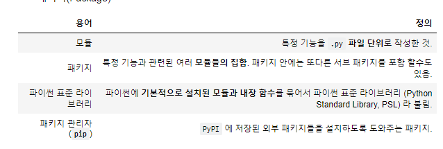

# 모듈(Module)

> 파일 단위의 코드 재사용

- 모듈(Module)
- 패키지(Package)



## 1 모듈(Module)

모듈(module)은 특정 기능을 하는 코드를 담고 있는 파일(또는 스크립트)입니다.

### 1.1 모듈 생성

- jupyter notebook 파일트리화면에서 New > Text File
- 파일의 이름을 `check.py` 로 저장

```python
# check.py
def odd(n):
    return bool(n % 2)

def even(n):
    return not bool(n % 2)
```


### 1.2 모듈 활용

#### 1.2.1 `import`

- 모듈을 활용하기 위해서는 반드시 `import`문을 통해 내장 모듈을 이름 공간으로 가져와야합니다.

```python
import check
check.odd(10)
# False
check.even(12)
# True
```


## 2 패키지(Package)

패키지(pakcage)는 **점(`.`)으로 구분된 모듈 이름(`package.module`)** 을 써서 모듈을 구조화하는 방법입니다.

### 2.1 패키지 생성

- jupyter notebook 파일트리화면에서 New > Folder
- 다음과 같은 폴더구조 생성

```python
my_package/
    __init__.py
    math/
        __init__.py
        tools.py  
```

> 모듈 이름 `my_package.math`는 `my_package`라는 이름의 패키지에 있는 `math`라는 이름의 하위 패키지를 가리킵니다.

- `__init__.py`?

  > python3.3 버전부터는 `__init__.py` 파일이 없어도 패키지로 인식합니다(PEP 420). 하지만 하위 버전 호환 및 일부 프레임워크에서의 올바른 동작을 위해 `__init__.py` 파일을 생성하는 것이 권장됩니다.

```python
# my_package/__init__.py
# my_package/math/__init__.py
# 모든 __init__.py 파일은 비워둡니다.

# my_package/math/tools.py
pi = 3.14159265358979323846
e = 2.71828182845904523536
def my_max(a, b):
    if a > b:
        return a
    else:
        return b
```

#### 2.1.1 [연습] 패키지 만들기

> `my_package` 패키지 내부에 `statistics` 패키지를 만들고, `tools.py` 모듈 생성 후, 아래의 표준편차 함수 `standard_deviation()`를 추가해보세요.

###### [폴더구조]

```py
my_package/
    __init__.py
    math/
        __init__.py
        tools.py  
    statistics/
        __init__.py
        tools.py
```

###### `standard_deviation()` 함수

```python
import math

def standard_deviation(values):
    mean = sum(values) / len(values)
    sum_var = sum(pow(value - mean, 2) for value in values) / len(values)
    std_dev = math.sqrt(sum_var)
    return std_dev
```


