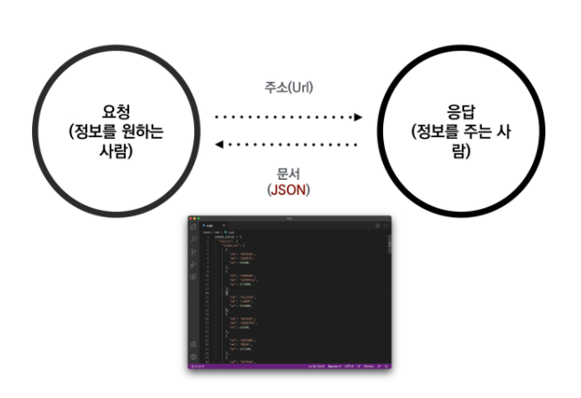

# API란

- 응용 프로그램에서 사용할 수 있도록, 운영 체제나 프로그래밍 언어가 제공하는 기능을 제어할 수 있게 만든 인터페이스


### API 사용의 핵심!

- 서버에서 확인할 수 있게끔 요청을 보내야함


### JSON(JavaScript Object Notation)

- 데이터만을 주고 받기 위한 표기법

- 파이썬의 Dictionary와 List구조로 쉽게 변환하여 활용할 수 있다.

  

### API활용

```python
#age.py

import requests

url = 'https://api.agify.io?name=seungwon'
response = requests.get(url).json()
print(response)

#$python age.py
#{'name': 'seungwon', 'age': 45, 'count': 95}
```

```python
#weather.py

import requests

location_url = 'https://www.metaweather.com/api/location/\
				search/?query=seoul'
location = requests.get(location_url).json()
url = 'https://www.metaweather.com/api/location/{}/2021/7/18/'\
	  .format(location[0]['woeid'])
response = requests.get(url).json()

print('서울의 모레 날씨는 {}로 예상됩니다.'\
      .format(response[0]['weather_state_name']))

#$python weather.py
#서울의 모레 날씨는 Heavy Rain로 예상됩니다.
```

