# CSS

#####  - Cascading Style Sheets

> 스타일, 레이아웃 등을 통해 문서(HTML)를 표시하는 방법을 지정하는 언어


- CSS 구문

```css
h1{
    color: blue;
    font-size: 15px;
}
```


- CSS 구문은 선택자와 함께 열림
- 선택자를 통해 스타일을 지정할 HTML 요소를 선택
- 중괄호 안에서는 속성과 값, 하나의 쌍으로 이루어진 선언을 진행
- 각 쌍은 선택한 요소의 속성, 속성에 부여할 값을 의미
  - 속성 (Property) : 어떤 스타일 기능을 변경할지 결정
  - 값 (Value) : 어떻게 스타일 기능을 변경할지 결정


## CSS Selectors

#### 선택자 (Selector)

- HTML 문서에서 특정한 요소를 선택하여 스타일링 하기 위해서는 반드시 선택자라는 개념이 필요하다.
- 기본 선택자
  - 전체 선택자, 요소 선택자
  - 클래스 선택자, 아이디 선택자, 속성 선택자
- 결합자(Combinators)
  -  자손 결합자, 자식 결합자
  - 일반 형제 결합자, 인접 형제 결합자
- 의사 클래스/요소(pseudo class)
  - 링크, 동적 의사 클래스
  - 구조적 의사 클래스, 기타 의사 클래스, 의사 엘리먼트, 속성 선택자


- 요소 선택자
  - HTML 태그를 직접 선택
- 클래스 선택자
  - 마침표(.)문자로 시작하며, 해당 클래스가 적용된 모든 항목을 선택
- 아이디 선택자
  - '#' 문자로 시작하며, 해당 아이디가 적용된 모든 항목을 선택
  - 일반적으로 하나의 문서에 1번만 사용(Unique)
  - 여러 번 사용해도 동작하지만, 단일 id를 사용하는 것을 권장


#### CSS 적용 우선순위 (cascading order)

1. 중요도 (Importance)
   - !important
2. 우선 순위 (Specificity)
   - 인라인 > id 선택자 > class 선택자, 속성 선택자, pseudo-class > 요소 선택자, pseudo-element
3.  소스 순서


#### CSS 상속

- CSS는 상속을 통해 부모 요소의 속성을 자식에게 상속한다

  - 속성(프로퍼티) 중에는 상속이 되는 것과 되지 않는 것들이 있다.

  - 상속 되는 것 예시

    ex) Text 관련 요소(`font`, `color`, `text-align`), `opacity`, `visibility` 등

  - 상속 되지 않는 것 예시

    ex) Box model 관련 요소(`width`, `height`, `margin`, `padding`, `border`, `box-sizing`, `display`),

    position 관련 요소(`position`, `top / right / bottom / left `, `z-index`)

  

## CSS 단위

#### 크기 단위

- px(픽셀)
  - 모니터 해상도의 한 화소인 '픽셀'을 기준
  - 픽셀의 크기는 변하지 않기 때문에 고정적인 단위
  - 단, 사용자마다 화면 크기가 다르기 때문에 상대적으로 보임
- %
  - 백분율 단위
  - 가변적인 레이아웃에서 자주 사용
- em
  - (바로 위, 부모 요소에 대한) 상속의 영향을 받음
  - 배수 단위, 요소에 지정된 사이즈에 상대적인 사이즈를 가짐
- rem
  - (바로 위, 부모 요소에 대한) 상속의 영향을 받지 않음
  - 최상위 요소(html)의 사이즈를 기준으로 배수 단위를 가짐
- viewport
  - 웹 페이지를 방문한 유저에게 바로 보이게 되는 웹 컨텐츠의 영역
  - 주로 스마트폰이나 테블릿 디바이스의 화면을 일컫는 용어로 사용됨
  - 글자 그대로 디바이스의 viewport를 기준으로 상대적인 사이즈가 결정됨
  - `vw`, `vh`, `vmin`, `vmas`


## 결합자 (Combinators)


## Box model

- 모든 HTML 요소는 box 형태로 되어있음
- 하나의 박스는 네 부분(영역)으로 이루어짐
  - content
  - padding
  - border
  - margin


#### box-sizing

- 기본적으로 모든 요소의 `box-sizing` 은 `content-box`
  - Padding을 제외한 순수 contents 영역만을 box로 지정
- 다만, 우리가 일반적으로 영역을 볼 때는 border까지의 너비를 100px 보는 것을 원함
  - 그 경우 `box-sizing`을 `border-box`으로 설정


#### 마진 상쇄

> block A의 top과 block B의 bottom에 적용된 각각의 margin이 둘 중에서 큰 마진 값으로 결합(겹쳐지게)되는 현상


- 마진 상쇄를 피하기 위해 보통 한 한방향의 마진만 값을 줌

  ex) 모든 박스들이 margin.top = 30px, margin.bottom = 0px 


## CSS Display

> 모든 요소는 네모(박스모델)이고, 어떻게 보여지는지(display)에 따라 문서에서의 배치가 달라질 수 있다.


#### display

- display: block
  - 줄 바꿈이 일어나는 요소
  - 화면 크기 전체의 가로 폭을 차지한다.
  - 블록 레벨 요소 안에 인라인 레벨 요소가 들어갈 수 있음
  - `div` / `ul`, `ol`, `li` / `p` / `hr` / `form`
- display: inline
  - 줄 바꿈이 일어나지 않는 행의 일부 요소
  - content 너비만큼 가로 폭을 차지한다.
  - `width`, `height`, `margin-top`, `margin-bottom`을 지정할 수 없다.
  - `span` / `a` / `img` / `input`, `label` / `b`, `em`, `i`, `strong`


##### block

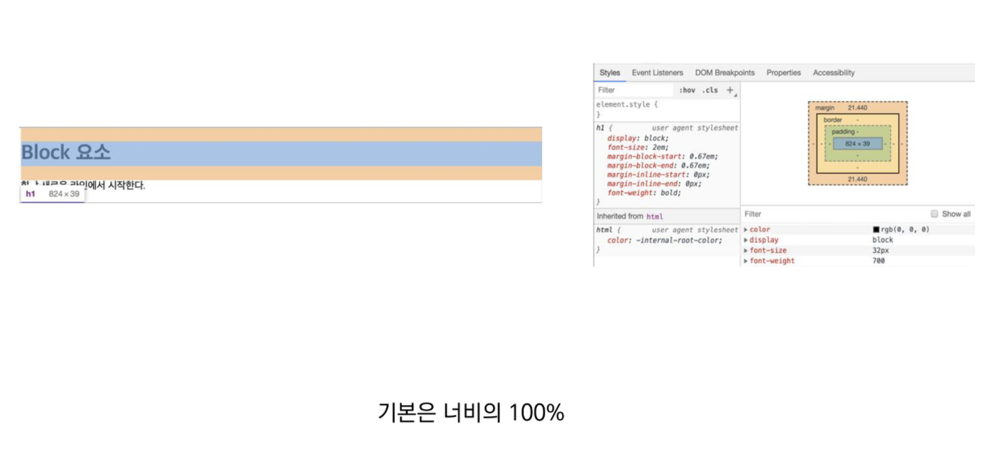

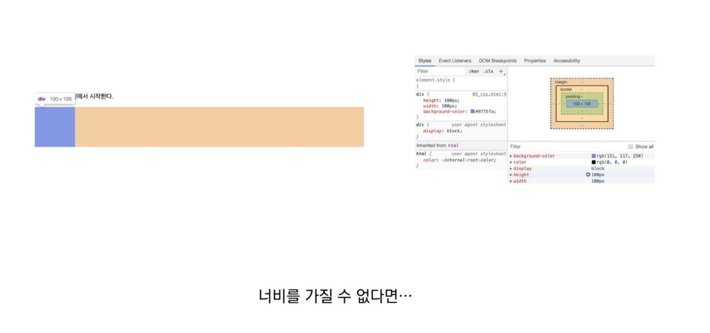


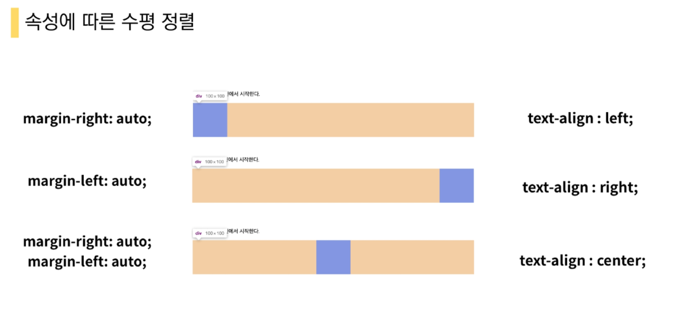

- display: inline-block
  - block과 inline 레벨 요소의 특징을 모두 갖는다.
  - inline처럼 한 줄에 표시 가능하며, block처럼 `width`, `height`, `margin` 속성을 모두 지정할 수 있다.

- display: none
  - 해당 요소를 화면에 표시하지 않는다. ( 공강조차 사라진다. )
  - 이와 비슷한 visibility: hidden은 해당 요소가 공간은 차지하나 화면에 표시만 하지 않는다.


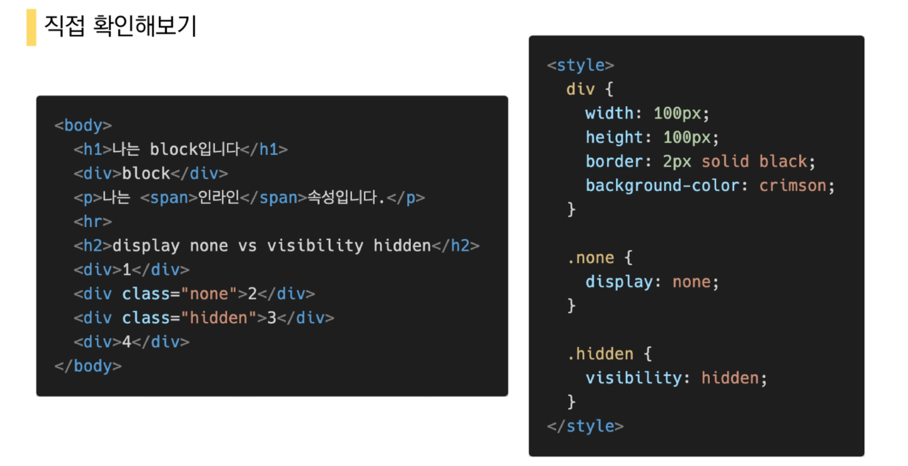


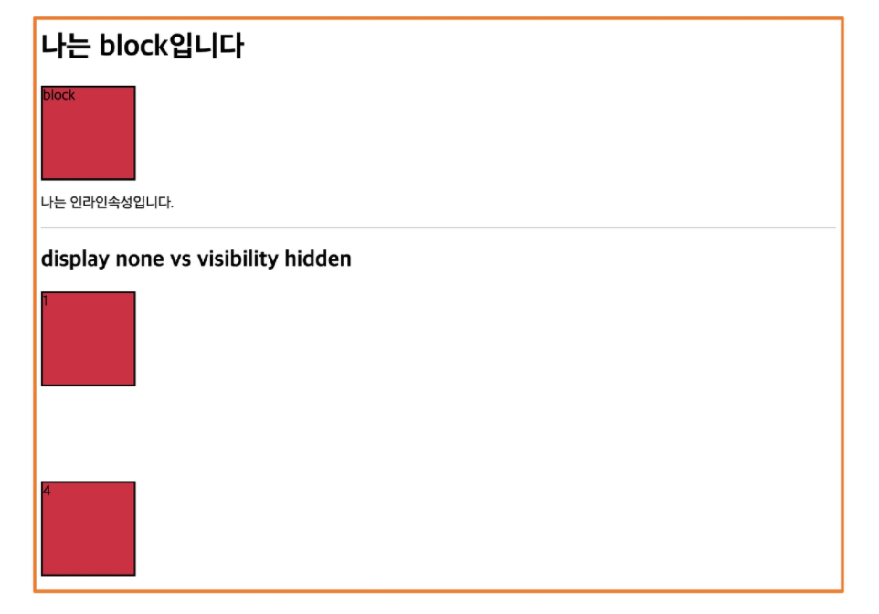


## CSS position

- 문서 상에서 요소를 배치하는 방법을 지정한다.
- static : 모든 태그의 기본 값(기준 위치)
  - 일반적인 쇼오의 배치 순서에 따름(좌측 상단)
  - 부모 요소 내에서 배치될 때는 부모 요소의 위치를 기준으로 배치 됨
- 아래는 좌표 프로퍼티(top, bottom, left, right)를 사용하여 이동이 가능하다. (음수 값도 가능)
  - relative
  - absolute
  - fixed


###### relative : 상대위치

- 자기 자신의 static 위치를 기준으로 이동
- 레이아웃에서 요소가 차지하는 공간은 static 일 때와 같음

###### absolute : 절대 위치

- 요소를 일반적인 문서 흐름에서 제거 후 레이아웃에 공간을 차지하지 않음
- static이 아닌 가장 가까이 있는 부모/조상 요소를 기준으로 이동 (없는 경우 body에 붙는 형태)

###### fixed : 고정 위치

- 요소를 일반적인 문서 흐름에서 제거 후 레이아웃에 공간을 차지하지 않음
- 부모요소와 관계없이 viewport를 기준으로 이동
- 스크롤 시에도 항상 같은 곳에 위치함

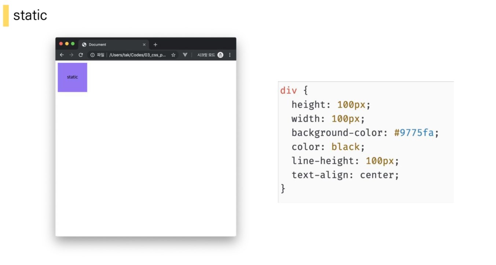

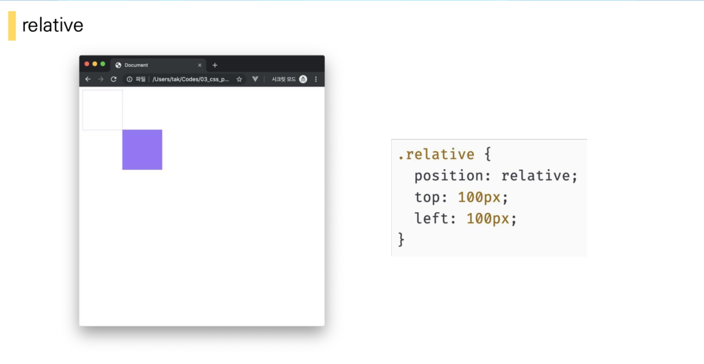

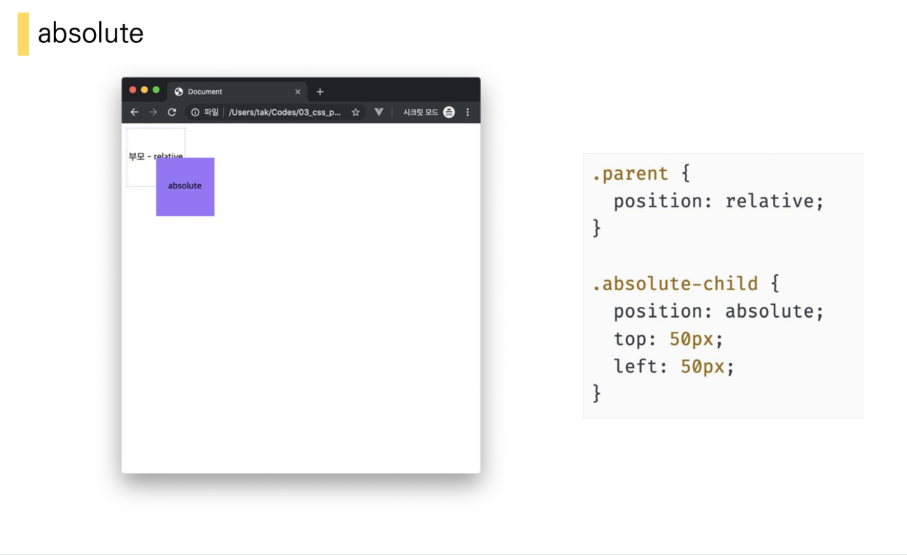

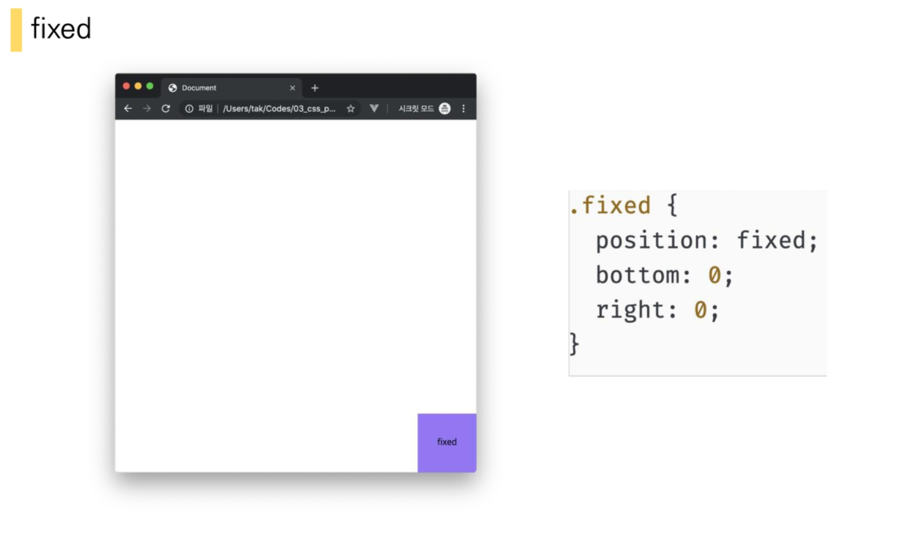

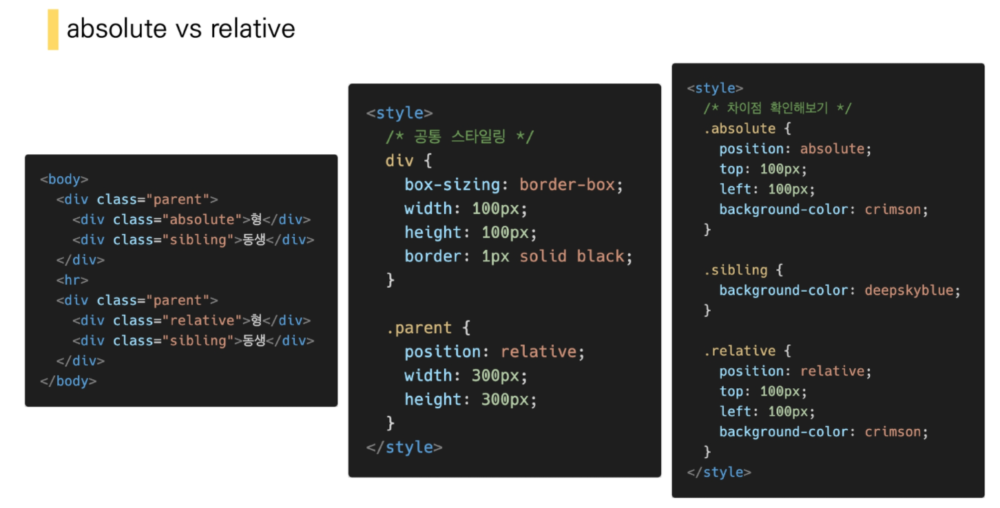

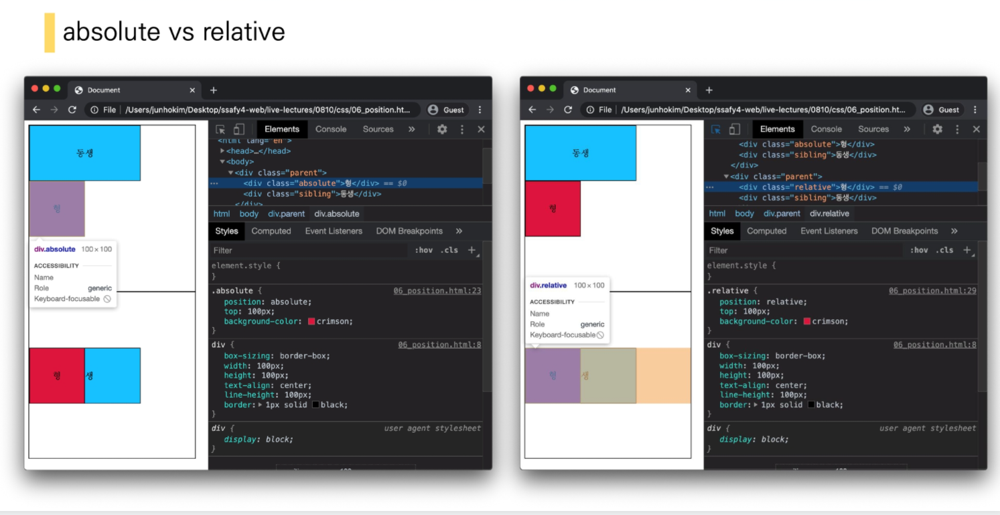


##### absolute의 특징

- 원래 위치해 있었던 과거 위치에 있던 공간은 더 이상 존재하지 않음
- 즉, 다른 모든 것과 별개로 독자적인 곳에 놓임
- 페이지의 다른 요소의 위치와 간섭하지 않는 격리된 사용자 인터페이스 기능을 만드는데 활용
  - 팝업 정보 상자, 제어 메뉴, 롤오버 패널, 페이지 어느 곳에서나 끌어서 놓기 할 수 있는 유저 인터페이스 페이지 등등


